# SỔ TAY BỔ SUNG – CHƯƠNG TRÌNH GDPT 2018
# PHẦN 1: HỌC KỲ I (CHỦ ĐỀ 17 – 20)
## ÔN THI VÀO LỚP 10 MÔN TOÁN – CẤU TRÚC ĐỀ SỞ GD&ĐT NINH BÌNH (MỤC TIÊU 8,0 – 8,5 ĐIỂM)
*Sổ tay bổ sung gồm 2 tập: **Phần 1** (Chủ đề 17 – 20, học kỳ I) và **Phần 2** (Chủ đề 21 – 25, học kỳ II). Đây là phần tiếp theo của "Sổ tay toàn bộ kiến thức & bài tập ôn thi vào 10" (Chủ đề 1 – 16). Mỗi chủ đề gồm lý thuyết, bẫy thường gặp, mẫu trình bày theo barem 0,25 điểm, bài trắc nghiệm và tự luận có lời giải chi tiết ở cuối tài liệu.*

---

> 💡 **VÌ SAO CÓ SỔ TAY BỔ SUNG?**
> - Từ năm 2025, đề tuyển sinh vào 10 theo **Chương trình GDPT 2018**. Khoảng **2,5 – 3,5 điểm** của đề mới thuộc các nội dung mà Sổ tay Chủ đề 1 – 16 chưa có: thống kê – xác suất, bất phương trình, cung – hình quạt – vành khuyên, đa giác đều – phép quay, hình học thực tế, Vi-ét với biểu thức không đối xứng, chứng minh đẳng thức số.
> - Thứ tự chủ đề dưới đây **bám theo SGK Kết nối tri thức Toán 9**, để em học song song với chương trình trên lớp.
> - Độ khó chỉ từ 4,0 đến 8,5/10: đề mới có tỉ lệ Nhận biết 40% – Thông hiểu 30% – Vận dụng 30%, không có mức vận dụng cao riêng.
> - **Quy tắc vàng:** tự giải ra vở trước, rồi mới lật xem lời giải ở phần cuối tài liệu.

| Chủ đề | Nội dung | SGK KNTT Toán 9 | Phần đề thi | Học vào khoảng |
|:---:|:---|:---:|:---|:---:|
| 17 | Bất đẳng thức, bất phương trình bậc nhất một ẩn, PT quy về PT bậc nhất | Chương II | Trắc nghiệm, Bài 4 | Tháng 11 |
| 18 | Tính giá trị & chứng minh đẳng thức số chứa căn | Chương III | Bài 1a | Tháng 12 |
| 19 | Tỉ số lượng giác & giải tam giác vuông trong thực tế | Chương IV | Trắc nghiệm, Bài 6 | Tháng 12 |
| 20 | Cung, hình quạt, viên phân, vành khuyên; hai đường tròn; tối ưu chi phí | Chương V | Trắc nghiệm, Bài 6b | Tháng 1 |
| 21 | Vi-ét với biểu thức không đối xứng; PT bậc hai trong thực tế | Chương VI | Bài 3b | Tháng 3 |
| 22 | Thống kê: tần số, tần số tương đối, ghép nhóm, biểu đồ | Chương VII | Trắc nghiệm, Bài 2 | Tháng 11 – 3 |
| 23 | Xác suất: phép thử, không gian mẫu, xác suất của biến cố | Chương VIII | Trắc nghiệm, Bài 2 | Tháng 2 – 3 |
| 24 | Đường tròn ngoại tiếp – nội tiếp, bốn điểm cùng thuộc đường tròn, đa giác đều, phép quay; luyện bài hình phẳng | Chương IX | Trắc nghiệm, Bài 5 | Tháng 4 |
| 25 | Hình khối trong thực tiễn (trụ, nón, cầu ghép) | Chương X | Trắc nghiệm, Bài 6a | Tháng 4 |

---

# PHẦN 5: BỔ SUNG HỌC KỲ I (CHƯƠNG II – V)

## Chủ đề 17: Bất đẳng thức, Bất phương trình bậc nhất một ẩn & Phương trình quy về phương trình bậc nhất

*(KNTT Toán 9 – Chương II. Trong đề thi: 1 câu trắc nghiệm về bất phương trình (Nam Định 2025–2026 Câu 2; Ninh Bình 2026–2027 Câu 6) và có thể xuất hiện trong Bài 4 "lập phương trình/bất phương trình" ở dạng bài toán thực tế.)*

### 1. Lý thuyết cốt lõi cần nhớ
- **Phương trình tích:** $$A(x) \cdot B(x) = 0 \Leftrightarrow A(x) = 0 \text{ hoặc } B(x) = 0$$
  Cách làm: chuyển mọi hạng tử sang một vế (vế kia bằng $0$) → phân tích vế trái thành nhân tử → giải từng phương trình bậc nhất → kết luận tập nghiệm.
- **Phương trình chứa ẩn ở mẫu (4 bước):** $$\text{1) Tìm ĐKXĐ (mọi mẫu} \neq 0) \to \text{2) Quy đồng, khử mẫu} \to \text{3) Giải PT vừa nhận được} \to \text{4) Đối chiếu ĐKXĐ, kết luận}$$
- **Bất đẳng thức:** hệ thức dạng $a < b$, $a > b$, $a \le b$, $a \ge b$. Các tính chất cần nhớ:
  - Cộng cùng một số vào hai vế, giữ nguyên chiều: $$a < b \Rightarrow a + c < b + c$$
  - Nhân với số **dương**, giữ nguyên chiều; nhân với số **âm**, **đổi chiều**: $$a < b,\ c > 0 \Rightarrow ac < bc; \qquad a < b,\ c < 0 \Rightarrow ac > bc$$
  - Tính chất bắc cầu: $$a < b \text{ và } b < c \Rightarrow a < c$$
- **Bất phương trình bậc nhất một ẩn:** có dạng $ax + b > 0$ (hoặc $<, \ge, \le$) với $a \neq 0$.
  - Quy tắc chuyển vế: chuyển một hạng tử từ vế này sang vế kia thì **đổi dấu** hạng tử đó.
  - Quy tắc nhân: nhân (chia) hai vế với cùng một số dương thì giữ chiều; với cùng một số âm thì **đổi chiều**.
  - Ví dụ: $$-3x < 6 \Leftrightarrow x > -2 \qquad (\text{chia hai vế cho } -3 < 0 \text{ nên đổi chiều})$$
- **Biểu diễn tập nghiệm trên trục số:** gạch bỏ phần **không** thuộc tập nghiệm. Tại điểm đầu mút: dùng ngoặc vuông "[" hoặc "]" nếu điểm đó **thuộc** tập nghiệm (dấu $\ge, \le$); dùng ngoặc tròn "(" hoặc ")" nếu điểm đó **không thuộc** tập nghiệm (dấu $>, <$).
- **Bài toán thực tế dùng bất phương trình – đọc đúng từ khóa:**
  - "ít nhất", "không dưới", "không ít hơn" → dùng dấu $\ge$; "tối đa", "nhiều nhất", "không vượt quá", "không quá" → dùng dấu $\le$; "hơn", "vượt quá" → dùng dấu $>$; "chưa đến", "dưới" → dùng dấu $<$.
  - Nếu ẩn là **số tự nhiên** (số vé, số chai, số bao, số km...): với "ít nhất" thì lấy số tự nhiên **nhỏ nhất** thỏa mãn (làm tròn **lên**); với "tối đa" thì lấy số tự nhiên **lớn nhất** thỏa mãn (làm tròn **xuống**).

**⚠️ Bẫy thường gặp:**

- Nhân hoặc chia hai vế bất phương trình cho số âm mà quên đổi chiều: từ $-3x < 6$ phải ra $x > -2$, **không phải** $x < -2$.
- Phương trình chứa ẩn ở mẫu: quên viết ĐKXĐ, hoặc giải xong không đối chiếu nên giữ lại nghiệm làm mẫu bằng $0$ (nghiệm đó phải **loại**).
- Phương trình tích: chia hai vế cho một biểu thức chứa ẩn (ví dụ chia cho $x - 2$) làm **mất nghiệm**. Phải chuyển vế rồi đặt nhân tử chung.
- Bài toán thực tế: giải ra $x \ge 86{,}7$ mà trả lời "ít nhất 86" (sai, phải là $87$); giải ra $x \le 13{,}08$ mà trả lời "tối đa 14" (sai, phải là $13$). Quên điều kiện ẩn là số tự nhiên.
- Đọc nhầm "không vượt quá" thành dấu $<$ (đúng là $\le$), "không dưới" thành dấu $>$ (đúng là $\ge$).

**✍️ Mẫu trình bày ăn trọn điểm (bài toán thực tế "tối đa", 1,0 điểm):**

*Đề:* Giá cước một hãng taxi (giả định) là $15$ nghìn đồng cho ki-lô-mét đầu tiên và $12$ nghìn đồng cho mỗi ki-lô-mét tiếp theo. Bác Hòa có $160$ nghìn đồng. Hỏi bác Hòa đi được quãng đường dài nhất là bao nhiêu ki-lô-mét? (Biết cước tính theo từng ki-lô-mét, số ki-lô-mét là số tự nhiên.)

*Lời giải mẫu:*
- Gọi $x$ (km) là quãng đường bác Hòa đi, điều kiện: $x$ là số tự nhiên, $x \ge 1$. **(0,25đ)**
- Số tiền phải trả là $15 + 12(x - 1)$ (nghìn đồng). Vì bác chỉ có $160$ nghìn đồng nên ta có bất phương trình $15 + 12(x - 1) \le 160$. **(0,25đ)**
- Giải: $12x + 3 \le 160 \Leftrightarrow 12x \le 157 \Leftrightarrow x \le \dfrac{157}{12} \approx 13{,}08$. **(0,25đ)**
- Vì $x$ là số tự nhiên lớn nhất thỏa mãn nên $x = 13$ (thử lại: $15 + 12 \cdot 12 = 159 \le 160$). Vậy bác Hòa đi được tối đa $13$ km. **(0,25đ)**

### 2. Bài tập Trắc nghiệm (8 câu độ khó tăng dần - Ghi chữ cái đứng trước đáp án đúng)
**Câu 17.1 [Độ khó: 4.0/10 - Nhận biết]: Bất phương trình nào sau đây là bất phương trình bậc nhất một ẩn?**
> A. $0x + 3 > 0$        B. $x^2 - 1 \le 0$        C. $\dfrac{1}{x} + 2 < 0$        D. $2x - 5 \ge 0$

**Câu 17.2 [Độ khó: 4.5/10 - Nhận biết]: Số nào sau đây là một nghiệm của bất phương trình $3x - 7 > 2$?**
> A. $3$        B. $2$        C. $4$        D. $0$

**Câu 17.3 [Độ khó: 5.0/10 - Nhận biết]: Cho $a < b$. Khẳng định nào sau đây đúng?**
> A. $-2a < -2b$        B. $a - 5 < b - 5$        C. $3a > 3b$        D. $\dfrac{a}{-4} < \dfrac{b}{-4}$

**Câu 17.4 [Độ khó: 5.0/10 - Nhận biết]: Nghiệm của bất phương trình $4 - 3x \le 10$ là:**
> A. $x \ge -2$        B. $x \le -2$        C. $x \ge 2$        D. $x \le 2$

**Câu 17.5 [Độ khó: 5.5/10 - Thông hiểu]: Tập nghiệm của phương trình $(2x - 1)(x + 3) = 0$ là:**
> A. $\left\{\dfrac{1}{2}; 3\right\}$        B. $\left\{-\dfrac{1}{2}; 3\right\}$        C. $\{2; -3\}$        D. $\left\{\dfrac{1}{2}; -3\right\}$

**Câu 17.6 [Độ khó: 6.0/10 - Thông hiểu]: Điều kiện xác định của phương trình $\dfrac{x}{x + 2} + \dfrac{3}{x - 1} = \dfrac{2x + 1}{(x + 2)(x - 1)}$ là:**
> A. $x \neq 2$ và $x \neq -1$        B. $x \neq -2$ và $x \neq 1$        C. $x \neq -2$        D. $x \neq 1$

**Câu 17.7 [Độ khó: 6.5/10 - Thông hiểu]: Phương trình $\dfrac{x + 3}{x - 1} = \dfrac{4}{x - 1}$ có:**
> A. Nghiệm $x = 1$        B. Nghiệm $x = -1$        C. Vô nghiệm        D. Vô số nghiệm $x \neq 1$

**Câu 17.8 [Độ khó: 7.0/10 - Thông hiểu]: Điểm ba bài kiểm tra thường xuyên môn Toán của bạn Lan là $6{,}5$; $7{,}0$; $7{,}5$. Bài kiểm tra thứ tư Lan cần đạt ít nhất bao nhiêu điểm để điểm trung bình của bốn bài không dưới $7{,}5$?**
> A. $9$        B. $7{,}5$        C. $8{,}5$        D. $10$

### 3. Bài tập Tự luận (6 bài độ khó tăng dần - Trình bày chi tiết ra vở)
**Bài 17.1 [Độ khó: 4.5/10 - Nhận biết]:**
Giải các phương trình sau:
- a) $(3x - 6)(2x + 5) = 0$
- b) $(x - 2)(2x + 1) = (x - 2)(x + 4)$

**Bài 17.2 [Độ khó: 5.0/10 - Nhận biết]:**
Giải các bất phương trình sau và biểu diễn tập nghiệm của mỗi bất phương trình trên trục số:
- a) $2x - 5 \ge 3$
- b) $5 - 2x > 3x - 10$

**Bài 17.3 [Độ khó: 6.0/10 - Thông hiểu]:**
- a) Giải bất phương trình: $$\frac{x + 1}{2} - \frac{2x - 1}{3} < \frac{x}{6} + 1$$
- b) Tìm nghiệm nguyên nhỏ nhất của bất phương trình ở câu a.

**Bài 17.4 [Độ khó: 7.0/10 - Vận dụng]:**
Giải các phương trình sau:
- a) $\dfrac{x + 2}{x - 2} - \dfrac{2}{x} = \dfrac{8}{x(x - 2)}$
- b) $\dfrac{1}{x - 1} + \dfrac{2}{x + 1} = \dfrac{3}{x}$

**Bài 17.5 [Độ khó: 7.5/10 - Vận dụng]:**
Để gây quỹ "Tết cho em", lớp 9A gói bánh chưng để bán. Chi phí chung (thuê nồi luộc, củi đun, vận chuyển) hết $300$ nghìn đồng; mỗi chiếc bánh tốn thêm $45$ nghìn đồng tiền nguyên liệu và được bán với giá $60$ nghìn đồng một chiếc (số liệu giả định).
- a) Lớp 9A phải bán được ít nhất bao nhiêu chiếc bánh để không bị lỗ?
- b) Lớp 9A phải bán được ít nhất bao nhiêu chiếc bánh để số tiền lãi không dưới $1\,000$ nghìn đồng (tức $1$ triệu đồng)?

**Bài 17.6 [Độ khó: 8.0/10 - Vận dụng]:**
Giá nước sinh hoạt ở một địa phương (giả định, đã gồm các loại phí) được tính lũy tiến theo bậc như sau:
- $10$ m³ đầu tiên: $6$ nghìn đồng/m³;
- từ trên $10$ m³ đến $20$ m³: $7$ nghìn đồng/m³;
- trên $20$ m³: $9$ nghìn đồng/m³.

Hỏi:
- a) Tháng 9, gia đình bạn Minh dùng hết $25$ m³ nước. Gia đình bạn Minh phải trả bao nhiêu tiền nước?
- b) Gia đình bạn Minh muốn tiền nước mỗi tháng không vượt quá $200$ nghìn đồng. Hỏi mỗi tháng gia đình bạn dùng được tối đa bao nhiêu mét khối nước (số mét khối nước là số tự nhiên)?

> 🔒 **LƯU Ý TRA CỨU ĐÁP ÁN:** Em hãy tự giải ra vở trước, không xem đáp án trước. Khi làm xong, hãy lật xem **LỜI GIẢI CHỦ ĐỀ 17** ở phần cuối tài liệu.

---

## Chủ đề 18: Tính giá trị & Chứng minh đẳng thức số chứa căn (dạng Bài 1a đề thi)

*(Dạng ý a của Bài 1 trong đề mới: Nam Định 2025–2026 yêu cầu "Chứng minh đẳng thức $\sqrt{8 - 2\sqrt{7}} - \dfrac{6}{\sqrt{7} - 1} = -2$"; Ninh Bình 2026–2027 yêu cầu "Tính giá trị biểu thức $A = \sqrt{(\sqrt{5} + 1)^2} - \sqrt{5}(\sqrt{5} + 1)$". Đây là ý dễ lấy điểm nếu nắm chắc các phép biến đổi và trình bày cẩn thận.)*

### 1. Lý thuyết cốt lõi cần nhớ
- **Hằng đẳng thức căn bậc hai:** $$\sqrt{A^2} = |A| = \begin{cases} A & \text{nếu } A \ge 0 \\ -A & \text{nếu } A < 0 \end{cases}$$
  Để bỏ dấu giá trị tuyệt đối, so sánh nhanh bằng cách đưa về cùng dạng căn: $\sqrt{a} < \sqrt{b} \Leftrightarrow a < b$ (với $a, b \ge 0$). Ví dụ: $3 = \sqrt{9} > \sqrt{8}$ nên $\sqrt{(\sqrt{8} - 3)^2} = 3 - \sqrt{8}$.
- **Đưa thừa số ra ngoài dấu căn:** $$\sqrt{A^2 B} = |A|\sqrt{B} \quad (B \ge 0). \quad \text{Ví dụ: } \sqrt{48} = \sqrt{16 \cdot 3} = 4\sqrt{3}$$
- **Đưa thừa số vào trong dấu căn:** $$A\sqrt{B} = \sqrt{A^2 B} \text{ nếu } A \ge 0; \qquad A\sqrt{B} = -\sqrt{A^2 B} \text{ nếu } A < 0 \quad (B \ge 0)$$
  Ví dụ: $2\sqrt{5} = \sqrt{20}$; $-2\sqrt{5} = -\sqrt{20}$. Dùng để **so sánh** hai số dạng $a\sqrt{b}$.
- **Biến đổi $a \pm 2\sqrt{b}$ thành bình phương:** tìm hai số $m, n \ge 0$ có $m + n = a$ và $m \cdot n = b$. Khi đó: $$a \pm 2\sqrt{b} = (\sqrt{m} \pm \sqrt{n})^2 \Rightarrow \sqrt{a - 2\sqrt{b}} = \left|\sqrt{m} - \sqrt{n}\right|$$
  - Ví dụ 1: $8 - 2\sqrt{7}$ có $7 + 1 = 8$, $7 \cdot 1 = 7$ nên $8 - 2\sqrt{7} = (\sqrt{7} - 1)^2$.
  - Ví dụ 2 (hệ số trước căn không phải 2 → đưa số vào trong căn để tạo "$2\sqrt{\ }$"): $11 - 4\sqrt{6} = 11 - 2\sqrt{24}$; có $8 + 3 = 11$, $8 \cdot 3 = 24$ nên $11 - 4\sqrt{6} = (\sqrt{8} - \sqrt{3})^2 = (2\sqrt{2} - \sqrt{3})^2$.
  - Ví dụ 3 (thiếu hệ số 2 → nhân và chia cho 2): $3 - \sqrt{5} = \dfrac{6 - 2\sqrt{5}}{2} = \dfrac{(\sqrt{5} - 1)^2}{2}$.
- **Trục căn thức ở mẫu:** $$\frac{A}{\sqrt{B}} = \frac{A\sqrt{B}}{B}\ (B > 0); \qquad \frac{C}{\sqrt{A} \pm \sqrt{B}} = \frac{C(\sqrt{A} \mp \sqrt{B})}{A - B}; \qquad \frac{C}{\sqrt{A} \pm B} = \frac{C(\sqrt{A} \mp B)}{A - B^2}$$
  Mẹo: thử **phân tích tử thành nhân tử** trước, nhiều khi rút gọn được ngay, ví dụ $\dfrac{\sqrt{10} - \sqrt{5}}{\sqrt{2} - 1} = \dfrac{\sqrt{5}(\sqrt{2} - 1)}{\sqrt{2} - 1} = \sqrt{5}$.
- **Căn bậc ba:** $$\sqrt[3]{A^3} = A \text{ với mọi } A \text{ (kể cả } A < 0); \qquad \sqrt[3]{AB} = \sqrt[3]{A} \cdot \sqrt[3]{B}; \qquad \frac{\sqrt[3]{A}}{\sqrt[3]{B}} = \sqrt[3]{\frac{A}{B}}\ (B \neq 0)$$
  Ví dụ: $\sqrt[3]{-8} = -2$; $\sqrt[3]{(2 - \sqrt{5})^3} = 2 - \sqrt{5}$ (giữ nguyên dấu âm).
- **Cách trình bày "Chứng minh đẳng thức số":** biến đổi vế phức tạp (thường là vế trái, ký hiệu VT) cho đến khi được vế còn lại (VP): $$\text{VT} = \dots = \dots = \text{VP}. \text{ Vậy đẳng thức được chứng minh.}$$
  Tránh viết luôn đẳng thức cần chứng minh rồi "chuyển vế" như giải phương trình, vì như thế là đã coi điều cần chứng minh là đúng.

**⚠️ Bẫy thường gặp:**

- $\sqrt{(1 - \sqrt{3})^2} = |1 - \sqrt{3}| = \sqrt{3} - 1$, **không phải** $1 - \sqrt{3}$ (căn bậc hai số học luôn không âm).
- $\sqrt{a + b} \neq \sqrt{a} + \sqrt{b}$: ví dụ $\sqrt{9 + 16} = \sqrt{25} = 5$, không phải $3 + 4 = 7$.
- Trục căn thức: nhân liên hợp sai dấu (liên hợp của $\sqrt{7} - 1$ là $\sqrt{7} + 1$) hoặc quên chia cho $A - B$ ở mẫu.
- Đưa thừa số âm vào trong căn: $-2\sqrt{5} = -\sqrt{20}$, **không phải** $\sqrt{20}$, càng không phải $\sqrt{-20}$.
- Căn bậc ba không có dấu giá trị tuyệt đối: $\sqrt[3]{(1 - \sqrt{2})^3} = 1 - \sqrt{2}$, còn $\sqrt{(1 - \sqrt{2})^2} = \sqrt{2} - 1$.

**✍️ Mẫu trình bày ăn trọn điểm (trích đề tuyển sinh lớp 10 Nam Định năm học 2025–2026, Bài 1a):**

*Đề:* Chứng minh đẳng thức $\sqrt{8 - 2\sqrt{7}} - \dfrac{6}{\sqrt{7} - 1} = -2$.

*Lời giải mẫu (barem tham khảo):*
- Ta có $8 - 2\sqrt{7} = 7 - 2\sqrt{7} + 1 = (\sqrt{7} - 1)^2$, nên $\sqrt{8 - 2\sqrt{7}} = |\sqrt{7} - 1| = \sqrt{7} - 1$ (vì $\sqrt{7} > 1$). **(0,25đ)**
- $\dfrac{6}{\sqrt{7} - 1} = \dfrac{6(\sqrt{7} + 1)}{(\sqrt{7} - 1)(\sqrt{7} + 1)} = \dfrac{6(\sqrt{7} + 1)}{7 - 1} = \sqrt{7} + 1$. **(0,25đ)**
- Do đó $\text{VT} = (\sqrt{7} - 1) - (\sqrt{7} + 1) = -2 = \text{VP}$. Vậy đẳng thức được chứng minh. **(0,25đ)**

### 2. Bài tập Trắc nghiệm (6 câu độ khó tăng dần - Ghi chữ cái đứng trước đáp án đúng)
**Câu 18.1 [Độ khó: 4.0/10 - Nhận biết]: Giá trị của $\sqrt[3]{-64}$ là:**
> A. $4$        B. $-8$        C. Không xác định        D. $-4$

**Câu 18.2 [Độ khó: 4.5/10 - Nhận biết]: Đưa thừa số vào trong dấu căn, biểu thức $-3\sqrt{2}$ bằng:**
> A. $\sqrt{18}$        B. $-\sqrt{18}$        C. $\sqrt{-18}$        D. $-\sqrt{6}$

**Câu 18.3 [Độ khó: 5.0/10 - Nhận biết]: Giá trị của biểu thức $\sqrt{(2 - \sqrt{5})^2}$ là:**
> A. $2 - \sqrt{5}$        B. $\sqrt{5} - 2$        C. $2 + \sqrt{5}$        D. $-2 - \sqrt{5}$

**Câu 18.4 [Độ khó: 5.5/10 - Thông hiểu]: Trục căn thức ở mẫu của biểu thức $\dfrac{2}{\sqrt{3} + 1}$ ta được:**
> A. $\sqrt{3} - 1$        B. $\sqrt{3} + 1$        C. $2(\sqrt{3} - 1)$        D. $\dfrac{\sqrt{3} - 1}{2}$

**Câu 18.5 [Độ khó: 6.0/10 - Thông hiểu]: Biểu thức $4 - 2\sqrt{3}$ được viết dưới dạng bình phương là:**
> A. $(2 - \sqrt{3})^2$        B. $(\sqrt{3} - 2)^2$        C. $(\sqrt{3} - 1)^2$        D. $(1 - 2\sqrt{3})^2$

**Câu 18.6 [Độ khó: 6.5/10 - Thông hiểu]: Giá trị của biểu thức $\sqrt{7 - 4\sqrt{3}} + \sqrt{3}$ là:**
> A. $2\sqrt{3} - 2$        B. $2 + 2\sqrt{3}$        C. $4$        D. $2$

### 3. Bài tập Tự luận (6 bài độ khó tăng dần - Trình bày chi tiết ra vở)
**Bài 18.1 [Độ khó: 4.5/10 - Nhận biết]:**
- a) Tính $A = \sqrt{12} + \sqrt{27} - \sqrt{48}$.
- b) Tính $B = \sqrt[3]{-125} + \dfrac{\sqrt[3]{54}}{\sqrt[3]{2}}$.
- c) Không dùng máy tính, so sánh hai số $3\sqrt{5}$ và $2\sqrt{11}$.

**Bài 18.2 [Độ khó: 5.5/10 - Thông hiểu]:**
- a) (Trích đề tuyển sinh lớp 10 Ninh Bình năm học 2026–2027, Bài 1a) Tính giá trị biểu thức $A = \sqrt{(\sqrt{5} + 1)^2} - \sqrt{5}(\sqrt{5} + 1)$.
- b) Tính giá trị biểu thức $B = \sqrt{(\sqrt{7} - 3)^2} + \sqrt{(\sqrt{7} - 2)^2}$.

**Bài 18.3 [Độ khó: 6.0/10 - Thông hiểu]:**
Rút gọn các biểu thức sau:
- a) $C = \dfrac{3}{\sqrt{5} - \sqrt{2}} + \dfrac{4}{\sqrt{6} + \sqrt{2}} - \sqrt{5}$
- b) $D = \dfrac{\sqrt{15} - \sqrt{5}}{\sqrt{3} - 1} - \dfrac{10}{\sqrt{5}}$

**Bài 18.4 [Độ khó: 7.0/10 - Vận dụng]:**
Chứng minh các đẳng thức sau:
- a) $\sqrt{11 - 4\sqrt{7}} - \dfrac{6}{\sqrt{7} + 1} = -1$
- b) $\sqrt{4 + 2\sqrt{3}} - \sqrt{4 - 2\sqrt{3}} = 2$

**Bài 18.5 [Độ khó: 7.5/10 - Vận dụng]:**
- a) Tính $E = \sqrt[3]{(1 - \sqrt{2})^3} + \sqrt{(1 - \sqrt{2})^2}$.
- b) Tính $F = \sqrt[3]{2 - \sqrt{5}} \cdot \sqrt[3]{2 + \sqrt{5}}$.
- c) Tính $(1 + \sqrt{2})^3$, từ đó chứng minh đẳng thức $\sqrt[3]{7 + 5\sqrt{2}} - \sqrt{2} = 1$.

**Bài 18.6 [Độ khó: 8.5/10 - Vận dụng]:**
Chứng minh các đẳng thức sau:
- a) $\left(\dfrac{\sqrt{14} - \sqrt{7}}{1 - \sqrt{2}} + \dfrac{\sqrt{15} - \sqrt{5}}{1 - \sqrt{3}}\right) : \dfrac{1}{\sqrt{7} - \sqrt{5}} = -2$
- b) $\sqrt{2 + \sqrt{3}} - \sqrt{2 - \sqrt{3}} = \sqrt{2}$

> 🔒 **LƯU Ý TRA CỨU ĐÁP ÁN:** Em hãy tự giải ra vở trước, không xem đáp án trước. Khi làm xong, hãy lật xem **LỜI GIẢI CHỦ ĐỀ 18** ở phần cuối tài liệu.

---

## Chủ đề 19: Tỉ số lượng giác & Giải tam giác vuông trong thực tế

*(Đề mới có câu trắc nghiệm tỉ số lượng giác ở cả năm 2025 (tính $\sin B$) và 2026 (tính $\tan C$); đề tham khảo Ninh Bình có bài thực tế đo khoảng cách bằng góc. Phần này thuộc Chương IV – SGK Kết nối tri thức Toán 9.)*

### 1. Lý thuyết cốt lõi cần nhớ
- **Tỉ số lượng giác của góc nhọn** $\alpha$ trong tam giác vuông: $$\sin\alpha = \frac{\text{cạnh đối}}{\text{cạnh huyền}}; \quad \cos\alpha = \frac{\text{cạnh kề}}{\text{cạnh huyền}}; \quad \tan\alpha = \frac{\text{cạnh đối}}{\text{cạnh kề}}; \quad \cot\alpha = \frac{\text{cạnh kề}}{\text{cạnh đối}}$$ Mẹo nhớ: "**Sin** đi học, **Cos** không hư, **Tan** đoàn kết, **Cot** kết đoàn" (sin = đối/huyền, cos = kề/huyền, tan = đối/kề, cot = kề/đối).
- **Hai góc phụ nhau** ($\alpha + \beta = 90^\circ$): $\sin\alpha = \cos\beta$, $\cos\alpha = \sin\beta$, $\tan\alpha = \cot\beta$, $\cot\alpha = \tan\beta$.
- **Giá trị đặc biệt:**

| Góc | $30^\circ$ | $45^\circ$ | $60^\circ$ |
|:---:|:---:|:---:|:---:|
| $\sin$ | $\dfrac{1}{2}$ | $\dfrac{\sqrt{2}}{2}$ | $\dfrac{\sqrt{3}}{2}$ |
| $\cos$ | $\dfrac{\sqrt{3}}{2}$ | $\dfrac{\sqrt{2}}{2}$ | $\dfrac{1}{2}$ |
| $\tan$ | $\dfrac{\sqrt{3}}{3}$ | $1$ | $\sqrt{3}$ |
| $\cot$ | $\sqrt{3}$ | $1$ | $\dfrac{\sqrt{3}}{3}$ |

- **Hệ thức giữa cạnh và góc** (tam giác $ABC$ vuông tại $A$, cạnh huyền $BC$): $$AC = BC \cdot \sin B = BC \cdot \cos C; \qquad AC = AB \cdot \tan B = AB \cdot \cot C$$ $$AB = BC \cdot \sin C = BC \cdot \cos B; \qquad AB = AC \cdot \tan C = AC \cdot \cot B$$ Nói gọn: *cạnh góc vuông = cạnh huyền × sin góc đối = cạnh huyền × cos góc kề*; *cạnh góc vuông = cạnh góc vuông kia × tan góc đối*.
- **Giải tam giác vuông:** biết hai cạnh, hoặc một cạnh và một góc nhọn, thì tìm được các cạnh và góc còn lại (nhớ $\widehat{B} + \widehat{C} = 90^\circ$).
- **Góc nâng, góc hạ:** góc nâng là góc giữa tia nhìn **lên** và phương nằm ngang; góc hạ là góc giữa tia nhìn **xuống** và phương nằm ngang. Góc hạ từ $A$ nhìn xuống $B$ bằng góc nâng từ $B$ nhìn lên $A$ (so le trong).
- **Máy tính cầm tay:** để màn hình ở chế độ **độ** (chữ D); tính góc từ tỉ số dùng phím SHIFT + sin/cos/tan ($\sin^{-1}, \cos^{-1}, \tan^{-1}$). Giữ nguyên kết quả trong máy khi tính tiếp, **chỉ làm tròn ở bước cuối**.

**⚠️ Bẫy thường gặp:**

- Máy tính để chế độ R (radian) hoặc G nên ra kết quả sai hoàn toàn.
- Nhầm cạnh đối với cạnh kề (luôn xác định "đối/kề" **so với góc đang xét**).
- Bài đo chiều cao bằng mắt người: quên **cộng chiều cao từ mặt đất đến mắt**.
- Làm tròn sớm ở bước giữa làm kết quả cuối lệch; quên đơn vị hoặc làm tròn sai yêu cầu.
- Dùng $\tan$ thay cho $\sin$ khi đề cho **độ dài mặt dốc** (cạnh huyền), không phải độ dài theo phương ngang.

**✍️ Mẫu trình bày ăn trọn điểm:**

*Đề:* Bạn Nam thả diều, dây diều dài $50\text{ m}$ (coi như căng thẳng) và tạo với phương nằm ngang góc $40^\circ$; tay Nam cách mặt đất $1\text{ m}$. Tính độ cao của diều so với mặt đất (làm tròn đến $0{,}1\text{ m}$).

*Lời giải mẫu:*
- Gọi $A$ là tay Nam, $C$ là diều, $H$ là hình chiếu của $C$ trên phương nằm ngang qua $A$. Tam giác $AHC$ vuông tại $H$, $AC = 50\text{ m}$, $\widehat{CAH} = 40^\circ$. **(0,25đ)**
- $CH = AC \cdot \sin 40^\circ = 50 \sin 40^\circ \approx 32{,}14\text{ (m)}$. **(0,25đ)**
- Độ cao của diều: $CH + 1 \approx 33{,}1\text{ (m)}$. Vậy diều cao khoảng $33{,}1\text{ m}$ so với mặt đất. **(0,25đ)**

### 2. Bài tập Trắc nghiệm (6 câu độ khó tăng dần - Ghi chữ cái đứng trước đáp án đúng)
**Câu 19.1 [Độ khó: 4.0/10 - Nhận biết]: Cho góc nhọn $\alpha$ có $\sin\alpha = 0{,}6$. Giá trị của $\cos(90^\circ - \alpha)$ là:**
> A. $0{,}4$        B. $0{,}6$        C. $0{,}8$        D. $1{,}6$

**Câu 19.2 [Độ khó: 4.5/10 - Nhận biết]: Giá trị của biểu thức $\sin 30^\circ + \cos 60^\circ$ là:**
> A. $1$        B. $\sqrt{3}$        C. $\dfrac{1}{2}$        D. $\dfrac{1 + \sqrt{3}}{2}$

**Câu 19.3 [Độ khó: 5.0/10 - Thông hiểu]: Cho tam giác $ABC$ vuông tại $A$. Khẳng định nào sau đây đúng?**
> A. $AC = BC \cdot \cos B$        B. $AB = BC \cdot \sin B$        C. $AC = AB \cdot \cot B$        D. $AB = BC \cdot \cos B$

**Câu 19.4 [Độ khó: 5.5/10 - Thông hiểu]: Một chiếc thang dài $5\text{ m}$ dựa vào tường, chân thang cách chân tường $1{,}8\text{ m}$. Góc tạo bởi thang và mặt đất (làm tròn đến độ) là:**
> A. $21^\circ$        B. $20^\circ$        C. $69^\circ$        D. $70^\circ$

**Câu 19.5 [Độ khó: 6.0/10 - Thông hiểu]: Từ đỉnh một ngọn hải đăng cao $40\text{ m}$ so với mặt biển, người quan sát nhìn thấy một chiếc thuyền với góc hạ $25^\circ$ (hình vẽ). Khoảng cách từ thuyền đến chân hải đăng (làm tròn đến mét) là:**

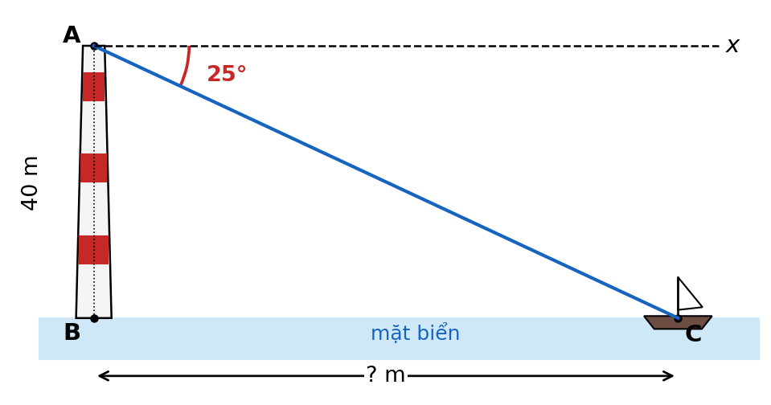{width=50%}

> A. $19\text{ m}$        B. $86\text{ m}$        C. $95\text{ m}$        D. $44\text{ m}$

**Câu 19.6 [Độ khó: 6.0/10 - Thông hiểu]: Một con dốc có mặt dốc dài $120\text{ m}$ và nghiêng $6^\circ$ so với phương nằm ngang. Đi hết con dốc thì độ cao tăng thêm khoảng:**
> A. $12{,}5\text{ m}$        B. $12{,}6\text{ m}$        C. $119{,}3\text{ m}$        D. $12{,}0\text{ m}$

### 3. Bài tập Tự luận (6 bài độ khó tăng dần - Trình bày chi tiết ra vở)
**Bài 19.1 [Độ khó: 4.5/10 - Nhận biết]:**
Cho tam giác $ABC$ vuông tại $A$ có $BC = 10\text{ cm}$, $\widehat{B} = 35^\circ$. Giải tam giác vuông $ABC$ (độ dài làm tròn đến $0{,}01\text{ cm}$).

**Bài 19.2 [Độ khó: 5.5/10 - Thông hiểu]:**
Vào một buổi chiều, bóng của tháp nước trên mặt đất dài $18\text{ m}$ và tia nắng mặt trời tạo với mặt đất góc $52^\circ$.

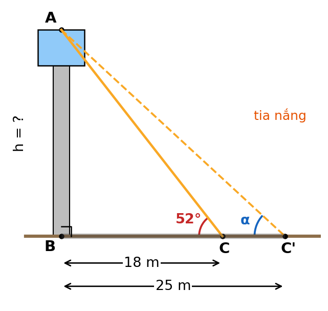{width=50%}

- a) Tính chiều cao của tháp nước (làm tròn đến $0{,}1\text{ m}$).
- b) Vào một thời điểm khác, bóng của tháp dài $25\text{ m}$. Khi đó tia nắng tạo với mặt đất góc bao nhiêu độ (làm tròn đến độ)?

**Bài 19.3 [Độ khó: 6.0/10 - Thông hiểu]:**
Bạn Minh đứng cách chân cột cờ của trường $15\text{ m}$, mắt bạn cách mặt đất $1{,}5\text{ m}$. Minh nhìn thấy đỉnh cột cờ với góc nâng $32^\circ$. Tính chiều cao của cột cờ (làm tròn đến $0{,}1\text{ m}$).

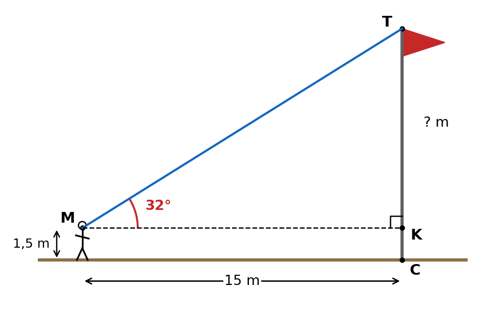{width=50%}

**Bài 19.4 [Độ khó: 7.0/10 - Vận dụng]:**
Để đo chiều rộng một khúc sông, người ta chọn hai điểm $A$, $B$ trên bờ bên này cách nhau $60\text{ m}$ và một cái cây $C$ ở bờ bên kia. Đo được $\widehat{CAB} = 45^\circ$, $\widehat{CBA} = 60^\circ$. Coi hai bờ sông song song, gọi $H$ là chân đường vuông góc kẻ từ $C$ xuống $AB$.

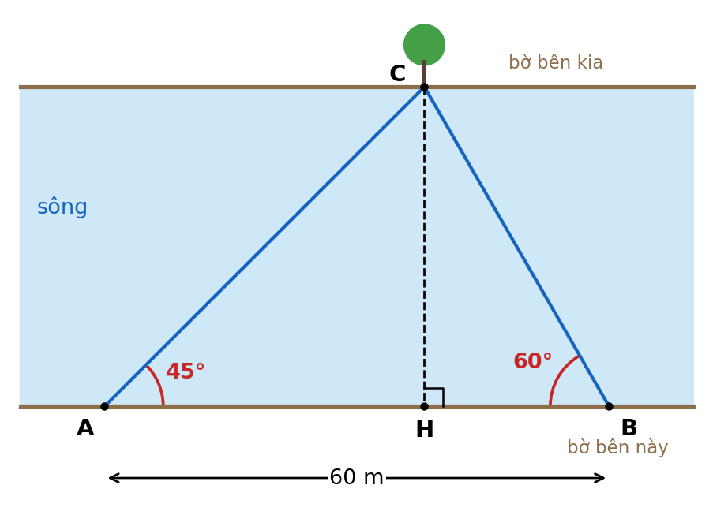{width=55%}

- a) Tính chiều rộng $CH$ của khúc sông (làm tròn đến $0{,}01\text{ m}$).
- b) Tính khoảng cách $AC$ (làm tròn đến $0{,}1\text{ m}$).

**Bài 19.5 [Độ khó: 7.5/10 - Vận dụng]:**
Bờ biển nơi có cảng cá $A$ coi như một đường thẳng theo hướng Đông – Tây. Một tàu cá rời cảng $A$, chạy thẳng ra biển theo hướng tạo với bờ biển một góc $35^\circ$ với vận tốc $30\text{ km/h}$; sau $40$ phút tàu đến vị trí $C$. Gọi $B$ là điểm trên bờ biển gần $C$ nhất.

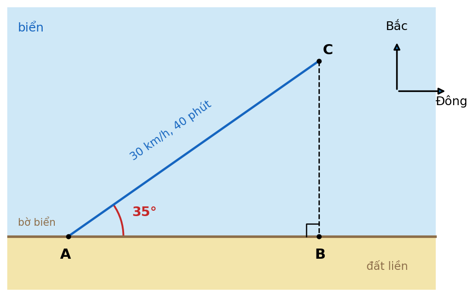{width=55%}

- a) Tính quãng đường $AC$ tàu đã đi.
- b) Tính khoảng cách $CB$ từ tàu đến bờ biển và khoảng cách $AB$ (làm tròn đến $0{,}01\text{ km}$).
- c) Từ $C$, tàu chạy thẳng vào bờ theo đường $CB$ với vận tốc $25\text{ km/h}$. Hỏi tàu mất khoảng bao nhiêu phút (làm tròn đến phút)?

**Bài 19.6 [Độ khó: 8.0/10 - Vận dụng]:**
Hai bạn An và Bình đứng trên mặt đất bằng phẳng, trên cùng một đường thẳng đi qua chân một cột ăng-ten và ở cùng phía đối với cột; hai bạn cách nhau $20\text{ m}$, An đứng gần cột hơn. An nhìn đỉnh cột với góc nâng $40^\circ$, Bình nhìn đỉnh cột với góc nâng $28^\circ$. Mắt của hai bạn đều cách mặt đất $1{,}6\text{ m}$. Tính chiều cao của cột ăng-ten (làm tròn đến $0{,}1\text{ m}$).

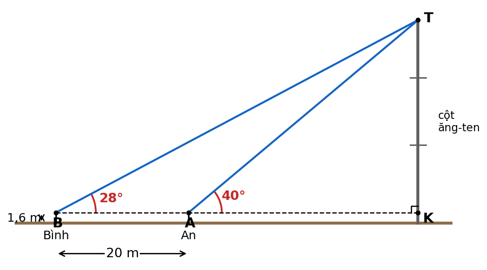{width=55%}

> 🔒 **LƯU Ý TRA CỨU ĐÁP ÁN:** Em hãy tự giải ra vở trước, không xem đáp án trước. Khi làm xong, hãy lật xem **LỜI GIẢI CHỦ ĐỀ 19** ở phần cuối tài liệu.

---

## Chủ đề 20: Độ dài cung, diện tích hình quạt, hình viên phân, hình vành khuyên & Vị trí tương đối của hai đường tròn

*(Bài hình học thực tế của đề mới: Ninh Bình 2026–2027 Bài 6b tính diện tích các hình quạt trên mảnh đất hình vuông rồi tìm chi phí nhỏ nhất; các đề Nam Định 2021–2023 và đề thi thử Hải Hậu đều có ý 1,0 điểm tính diện tích phần còn lại sau khi bỏ đi nửa hình tròn, hình quạt, hình viên phân. Phần này thuộc Chương V – SGK Kết nối tri thức Toán 9.)*

### 1. Lý thuyết cốt lõi cần nhớ
- **Độ dài đường tròn và cung tròn** (bán kính $R$, cung $n^\circ$): $$C = 2\pi R = \pi d; \qquad l = \frac{\pi R n}{180}$$
- **Diện tích hình tròn và hình quạt tròn:** $$S = \pi R^2; \qquad S_{\text{quạt}} = \frac{\pi R^2 n}{360} = \frac{l \cdot R}{2}$$ Hình quạt $90^\circ$ bằng $\dfrac{1}{4}$ hình tròn; nửa hình tròn là hình quạt $180^\circ$.
- **Hình viên phân** (giới hạn bởi cung và dây căng cung): $$S_{\text{viên phân}} = S_{\text{quạt}} - S_{\text{tam giác } OAB}$$ Với cung $90^\circ$: $S_{\text{viên phân}} = \dfrac{\pi R^2}{4} - \dfrac{R^2}{2}$.
- **Hình vành khuyên** (giữa hai đường tròn đồng tâm bán kính $R > r$): $$S = \pi(R^2 - r^2)$$
- **Cung và dây:** số đo cung nhỏ bằng số đo góc ở tâm chắn cung đó; dây $AB = R$ thì tam giác $OAB$ đều nên cung nhỏ $AB$ bằng $60^\circ$.
- **Vị trí tương đối của đường thẳng và đường tròn** ($d$ là khoảng cách từ tâm đến đường thẳng): $d < R$: cắt nhau (dây cắt có độ dài $2\sqrt{R^2 - d^2}$); $d = R$: tiếp xúc; $d > R$: không giao nhau.
- **Vị trí tương đối của hai đường tròn** $(O; R)$, $(O'; r)$ với $R \ge r$, $d = OO'$:

| Vị trí | Hệ thức | Số tiếp tuyến chung |
|:---|:---:|:---:|
| Ở ngoài nhau | $d > R + r$ | $4$ |
| Tiếp xúc ngoài | $d = R + r$ | $3$ |
| Cắt nhau | $R - r < d < R + r$ | $2$ |
| Tiếp xúc trong | $d = R - r$ | $1$ |
| Đựng nhau | $d < R - r$ | $0$ |

- **Bài toán chi phí nhỏ nhất:** biểu diễn chi phí theo một ẩn $x$ (có điều kiện), đưa về dạng $a(x - m)^2 + k$ với $a > 0$; khi đó chi phí $\ge k$, dấu "=" khi $x = m$ (kiểm tra $m$ thỏa điều kiện).

**⚠️ Bẫy thường gặp:**

- Dùng **đường kính** thay cho bán kính trong $l = \dfrac{\pi R n}{180}$ hoặc $S = \pi R^2$.
- Nhầm $180$ và $360$: độ dài cung chia $180$, diện tích quạt chia $360$.
- Tính viên phân mà **quên trừ diện tích tam giác**.
- Vành khuyên: $\pi(R^2 - r^2)$, **không phải** $\pi(R - r)^2$.
- Đề yêu cầu lấy $\pi \approx 3{,}14$ thì phải dùng $3{,}14$ (không dùng phím $\pi$); làm tròn ở bước cuối, ghi đơn vị $\text{m}^2$, $\text{cm}^2$.

**✍️ Mẫu trình bày ăn trọn điểm:**

*Đề:* Một tấm bìa hình vuông cạnh $6\text{ cm}$, người ta cắt bỏ ở mỗi góc một hình quạt tròn tâm là đỉnh hình vuông, bán kính $3\text{ cm}$ (hình vẽ). Tính diện tích phần bìa còn lại (lấy $\pi \approx 3{,}14$, làm tròn đến $0{,}01\text{ cm}^2$).

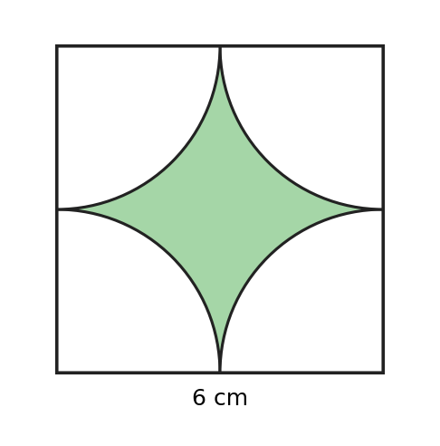{width=30%}

*Lời giải mẫu:*
- Diện tích hình vuông: $6^2 = 36\text{ (cm}^2)$. **(0,25đ)**
- Mỗi hình quạt có góc ở tâm $90^\circ$, bán kính $3\text{ cm}$; bốn hình quạt ghép lại thành một hình tròn bán kính $3\text{ cm}$, diện tích $\pi \cdot 3^2 = 9\pi\text{ (cm}^2)$. **(0,25đ)**
- Diện tích phần còn lại: $36 - 9\pi \approx 36 - 9 \cdot 3{,}14 = 7{,}74\text{ (cm}^2)$. **(0,25đ)**

### 2. Bài tập Trắc nghiệm (8 câu độ khó tăng dần - Ghi chữ cái đứng trước đáp án đúng)
**Câu 20.1 [Độ khó: 4.0/10 - Nhận biết]: Bánh xe đạp có đường kính $70\text{ cm}$. Chu vi bánh xe là (lấy $\pi \approx 3{,}14$):**
> A. $439{,}6\text{ cm}$        B. $109{,}9\text{ cm}$        C. $219{,}8\text{ cm}$        D. $3846{,}5\text{ cm}$

**Câu 20.2 [Độ khó: 4.5/10 - Nhận biết]: Độ dài cung $40^\circ$ của đường tròn bán kính $9\text{ cm}$ là:**
> A. $\pi\text{ cm}$        B. $2\pi\text{ cm}$        C. $4\pi\text{ cm}$        D. $18\pi\text{ cm}$

**Câu 20.3 [Độ khó: 5.0/10 - Nhận biết]: Diện tích hình quạt tròn bán kính $6\text{ cm}$, cung $120^\circ$ là:**
> A. $4\pi\text{ cm}^2$        B. $24\pi\text{ cm}^2$        C. $36\pi\text{ cm}^2$        D. $12\pi\text{ cm}^2$

**Câu 20.4 [Độ khó: 5.0/10 - Nhận biết]: Cho hai đường tròn $(O; 5\text{ cm})$ và $(O'; 3\text{ cm})$ có $OO' = 2\text{ cm}$. Vị trí tương đối của hai đường tròn là:**
> A. cắt nhau        B. tiếp xúc trong        C. tiếp xúc ngoài        D. đựng nhau

**Câu 20.5 [Độ khó: 5.5/10 - Thông hiểu]: Cho hai đường tròn $(O; 4\text{ cm})$ và $(O'; 3\text{ cm})$ có $OO' = 9\text{ cm}$. Số tiếp tuyến chung của hai đường tròn là:**
> A. $4$        B. $3$        C. $2$        D. $1$

**Câu 20.6 [Độ khó: 6.0/10 - Thông hiểu]: Đường tròn $(O; 6\text{ cm})$ có dây $AB = 6\text{ cm}$. Độ dài cung nhỏ $AB$ là:**
> A. $2\pi\text{ cm}$        B. $\pi\text{ cm}$        C. $10\pi\text{ cm}$        D. $6\pi\text{ cm}$

**Câu 20.7 [Độ khó: 6.5/10 - Thông hiểu]: Cho đường tròn $(O; 4\text{ cm})$ và dây $AB$ với $\widehat{AOB} = 90^\circ$. Diện tích hình viên phân giới hạn bởi cung nhỏ $AB$ và dây $AB$ là:**
> A. $(4\pi - 16)\text{ cm}^2$        B. $(16\pi - 8)\text{ cm}^2$        C. $(4\pi - 8)\text{ cm}^2$        D. $(8\pi - 8)\text{ cm}^2$

**Câu 20.8 [Độ khó: 6.5/10 - Thông hiểu]: Một miệng giếng có dạng hình vành khuyên, giới hạn bởi hai đường tròn đồng tâm bán kính $1\text{ m}$ và $0{,}8\text{ m}$. Diện tích miệng giếng là (lấy $\pi \approx 3{,}14$):**
> A. $0{,}1256\text{ m}^2$        B. $5{,}1496\text{ m}^2$        C. $0{,}36\text{ m}^2$        D. $1{,}1304\text{ m}^2$

### 3. Bài tập Tự luận (7 bài độ khó tăng dần - Trình bày chi tiết ra vở)
*(Trong các bài dưới đây, lấy $\pi \approx 3{,}14$.)*

**Bài 20.1 [Độ khó: 4.5/10 - Nhận biết]:**
Một bồn hoa hình tròn bán kính $3\text{ m}$. Xung quanh bồn hoa có một lối đi rộng $1\text{ m}$ (lối đi có dạng hình vành khuyên).
- a) Tính chu vi bồn hoa.
- b) Tính diện tích lối đi.
- c) Người ta lát gạch lối đi với giá $180\,000$ đồng/$\text{m}^2$. Tính số tiền lát lối đi.

**Bài 20.2 [Độ khó: 5.0/10 - Thông hiểu]:**
Cho đường tròn $(O; 5\text{ cm})$.
- a) Đường thẳng $a$ cách tâm $O$ một khoảng $4\text{ cm}$. Xác định vị trí tương đối của $a$ và $(O)$, rồi tính độ dài dây cung mà $(O)$ chắn trên $a$.
- b) Cho đường tròn $(O'; 3\text{ cm})$. Xác định vị trí tương đối của $(O)$ và $(O')$ khi $OO'$ lần lượt bằng $10\text{ cm}$; $8\text{ cm}$; $4\text{ cm}$; $1\text{ cm}$.

**Bài 20.3 [Độ khó: 5.5/10 - Thông hiểu]:**
Một chiếc máy cày có bánh sau đường kính $1{,}2\text{ m}$ và bánh trước đường kính $0{,}8\text{ m}$.
- a) Khi bánh sau quay được $20$ vòng thì máy cày đi được bao nhiêu mét?
- b) Khi đó bánh trước quay được bao nhiêu vòng?
- c) Để đi hết quãng đường $1{,}5\text{ km}$ từ nhà ra cánh đồng, bánh sau phải quay khoảng bao nhiêu vòng (làm tròn đến vòng)?

**Bài 20.4 [Độ khó: 6.0/10 - Thông hiểu]:**
Một thửa đất có dạng hình thang vuông $ABCD$ ($\widehat{A} = \widehat{D} = 90^\circ$) với đáy lớn $AB = 10\text{ m}$, đáy nhỏ $CD = 6\text{ m}$, cạnh $AD = 6\text{ m}$. Người ta đào một cái ao có dạng nửa hình tròn đường kính $AD$ nằm trong thửa đất; phần còn lại trồng rau.

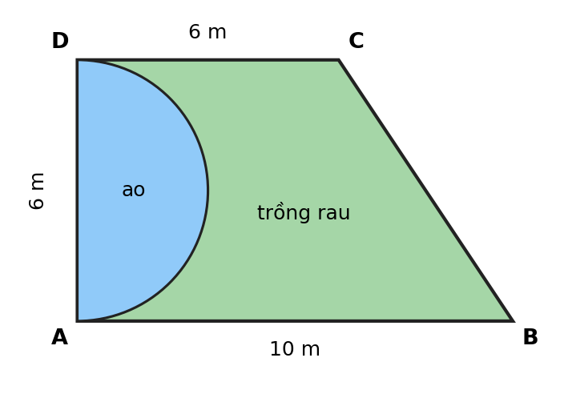{width=50%}

- a) Tính chu vi của ao (gồm nửa đường tròn và đường kính $AD$), làm tròn đến $0{,}01\text{ m}$.
- b) Tính diện tích phần đất trồng rau, làm tròn đến $0{,}01\text{ m}^2$.

**Bài 20.5 [Độ khó: 6.5/10 - Vận dụng]:**
Một mảnh vườn hình vuông $ABCD$ cạnh $8\text{ m}$. Người ta trồng hoa trên ba phần: hình quạt tâm $A$ và hình quạt tâm $B$ cùng có bán kính $4\text{ m}$, góc ở tâm $90^\circ$; nửa hình tròn đường kính $CD$ nằm trong mảnh vườn. Phần còn lại trồng cỏ (hình vẽ).

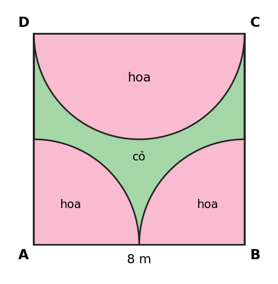{width=40%}

- a) Tính diện tích phần trồng hoa.
- b) Tính diện tích phần trồng cỏ.
- c) Chi phí trồng hoa là $100\,000$ đồng/$\text{m}^2$, trồng cỏ là $40\,000$ đồng/$\text{m}^2$. Tính tổng chi phí.

**Bài 20.6 [Độ khó: 7.0/10 - Vận dụng]:**
Trên một viên gạch hình vuông cạnh $40\text{ cm}$, người ta vẽ bốn nửa đường tròn có đường kính là bốn cạnh của hình vuông, cùng nằm phía trong viên gạch. Phần chung của các nửa hình tròn tạo thành bốn cánh hoa và được tô màu (hình vẽ).

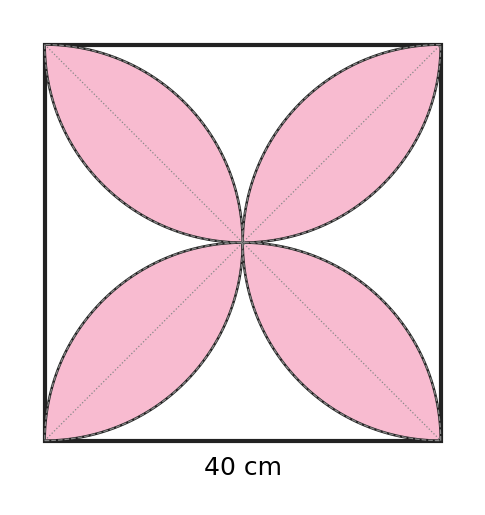{width=40%}

- a) Tính diện tích hình viên phân giới hạn bởi cung $90^\circ$ và dây căng cung của đường tròn bán kính $20\text{ cm}$.
- b) Mỗi cánh hoa gồm hai hình viên phân như ở câu a. Tính diện tích phần được tô màu và phần không tô màu của viên gạch.

**Bài 20.7 [Độ khó: 8.0/10 - Vận dụng] (dạng đề Ninh Bình 2026–2027, Bài 6b):**
Một mảnh đất hình chữ nhật $ABCD$ có $AB = 10\text{ m}$, $AD = 6\text{ m}$. Người ta làm một hồ nước có dạng hình quạt tâm $A$, bán kính $x$ (m) và một bồn hoa có dạng hình quạt tâm $B$, bán kính $y$ (m), cả hai có góc ở tâm $90^\circ$, nằm trong mảnh đất và tiếp xúc nhau trên cạnh $AB$ (tức $x + y = 10$). Chi phí làm hồ là $200$ nghìn đồng/$\text{m}^2$, làm bồn hoa là $300$ nghìn đồng/$\text{m}^2$.

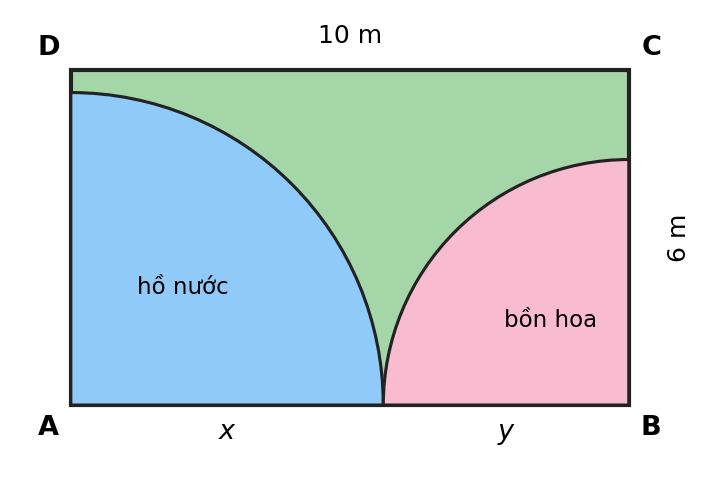{width=50%}

- a) Tìm điều kiện của $x$. Tính tổng chi phí khi $x = y = 5$.
- b) Tìm $x$ để tổng chi phí nhỏ nhất và tính chi phí nhỏ nhất đó.

> 🔒 **LƯU Ý TRA CỨU ĐÁP ÁN:** Em hãy tự giải ra vở trước, không xem đáp án trước. Khi làm xong, hãy lật xem **LỜI GIẢI CHỦ ĐỀ 20** ở phần cuối tài liệu.

---

```{=openxml}
<w:p><w:r><w:br w:type="page"/></w:r></w:p>
```

# ĐÁP ÁN & LỜI GIẢI CHI TIẾT CHỦ ĐỀ 17 – 20

*Chỉ đối chiếu phần này SAU KHI đã tự làm xong bài ra vở. Các bước có ghi (0,25đ) là gợi ý barem để em tự chấm.*

### Lời giải Chủ đề 17 (Bất đẳng thức, Bất phương trình bậc nhất một ẩn & Phương trình quy về phương trình bậc nhất)

**Đáp án trắc nghiệm:**

| Câu | Đáp án | Giải thích ngắn |
| :---: | :---: | :--- |
| 17.1 | **D** | Dạng $ax + b \ge 0$ với $a = 2 \neq 0$; A có $a = 0$, B là bậc hai, C có ẩn ở mẫu. |
| 17.2 | **C** | $3x > 9 \Leftrightarrow x > 3$; chỉ có $4$ thỏa mãn ($x = 3$ cho $2 > 2$ là sai). |
| 17.3 | **B** | Cộng $-5$ vào hai vế thì giữ chiều; A, D nhân với số âm phải đổi chiều; C sai chiều. |
| 17.4 | **A** | $-3x \le 6 \Leftrightarrow x \ge -2$ (chia hai vế cho $-3$ nên đổi chiều). |
| 17.5 | **D** | $2x - 1 = 0 \Leftrightarrow x = \frac{1}{2}$; $x + 3 = 0 \Leftrightarrow x = -3$. |
| 17.6 | **B** | Cần $x + 2 \neq 0$ và $x - 1 \neq 0$, tức $x \neq -2$ và $x \neq 1$. |
| 17.7 | **C** | ĐKXĐ $x \neq 1$; khử mẫu được $x + 3 = 4 \Leftrightarrow x = 1$ (loại) nên phương trình vô nghiệm. |
| 17.8 | **A** | $\frac{21 + x}{4} \ge 7{,}5 \Leftrightarrow x \ge 9$; số điểm nhỏ nhất là $9$. |

**Lời giải tự luận:**

**Bài 17.1:**
*Lời giải:*
- **a)** $(3x - 6)(2x + 5) = 0 \Leftrightarrow 3x - 6 = 0$ hoặc $2x + 5 = 0$. **(0,25đ)**
  $\Leftrightarrow x = 2$ hoặc $x = -\dfrac{5}{2}$. Vậy tập nghiệm $S = \left\{2; -\dfrac{5}{2}\right\}$. **(0,25đ)**
- **b)** Chuyển vế: $(x - 2)(2x + 1) - (x - 2)(x + 4) = 0 \Leftrightarrow (x - 2)\left[(2x + 1) - (x + 4)\right] = 0 \Leftrightarrow (x - 2)(x - 3) = 0$. **(0,25đ)**
  $\Leftrightarrow x = 2$ hoặc $x = 3$. Vậy $S = \{2; 3\}$. **(0,25đ)**
  *Lưu ý:* Nếu chia hai vế cho $x - 2$ ngay từ đầu thì chỉ còn $2x + 1 = x + 4 \Leftrightarrow x = 3$, **mất nghiệm** $x = 2$.

**Kết luận:** a) $S = \left\{2; -\dfrac{5}{2}\right\}$; b) $S = \{2; 3\}$.

**Bài 17.2:**
*Lời giải:*
- **a)** $2x - 5 \ge 3 \Leftrightarrow 2x \ge 8 \Leftrightarrow x \ge 4$. Vậy nghiệm của bất phương trình là $x \ge 4$. **(0,25đ)**
  Biểu diễn: gạch bỏ phần bên trái điểm $4$, dùng ngoặc vuông "[" tại điểm $4$ (vì $4$ thuộc tập nghiệm). **(0,25đ)**
- **b)** $5 - 2x > 3x - 10 \Leftrightarrow -2x - 3x > -10 - 5 \Leftrightarrow -5x > -15 \Leftrightarrow x < 3$ (chia hai vế cho $-5 < 0$ nên đổi chiều). **(0,25đ)**
  Biểu diễn: gạch bỏ phần bên phải điểm $3$, dùng ngoặc tròn ")" tại điểm $3$ (vì $3$ không thuộc tập nghiệm). **(0,25đ)**

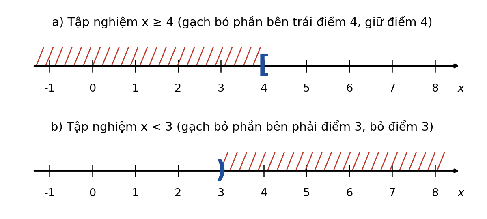{width=75%}

**Kết luận:** a) $x \ge 4$; b) $x < 3$.

**Bài 17.3:**
*Lời giải:*
- **a)** Mẫu chung là $6$. Nhân hai vế với $6 > 0$ (giữ nguyên chiều): $$3(x + 1) - 2(2x - 1) < x + 6 \quad \text{(0,25đ)}$$
  $\Leftrightarrow 3x + 3 - 4x + 2 < x + 6 \Leftrightarrow -x + 5 < x + 6$. **(0,25đ)**
  $\Leftrightarrow -2x < 1 \Leftrightarrow x > -\dfrac{1}{2}$ (chia hai vế cho $-2 < 0$ nên đổi chiều). **(0,25đ)**
- **b)** Các nghiệm thỏa mãn $x > -\dfrac{1}{2} = -0{,}5$. Số nguyên nhỏ nhất lớn hơn $-0{,}5$ là $0$. **(0,25đ)**

**Kết luận:** a) $x > -\dfrac{1}{2}$; b) nghiệm nguyên nhỏ nhất là $x = 0$.

**Bài 17.4:**
*Lời giải:*
- **a)** ĐKXĐ: $x \neq 0$ và $x \neq 2$. **(0,25đ)**
  Quy đồng mẫu chung $x(x - 2)$ rồi khử mẫu: $x(x + 2) - 2(x - 2) = 8$. **(0,25đ)**
  $\Leftrightarrow x^2 + 2x - 2x + 4 = 8 \Leftrightarrow x^2 = 4 \Leftrightarrow x = 2$ hoặc $x = -2$. **(0,25đ)**
  Đối chiếu ĐKXĐ: $x = 2$ **không thỏa mãn** (loại); $x = -2$ thỏa mãn. Vậy $S = \{-2\}$. **(0,25đ)**
- **b)** ĐKXĐ: $x \neq 0$, $x \neq 1$, $x \neq -1$. **(0,25đ)**
  Quy đồng mẫu chung $x(x - 1)(x + 1)$ rồi khử mẫu: $x(x + 1) + 2x(x - 1) = 3(x - 1)(x + 1)$. **(0,25đ)**
  $\Leftrightarrow x^2 + x + 2x^2 - 2x = 3x^2 - 3 \Leftrightarrow 3x^2 - x = 3x^2 - 3 \Leftrightarrow -x = -3 \Leftrightarrow x = 3$. **(0,25đ)**
  Đối chiếu: $x = 3$ thỏa mãn ĐKXĐ. Vậy $S = \{3\}$. **(0,25đ)**

**Kết luận:** a) $S = \{-2\}$; b) $S = \{3\}$.

**Bài 17.5:**
*Lời giải:* (Đơn vị tiền: nghìn đồng.)
Gọi $x$ (chiếc) là số bánh lớp 9A bán được, điều kiện: $x$ là số tự nhiên. **(0,25đ)**
Tổng tiền bán được là $60x$; tổng chi phí là $300 + 45x$. Tiền lãi là: $$60x - (300 + 45x) = 15x - 300 \quad \text{(0,25đ)}$$
- **a)** Không bị lỗ khi tiền lãi không âm: $15x - 300 \ge 0 \Leftrightarrow 15x \ge 300 \Leftrightarrow x \ge 20$. **(0,25đ)**
  Vậy lớp 9A phải bán được ít nhất $20$ chiếc bánh. **(0,25đ)**
- **b)** Lãi không dưới $1\,000$ nghìn đồng: $15x - 300 \ge 1\,000 \Leftrightarrow 15x \ge 1\,300 \Leftrightarrow x \ge \dfrac{260}{3} \approx 86{,}67$. **(0,25đ)**
  Vì $x$ là số tự nhiên nhỏ nhất thỏa mãn nên $x = 87$ (thử lại: $15 \cdot 87 - 300 = 1\,005 \ge 1\,000$; còn $15 \cdot 86 - 300 = 990 < 1\,000$). **(0,25đ)**

**Kết luận:** a) Ít nhất $20$ chiếc bánh; b) Ít nhất $87$ chiếc bánh.

**Bài 17.6:**
*Lời giải:* (Đơn vị tiền: nghìn đồng.)
- **a)** Dùng $25$ m³ gồm: $10$ m³ bậc 1, $10$ m³ bậc 2 và $25 - 20 = 5$ m³ bậc 3. **(0,25đ)**
  Tiền nước: $10 \cdot 6 + 10 \cdot 7 + 5 \cdot 9 = 60 + 70 + 45 = 175$ (nghìn đồng). **(0,25đ)**
- **b)** Gọi $x$ (m³) là lượng nước gia đình dùng trong một tháng, điều kiện: $x$ là số tự nhiên. **(0,25đ)**
  Nếu $x \le 20$ thì tiền nước không quá $60 + 70 = 130 < 200$, luôn thỏa mãn nhưng chưa phải lớn nhất. Ta xét $x > 20$, khi đó tiền nước là $130 + 9(x - 20)$. **(0,25đ)**
  Ta có bất phương trình: $130 + 9(x - 20) \le 200 \Leftrightarrow 9(x - 20) \le 70 \Leftrightarrow x - 20 \le \dfrac{70}{9} \Leftrightarrow x \le \dfrac{250}{9} \approx 27{,}78$. **(0,25đ)**
  Vì $x$ là số tự nhiên lớn nhất thỏa mãn nên $x = 27$ (thử lại: dùng $27$ m³ hết $130 + 9 \cdot 7 = 193 \le 200$; dùng $28$ m³ hết $130 + 9 \cdot 8 = 202 > 200$). **(0,25đ)**

**Kết luận:** a) $175$ nghìn đồng; b) Tối đa $27$ m³ nước mỗi tháng.

---

### Lời giải Chủ đề 18 (Tính giá trị & Chứng minh đẳng thức số chứa căn)

**Đáp án trắc nghiệm:**

| Câu | Đáp án | Giải thích ngắn |
| :---: | :---: | :--- |
| 18.1 | **D** | $(-4)^3 = -64$ nên $\sqrt[3]{-64} = -4$; căn bậc ba của số âm vẫn xác định. |
| 18.2 | **B** | $-3 < 0$ nên $-3\sqrt{2} = -\sqrt{3^2 \cdot 2} = -\sqrt{18}$. |
| 18.3 | **B** | $2 = \sqrt{4} < \sqrt{5}$ nên $\sqrt{(2 - \sqrt{5})^2} = \lvert 2 - \sqrt{5} \rvert = \sqrt{5} - 2$. |
| 18.4 | **A** | $\dfrac{2(\sqrt{3} - 1)}{(\sqrt{3} + 1)(\sqrt{3} - 1)} = \dfrac{2(\sqrt{3} - 1)}{2} = \sqrt{3} - 1$. |
| 18.5 | **C** | $(\sqrt{3} - 1)^2 = 3 - 2\sqrt{3} + 1 = 4 - 2\sqrt{3}$; A, B cho $7 - 4\sqrt{3}$. |
| 18.6 | **D** | $7 - 4\sqrt{3} = (2 - \sqrt{3})^2$ nên biểu thức bằng $(2 - \sqrt{3}) + \sqrt{3} = 2$. |

**Lời giải tự luận:**

**Bài 18.1:**
*Lời giải:*
- **a)** $\sqrt{12} = \sqrt{4 \cdot 3} = 2\sqrt{3}$; $\sqrt{27} = \sqrt{9 \cdot 3} = 3\sqrt{3}$; $\sqrt{48} = \sqrt{16 \cdot 3} = 4\sqrt{3}$. **(0,25đ)**
  $A = 2\sqrt{3} + 3\sqrt{3} - 4\sqrt{3} = \sqrt{3}$. **(0,25đ)**
- **b)** $\sqrt[3]{-125} = -5$ (vì $(-5)^3 = -125$); $\dfrac{\sqrt[3]{54}}{\sqrt[3]{2}} = \sqrt[3]{\dfrac{54}{2}} = \sqrt[3]{27} = 3$. **(0,25đ)**
  $B = -5 + 3 = -2$. **(0,25đ)**
- **c)** Đưa thừa số vào trong dấu căn: $3\sqrt{5} = \sqrt{9 \cdot 5} = \sqrt{45}$; $2\sqrt{11} = \sqrt{4 \cdot 11} = \sqrt{44}$. **(0,25đ)**
  Vì $45 > 44$ nên $\sqrt{45} > \sqrt{44}$, tức $3\sqrt{5} > 2\sqrt{11}$. **(0,25đ)**

**Kết luận:** a) $A = \sqrt{3}$; b) $B = -2$; c) $3\sqrt{5} > 2\sqrt{11}$.

**Bài 18.2:**
*Lời giải:*
- **a)** $A = |\sqrt{5} + 1| - (\sqrt{5} \cdot \sqrt{5} + \sqrt{5}) = \sqrt{5} + 1 - (5 + \sqrt{5})$ (vì $\sqrt{5} + 1 > 0$). **(0,25đ)**
  $A = \sqrt{5} + 1 - 5 - \sqrt{5} = -4$. **(0,25đ)**
- **b)** Vì $7 < 9$ nên $\sqrt{7} < 3$, suy ra $\sqrt{(\sqrt{7} - 3)^2} = |\sqrt{7} - 3| = 3 - \sqrt{7}$. **(0,25đ)**
  Vì $7 > 4$ nên $\sqrt{7} > 2$, suy ra $\sqrt{(\sqrt{7} - 2)^2} = |\sqrt{7} - 2| = \sqrt{7} - 2$. **(0,25đ)**
  $B = (3 - \sqrt{7}) + (\sqrt{7} - 2) = 1$. **(0,25đ)**

**Kết luận:** a) $A = -4$; b) $B = 1$.

**Bài 18.3:**
*Lời giải:*
- **a)** $\dfrac{3}{\sqrt{5} - \sqrt{2}} = \dfrac{3(\sqrt{5} + \sqrt{2})}{(\sqrt{5} - \sqrt{2})(\sqrt{5} + \sqrt{2})} = \dfrac{3(\sqrt{5} + \sqrt{2})}{5 - 2} = \sqrt{5} + \sqrt{2}$. **(0,25đ)**
  $\dfrac{4}{\sqrt{6} + \sqrt{2}} = \dfrac{4(\sqrt{6} - \sqrt{2})}{6 - 2} = \sqrt{6} - \sqrt{2}$. **(0,25đ)**
  $C = (\sqrt{5} + \sqrt{2}) + (\sqrt{6} - \sqrt{2}) - \sqrt{5} = \sqrt{6}$. **(0,25đ)**
- **b)** Phân tích tử thành nhân tử: $\dfrac{\sqrt{15} - \sqrt{5}}{\sqrt{3} - 1} = \dfrac{\sqrt{5}(\sqrt{3} - 1)}{\sqrt{3} - 1} = \sqrt{5}$. **(0,25đ)**
  $\dfrac{10}{\sqrt{5}} = \dfrac{10\sqrt{5}}{5} = 2\sqrt{5}$. Vậy $D = \sqrt{5} - 2\sqrt{5} = -\sqrt{5}$. **(0,25đ)**

**Kết luận:** a) $C = \sqrt{6}$; b) $D = -\sqrt{5}$.

**Bài 18.4:**
*Lời giải:*
- **a)** Ta có $11 - 4\sqrt{7} = 7 - 2 \cdot 2 \cdot \sqrt{7} + 4 = (\sqrt{7} - 2)^2$. Vì $\sqrt{7} > 2$ nên $\sqrt{11 - 4\sqrt{7}} = |\sqrt{7} - 2| = \sqrt{7} - 2$. **(0,25đ)**
  $\dfrac{6}{\sqrt{7} + 1} = \dfrac{6(\sqrt{7} - 1)}{(\sqrt{7} + 1)(\sqrt{7} - 1)} = \dfrac{6(\sqrt{7} - 1)}{6} = \sqrt{7} - 1$. **(0,25đ)**
  $\text{VT} = (\sqrt{7} - 2) - (\sqrt{7} - 1) = -1 = \text{VP}$. Vậy đẳng thức được chứng minh. **(0,25đ)**
- **b)** $4 + 2\sqrt{3} = 3 + 2\sqrt{3} + 1 = (\sqrt{3} + 1)^2$; $4 - 2\sqrt{3} = (\sqrt{3} - 1)^2$. **(0,25đ)**
  $\text{VT} = |\sqrt{3} + 1| - |\sqrt{3} - 1| = (\sqrt{3} + 1) - (\sqrt{3} - 1) = 2 = \text{VP}$ (vì $\sqrt{3} > 1$). Vậy đẳng thức được chứng minh. **(0,25đ)**

**Bài 18.5:**
*Lời giải:*
- **a)** $\sqrt[3]{(1 - \sqrt{2})^3} = 1 - \sqrt{2}$ (căn bậc ba giữ nguyên dấu). **(0,25đ)**
  $\sqrt{(1 - \sqrt{2})^2} = |1 - \sqrt{2}| = \sqrt{2} - 1$ (vì $\sqrt{2} > 1$). Vậy $E = (1 - \sqrt{2}) + (\sqrt{2} - 1) = 0$. **(0,25đ)**
- **b)** $F = \sqrt[3]{(2 - \sqrt{5})(2 + \sqrt{5})} = \sqrt[3]{4 - 5} = \sqrt[3]{-1} = -1$. **(0,25đ)**
- **c)** $(1 + \sqrt{2})^3 = 1 + 3\sqrt{2} + 3 \cdot (\sqrt{2})^2 + (\sqrt{2})^3 = 1 + 3\sqrt{2} + 6 + 2\sqrt{2} = 7 + 5\sqrt{2}$. **(0,25đ)**
  Suy ra $\sqrt[3]{7 + 5\sqrt{2}} = \sqrt[3]{(1 + \sqrt{2})^3} = 1 + \sqrt{2}$, nên $\text{VT} = 1 + \sqrt{2} - \sqrt{2} = 1 = \text{VP}$. Vậy đẳng thức được chứng minh. **(0,25đ)**

**Kết luận:** a) $E = 0$; b) $F = -1$; c) đã chứng minh.

**Bài 18.6:**
*Lời giải:*
- **a)** $\dfrac{\sqrt{14} - \sqrt{7}}{1 - \sqrt{2}} = \dfrac{\sqrt{7}(\sqrt{2} - 1)}{-(\sqrt{2} - 1)} = -\sqrt{7}$; $\dfrac{\sqrt{15} - \sqrt{5}}{1 - \sqrt{3}} = \dfrac{\sqrt{5}(\sqrt{3} - 1)}{-(\sqrt{3} - 1)} = -\sqrt{5}$. **(0,25đ)**
  Biểu thức trong ngoặc bằng $-(\sqrt{7} + \sqrt{5})$. Chia cho $\dfrac{1}{\sqrt{7} - \sqrt{5}}$ tức là nhân với $\sqrt{7} - \sqrt{5}$: **(0,25đ)**
  $$\text{VT} = -(\sqrt{7} + \sqrt{5})(\sqrt{7} - \sqrt{5}) = -(7 - 5) = -2 = \text{VP}.$$
  Vậy đẳng thức được chứng minh. **(0,25đ)**
- **b)** $2 + \sqrt{3} = \dfrac{4 + 2\sqrt{3}}{2} = \dfrac{(\sqrt{3} + 1)^2}{2}$ nên $\sqrt{2 + \sqrt{3}} = \dfrac{\sqrt{3} + 1}{\sqrt{2}}$; tương tự $\sqrt{2 - \sqrt{3}} = \dfrac{\sqrt{3} - 1}{\sqrt{2}}$. **(0,25đ)**
  $\text{VT} = \dfrac{(\sqrt{3} + 1) - (\sqrt{3} - 1)}{\sqrt{2}} = \dfrac{2}{\sqrt{2}} = \sqrt{2} = \text{VP}$. Vậy đẳng thức được chứng minh. **(0,25đ)**

---

### Lời giải Chủ đề 19 (Tỉ số lượng giác & Giải tam giác vuông trong thực tế)

**Đáp án trắc nghiệm:**

| Câu | Đáp án | Giải thích ngắn |
| :---: | :---: | :--- |
| 19.1 | **B** | Hai góc phụ nhau: $\cos(90^\circ - \alpha) = \sin\alpha = 0{,}6$. |
| 19.2 | **A** | $\sin 30^\circ + \cos 60^\circ = \dfrac{1}{2} + \dfrac{1}{2} = 1$. |
| 19.3 | **D** | $AB$ là cạnh kề của góc $B$: $AB = BC \cdot \cos B$; A, B nhầm sin/cos; C phải là $AC = AB \cdot \tan B$. |
| 19.4 | **C** | $\cos\alpha = \dfrac{1{,}8}{5} = 0{,}36 \Rightarrow \alpha \approx 68{,}9^\circ \approx 69^\circ$ (A là góc giữa thang và tường). |
| 19.5 | **B** | Góc nâng từ thuyền bằng góc hạ $25^\circ$: khoảng cách $= \dfrac{40}{\tan 25^\circ} \approx 85{,}8 \approx 86\text{ m}$. |
| 19.6 | **A** | Mặt dốc là cạnh huyền: $120 \sin 6^\circ \approx 12{,}54 \approx 12{,}5\text{ m}$ (B dùng nhầm $\tan$). |

**Lời giải tự luận:**

**Bài 19.1:**
*Lời giải:*
- $\widehat{C} = 90^\circ - \widehat{B} = 90^\circ - 35^\circ = 55^\circ$. **(0,25đ)**
- $AC = BC \cdot \sin B = 10 \sin 35^\circ \approx 5{,}74\text{ (cm)}$. **(0,25đ)**
- $AB = BC \cdot \cos B = 10 \cos 35^\circ \approx 8{,}19\text{ (cm)}$. **(0,25đ)**

**Kết luận:** $\widehat{C} = 55^\circ$, $AC \approx 5{,}74\text{ cm}$, $AB \approx 8{,}19\text{ cm}$.

**Bài 19.2:**
*Lời giải:*
- **a)** Gọi chiều cao tháp là $h$. Tháp vuông góc với mặt đất nên $h$ và bóng tháp là hai cạnh góc vuông, góc $52^\circ$ đối diện với $h$. **(0,25đ)**
  $h = 18 \cdot \tan 52^\circ \approx 23{,}0\text{ (m)}$. **(0,25đ)**
- **b)** Gọi $\beta$ là góc tạo bởi tia nắng và mặt đất: $\tan\beta = \dfrac{h}{25} = \dfrac{18 \tan 52^\circ}{25} \approx 0{,}922$. **(0,25đ)**
  Suy ra $\beta \approx 43^\circ$. **(0,25đ)**

**Kết luận:** a) Tháp cao khoảng $23{,}0\text{ m}$; b) góc khoảng $43^\circ$.

**Bài 19.3:**
*Lời giải:*
- Gọi $M$ là mắt Minh, $D$ là đỉnh cột cờ, $K$ là điểm trên cột cờ ngang tầm mắt. Tam giác $MKD$ vuông tại $K$ có $MK = 15\text{ m}$, $\widehat{DMK} = 32^\circ$. **(0,25đ)**
- $DK = MK \cdot \tan 32^\circ = 15 \tan 32^\circ \approx 9{,}37\text{ (m)}$. **(0,25đ)**
- Chiều cao cột cờ: $DK + 1{,}5 \approx 9{,}37 + 1{,}5 \approx 10{,}9\text{ (m)}$. **(0,25đ)**

**Kết luận:** Cột cờ cao khoảng $10{,}9\text{ m}$.

**Bài 19.4:**
*Lời giải:*
- **a)** Hai góc $\widehat{CAB}$, $\widehat{CBA}$ đều nhọn nên $H$ nằm giữa $A$ và $B$: $AH + HB = 60$. **(0,25đ)**
  Tam giác $AHC$ vuông tại $H$: $AH = CH \cdot \cot 45^\circ = CH$. Tam giác $BHC$ vuông tại $H$: $HB = CH \cdot \cot 60^\circ = \dfrac{CH}{\sqrt{3}}$. **(0,25đ)**
  $CH + \dfrac{CH}{\sqrt{3}} = 60 \Leftrightarrow CH = \dfrac{60\sqrt{3}}{\sqrt{3} + 1} = 30(3 - \sqrt{3}) \approx 38{,}04\text{ (m)}$. **(0,25đ)**
- **b)** Tam giác $AHC$ vuông cân tại $H$ nên $AC = CH\sqrt{2} \approx 53{,}8\text{ (m)}$. **(0,25đ)**

**Kết luận:** a) Sông rộng khoảng $38{,}04\text{ m}$; b) $AC \approx 53{,}8\text{ m}$.

**Bài 19.5:**
*Lời giải:*
- **a)** $40$ phút $= \dfrac{2}{3}$ giờ. Quãng đường $AC = 30 \cdot \dfrac{2}{3} = 20\text{ (km)}$. **(0,25đ)**
- **b)** Tam giác $ABC$ vuông tại $B$, $\widehat{CAB} = 35^\circ$: **(0,25đ)**
  $CB = AC \cdot \sin 35^\circ = 20 \sin 35^\circ \approx 11{,}47\text{ (km)}$; $AB = AC \cdot \cos 35^\circ = 20 \cos 35^\circ \approx 16{,}38\text{ (km)}$. **(0,25đ)**
- **c)** Thời gian vào bờ: $\dfrac{CB}{25} \approx \dfrac{11{,}47}{25} \approx 0{,}459\text{ (giờ)} \approx 28$ phút. **(0,25đ)**

**Kết luận:** a) $20\text{ km}$; b) $CB \approx 11{,}47\text{ km}$, $AB \approx 16{,}38\text{ km}$; c) khoảng $28$ phút.

**Bài 19.6:**
*Lời giải:*
- Gọi $T$ là đỉnh cột, $K$ là điểm trên cột ngang tầm mắt hai bạn; $A'$, $B'$ là vị trí mắt An, Bình. Đặt $x = A'K$ (m), $x > 0$; khi đó $B'K = x + 20$. **(0,25đ)**
- Tam giác $A'KT$ vuông tại $K$: $TK = x \tan 40^\circ$. Tam giác $B'KT$ vuông tại $K$: $TK = (x + 20)\tan 28^\circ$. **(0,25đ)**
- Suy ra $x \tan 40^\circ = (x + 20)\tan 28^\circ \Leftrightarrow x = \dfrac{20 \tan 28^\circ}{\tan 40^\circ - \tan 28^\circ} \approx 34{,}6\text{ (m)}$, nên $TK = x\tan 40^\circ \approx 29{,}0\text{ (m)}$. **(0,25đ)**
- Chiều cao cột: $TK + 1{,}6 \approx 30{,}6\text{ (m)}$. **(0,25đ)**

**Kết luận:** Cột ăng-ten cao khoảng $30{,}6\text{ m}$.

---

### Lời giải Chủ đề 20 (Độ dài cung, hình quạt, viên phân, vành khuyên & hai đường tròn)

**Đáp án trắc nghiệm:**

| Câu | Đáp án | Giải thích ngắn |
| :---: | :---: | :--- |
| 20.1 | **C** | $C = \pi d \approx 3{,}14 \cdot 70 = 219{,}8\text{ cm}$ (A dùng $2\pi d$; D là diện tích). |
| 20.2 | **B** | $l = \dfrac{\pi \cdot 9 \cdot 40}{180} = 2\pi$ (A chia nhầm $360$; C dùng đường kính). |
| 20.3 | **D** | $S = \dfrac{\pi \cdot 6^2 \cdot 120}{360} = 12\pi$ (A là độ dài cung; B chia nhầm $180$). |
| 20.4 | **B** | $d = 2 = 5 - 3 = R - r$ nên tiếp xúc trong. |
| 20.5 | **A** | $d = 9 > 4 + 3$ nên hai đường tròn ở ngoài nhau, có $4$ tiếp tuyến chung. |
| 20.6 | **A** | $AB = R$ nên tam giác $OAB$ đều, cung nhỏ $60^\circ$: $l = \dfrac{\pi \cdot 6 \cdot 60}{180} = 2\pi$ (C là cung lớn). |
| 20.7 | **C** | $S_{\text{quạt}} = \dfrac{\pi \cdot 16}{4} = 4\pi$; $S_{OAB} = \dfrac{4 \cdot 4}{2} = 8$; viên phân $= 4\pi - 8$. |
| 20.8 | **D** | $\pi(1^2 - 0{,}8^2) = 0{,}36\pi \approx 1{,}1304\text{ m}^2$ (A dùng nhầm $\pi(R - r)^2$; C quên $\pi$). |

**Lời giải tự luận:**

**Bài 20.1:**
*Lời giải:*
- **a)** Chu vi bồn hoa: $C = 2\pi \cdot 3 = 6\pi \approx 18{,}84\text{ (m)}$. **(0,25đ)**
- **b)** Lối đi là hình vành khuyên giới hạn bởi hai đường tròn đồng tâm bán kính $3 + 1 = 4\text{ (m)}$ và $3\text{ m}$. **(0,25đ)**
  Diện tích lối đi: $\pi(4^2 - 3^2) = 7\pi \approx 21{,}98\text{ (m}^2)$. **(0,25đ)**
- **c)** Số tiền lát lối đi: $21{,}98 \cdot 180\,000 = 3\,956\,400$ (đồng). **(0,25đ)**

**Kết luận:** a) $18{,}84\text{ m}$; b) $21{,}98\text{ m}^2$; c) $3\,956\,400$ đồng.

**Bài 20.2:**
*Lời giải:*
- **a)** $d = 4 < R = 5$ nên đường thẳng $a$ cắt $(O)$ tại hai điểm $M$, $N$. **(0,25đ)**
  Gọi $H$ là chân đường vuông góc kẻ từ $O$ xuống $a$ thì $H$ là trung điểm $MN$ và $MH = \sqrt{OM^2 - OH^2} = \sqrt{25 - 16} = 3\text{ (cm)}$, nên $MN = 6\text{ cm}$. **(0,25đ)**
- **b)** $R + r = 8$, $R - r = 2$. **(0,25đ)**
  - $OO' = 10 > 8$: hai đường tròn ở ngoài nhau. $OO' = 8 = R + r$: tiếp xúc ngoài.
  - $2 < OO' = 4 < 8$: cắt nhau. $OO' = 1 < 2$: đựng nhau ($(O)$ đựng $(O')$). **(0,25đ)**

**Bài 20.3:**
*Lời giải:*
- **a)** Mỗi vòng quay, bánh sau lăn được một đoạn bằng chu vi bánh: $1{,}2\pi\text{ (m)}$. Đi $20$ vòng: $20 \cdot 1{,}2\pi = 24\pi \approx 75{,}36\text{ (m)}$. **(0,25đ)**
- **b)** Chu vi bánh trước: $0{,}8\pi\text{ (m)}$. Số vòng bánh trước: $\dfrac{24\pi}{0{,}8\pi} = 30$ (vòng). **(0,25đ)**
- **c)** $1{,}5\text{ km} = 1500\text{ m}$. Số vòng bánh sau: $\dfrac{1500}{1{,}2 \cdot 3{,}14} \approx 398$ (vòng). **(0,25đ)**

**Bài 20.4:**
*Lời giải:*
- **a)** Nửa đường tròn đường kính $AD = 6\text{ m}$ (bán kính $3\text{ m}$) có độ dài $\dfrac{2\pi \cdot 3}{2} = 3\pi\text{ (m)}$. **(0,25đ)**
  Chu vi ao: $3\pi + 6 \approx 3 \cdot 3{,}14 + 6 = 15{,}42\text{ (m)}$. **(0,25đ)**
- **b)** Diện tích thửa đất: $S_{ABCD} = \dfrac{(AB + CD) \cdot AD}{2} = \dfrac{(10 + 6) \cdot 6}{2} = 48\text{ (m}^2)$. **(0,25đ)**
  Diện tích ao: $\dfrac{\pi \cdot 3^2}{2} = 4{,}5\pi\text{ (m}^2)$. Diện tích trồng rau: $48 - 4{,}5\pi \approx 48 - 14{,}13 = 33{,}87\text{ (m}^2)$. **(0,25đ)**

**Kết luận:** a) $15{,}42\text{ m}$; b) $33{,}87\text{ m}^2$.

**Bài 20.5:**
*Lời giải:*
- **a)** Mỗi hình quạt $90^\circ$ bán kính $4\text{ m}$ có diện tích $\dfrac{\pi \cdot 4^2}{4} = 4\pi\text{ (m}^2)$. **(0,25đ)**
  Nửa hình tròn đường kính $CD = 8\text{ m}$ (bán kính $4\text{ m}$) có diện tích $\dfrac{\pi \cdot 4^2}{2} = 8\pi\text{ (m}^2)$. **(0,25đ)**
  Các phần trồng hoa không chồng lên nhau (khoảng cách từ trung điểm $CD$ đến $A$ là $\sqrt{8^2 + 4^2} = \sqrt{80} > 4 + 4$), nên diện tích trồng hoa: $4\pi + 4\pi + 8\pi = 16\pi \approx 50{,}24\text{ (m}^2)$. **(0,25đ)**
- **b)** Diện tích trồng cỏ: $8^2 - 50{,}24 = 13{,}76\text{ (m}^2)$. **(0,25đ)**
- **c)** Tổng chi phí: $50{,}24 \cdot 100\,000 + 13{,}76 \cdot 40\,000 = 5\,024\,000 + 550\,400 = 5\,574\,400$ (đồng). **(0,25đ)**

**Kết luận:** a) $50{,}24\text{ m}^2$; b) $13{,}76\text{ m}^2$; c) $5\,574\,400$ đồng.

**Bài 20.6:**
*Lời giải:*
- **a)** Hình quạt $90^\circ$, bán kính $20\text{ cm}$ có diện tích $\dfrac{\pi \cdot 20^2}{4} = 100\pi\text{ (cm}^2)$; tam giác vuông cân tạo bởi hai bán kính và dây có diện tích $\dfrac{20 \cdot 20}{2} = 200\text{ (cm}^2)$. **(0,25đ)**
  Diện tích hình viên phân: $100\pi - 200 \approx 314 - 200 = 114\text{ (cm}^2)$. **(0,25đ)**
- **b)** Bốn cánh hoa gồm $8$ hình viên phân: diện tích phần tô màu $\approx 8 \cdot 114 = 912\text{ (cm}^2)$. **(0,25đ)**
  Diện tích phần không tô màu: $40^2 - 912 = 1600 - 912 = 688\text{ (cm}^2)$. **(0,25đ)**
  *(Giải thích: cánh hoa nối một đỉnh với tâm viên gạch; đường chéo chia cánh hoa thành hai hình viên phân, mỗi hình có tâm là trung điểm một cạnh, bán kính $20\text{ cm}$, cung $90^\circ$.)*

**Kết luận:** a) $114\text{ cm}^2$; b) phần tô màu $912\text{ cm}^2$, phần không tô màu $688\text{ cm}^2$.

**Bài 20.7:**
*Lời giải:*
- **a)** Hình quạt tâm $A$ nằm trong mảnh đất nên $x \le AD = 6$; tương tự $y = 10 - x \le 6$, suy ra $x \ge 4$. Vậy điều kiện: $4 \le x \le 6$. **(0,25đ)**
  Diện tích hồ: $\dfrac{\pi x^2}{4}$; diện tích bồn hoa: $\dfrac{\pi y^2}{4}$. Tổng chi phí (nghìn đồng): $T = 200 \cdot \dfrac{\pi x^2}{4} + 300 \cdot \dfrac{\pi (10 - x)^2}{4}$. **(0,25đ)**
  Khi $x = y = 5$: $T = 200 \cdot \dfrac{25\pi}{4} + 300 \cdot \dfrac{25\pi}{4} = 3125\pi \approx 9812{,}5$ (nghìn đồng). **(0,25đ)**
- **b)** $T = \dfrac{\pi}{4}\left[200x^2 + 300(100 - 20x + x^2)\right] = \pi(125x^2 - 1500x + 7500) = 125\pi\left[(x - 6)^2 + 24\right]$. **(0,25đ)**
  Vì $(x - 6)^2 \ge 0$ nên $T \ge 125\pi \cdot 24 = 3000\pi \approx 9420$ (nghìn đồng); dấu "=" xảy ra khi $x = 6$ (thỏa mãn $4 \le x \le 6$), khi đó $y = 4$. **(0,25đ)**

**Kết luận:** Chi phí nhỏ nhất khoảng $9\,420\,000$ đồng khi hồ nước có bán kính $6\text{ m}$, bồn hoa có bán kính $4\text{ m}$.

---

