# SỔ TAY BỔ SUNG – CHƯƠNG TRÌNH GDPT 2018
# PHẦN 2: HỌC KỲ II (CHỦ ĐỀ 21 – 25)
## ÔN THI VÀO LỚP 10 MÔN TOÁN – CẤU TRÚC ĐỀ SỞ GD&ĐT NINH BÌNH (MỤC TIÊU 8,0 – 8,5 ĐIỂM)
*Tiếp theo Phần 1 (Chủ đề 17 – 20). Bảng tổng quan các chủ đề 17 – 25 và cách dùng xem ở đầu Phần 1. Lời giải chi tiết ở cuối tài liệu này.*

---

# PHẦN 6: BỔ SUNG HỌC KỲ II (CHƯƠNG VI – X)

## Chủ đề 21: Định lí Vi-ét với biểu thức KHÔNG đối xứng & Phương trình bậc hai trong thực tế (ý cuối Bài 3 đề thi)

*(Ý cuối Bài 3 của đề mới thường cho biểu thức không đối xứng giữa $x_1$ và $x_2$: Nam Định 2025–2026 yêu cầu tính $A = \sqrt{-13x_1 + 2} - x_2$; Ninh Bình 2026–2027 yêu cầu tính $C = x_1^2 - x_1x_2^2 + 2026$. Kỹ thuật chung: **dùng chính phương trình để hạ bậc** rồi đưa về tổng $S$ và tích $P$.)*

### 1. Lý thuyết cốt lõi cần nhớ
- **Định lí Vi-ét:** nếu $ax^2 + bx + c = 0$ ($a \neq 0$) có hai nghiệm $x_1, x_2$ (tức $\Delta \ge 0$) thì $$S = x_1 + x_2 = -\frac{b}{a}; \qquad P = x_1 x_2 = \frac{c}{a}$$
- **Dấu của các nghiệm:**
  - Hai nghiệm **trái dấu** $\Leftrightarrow ac < 0$ (khi đó luôn có $\Delta > 0$, không cần tính $\Delta$).
  - Hai nghiệm phân biệt **cùng dương** $\Leftrightarrow \Delta > 0,\ P > 0,\ S > 0$; **cùng âm** $\Leftrightarrow \Delta > 0,\ P > 0,\ S < 0$.
- **Hạ bậc bằng nghiệm (kỹ thuật then chốt):** $x_1$ là nghiệm nên $ax_1^2 + bx_1 + c = 0$, suy ra $$x_1^2 = \frac{-bx_1 - c}{a}; \qquad x_1^3 = x_1 \cdot x_1^2 = \dots$$ Ví dụ: $x^2 - 3x - 1 = 0$ thì $x_1^2 = 3x_1 + 1$ và $x_2^2 = 3x_2 + 1$.
- **Biểu thức có tích lẫn:** dùng $x_1x_2 = P$ để thu gọn, ví dụ $x_1x_2^2 = (x_1x_2) \cdot x_2 = P \cdot x_2$.
- **Biểu thức chứa căn:** biến đổi biểu thức dưới căn thành bình phương nhờ hạ bậc, ví dụ $-13x_1 + 2 = (x_1 - 2)^2$; khi đó $\sqrt{(x_1 - 2)^2} = |x_1 - 2|$ và **phải xét dấu** $x_1 - 2$ (dựa vào dấu các nghiệm hoặc điều kiện $x_1 < x_2$).
- **Biểu thức chứa giá trị tuyệt đối** $|x_1| + |x_2|$: bình phương hai vế, dùng $(|x_1| + |x_2|)^2 = S^2 - 2P + 2|P|$, rồi xét dấu của $P$.
- **Tìm $m$ để hệ thức không đối xứng đúng:** điều kiện có nghiệm → Vi-ét → hạ bậc (hoặc kết hợp hệ thức với $S$ để tìm $x_1, x_2$) → giải tìm $m$ → **đối chiếu điều kiện**.
- **Phương trình bậc hai trong thực tế:** chọn ẩn và điều kiện → lập phương trình → giải → loại nghiệm không thỏa mãn (âm, không nguyên…) → kết luận có đơn vị. Công thức hay gặp: quãng đường rơi tự do $s = 4{,}9t^2$ ($s$ tính bằng mét, $t$ bằng giây).

**⚠️ Bẫy thường gặp:**

- Chuyển vế sai dấu khi hạ bậc: $x^2 - 3x - 5 = 0$ cho $x_1^2 = 3x_1 + 5$, **không phải** $3x_1 - 5$.
- Dùng Vi-ét khi chưa kiểm tra phương trình có nghiệm (mất 0,25đ).
- Viết $\sqrt{(x_1 - 2)^2} = x_1 - 2$ mà không xét dấu.
- Với biểu thức không đối xứng, đổi vai $x_1$ và $x_2$ có thể cho kết quả khác: phải dùng đúng giả thiết đề cho (ví dụ $x_1 < x_2$).
- Bài thực tế: quên loại nghiệm âm, quên đơn vị và câu kết luận.

**✍️ Mẫu trình bày ăn trọn điểm:**

*Đề:* Cho phương trình $x^2 - 3x - 1 = 0$. Không giải phương trình, tính $T = x_1^2 + 3x_2$ với $x_1, x_2$ là hai nghiệm của phương trình.

*Lời giải mẫu:*
- $\Delta = (-3)^2 - 4 \cdot 1 \cdot (-1) = 13 > 0$ nên phương trình có hai nghiệm phân biệt $x_1, x_2$. **(0,25đ)**
- Theo Vi-ét: $x_1 + x_2 = 3$; $x_1 x_2 = -1$. **(0,25đ)**
- Vì $x_1$ là nghiệm nên $x_1^2 - 3x_1 - 1 = 0 \Rightarrow x_1^2 = 3x_1 + 1$. **(0,25đ)**
- $T = 3x_1 + 1 + 3x_2 = 3(x_1 + x_2) + 1 = 3 \cdot 3 + 1 = 10$. Vậy $T = 10$. **(0,25đ)**

### 2. Bài tập Trắc nghiệm (6 câu độ khó tăng dần - Ghi chữ cái đứng trước đáp án đúng)
**Câu 21.1 [Độ khó: 4.5/10 - Nhận biết]: Phương trình nào sau đây có hai nghiệm trái dấu?**
> A. $x^2 - 5x + 6 = 0$        B. $2x^2 + 3x + 1 = 0$        C. $3x^2 + x - 7 = 0$        D. $x^2 + 4x + 4 = 0$

**Câu 21.2 [Độ khó: 5.0/10 - Thông hiểu]: Một mảnh vườn hình chữ nhật có chiều dài hơn chiều rộng $4\text{ m}$ và diện tích $96\text{ m}^2$. Chiều rộng mảnh vườn là:**
> A. $12\text{ m}$        B. $8\text{ m}$        C. $6\text{ m}$        D. $10\text{ m}$

**Câu 21.3 [Độ khó: 5.5/10 - Thông hiểu]: Gọi $x_1$ là một nghiệm của phương trình $x^2 - 3x - 5 = 0$. Khẳng định nào sau đây đúng?**
> A. $x_1^2 = 3x_1 - 5$        B. $x_1^2 = -3x_1 - 5$        C. $x_1^2 = -3x_1 + 5$        D. $x_1^2 = 3x_1 + 5$

**Câu 21.4 [Độ khó: 6.0/10 - Thông hiểu]: Phương trình $x^2 - 7x + 3 = 0$:**
> A. có hai nghiệm phân biệt cùng dương        B. có hai nghiệm trái dấu        C. có hai nghiệm phân biệt cùng âm        D. vô nghiệm

**Câu 21.5 [Độ khó: 7.0/10 - Vận dụng]: Gọi $x_1, x_2$ là hai nghiệm của phương trình $x^2 - x - 3 = 0$. Giá trị của biểu thức $T = x_1^2 + x_2$ là:**
> A. $1$        B. $7$        C. $4$        D. $-2$

**Câu 21.6 [Độ khó: 6.0/10 - Thông hiểu]: Phương trình $x^2 + 5x + 2m - 6 = 0$ có hai nghiệm trái dấu khi và chỉ khi:**
> A. $m > 3$        B. $m \ge 3$        C. $m < -3$        D. $m < 3$

### 3. Bài tập Tự luận (7 bài độ khó tăng dần - Trình bày chi tiết ra vở)
**Bài 21.1 [Độ khó: 5.0/10 - Thông hiểu]:**
Quãng đường rơi tự do của một vật được tính bởi công thức $s = 4{,}9t^2$, trong đó $s$ (mét) là quãng đường vật rơi được sau $t$ (giây). Một vật được thả rơi từ độ cao $122{,}5\text{ m}$ so với mặt đất (bỏ qua sức cản không khí).
- a) Sau $3$ giây, vật còn cách mặt đất bao nhiêu mét?
- b) Sau bao lâu kể từ lúc thả thì vật chạm đất?

**Bài 21.2 [Độ khó: 6.0/10 - Thông hiểu]:**
Cho phương trình $x^2 - 6x + 4 = 0$.
- a) Chứng minh phương trình có hai nghiệm phân biệt $x_1, x_2$ cùng dương.
- b) Không giải phương trình, tính $M = x_1^2 + 6x_2$.
- c) Tính $N = \sqrt{x_1} + \sqrt{x_2}$.

**Bài 21.3 [Độ khó: 7.0/10 - Vận dụng] (dạng đề Ninh Bình 2026–2027, Bài 3b):**
Gọi $x_1, x_2$ là hai nghiệm của phương trình $x^2 - x - 1 = 0$. Không giải phương trình, hãy tính:
- a) $C = x_1^2 - x_1x_2^2 + 2026$
- b) $D = x_1^3 + 2x_2 + 1$

**Bài 21.4 [Độ khó: 6.5/10 - Thông hiểu]:**
Một tổ công nhân dự định làm $120\text{ m}$ đường bê tông nông thôn trong một số ngày, mỗi ngày làm số mét đường như nhau. Thực tế mỗi ngày tổ làm thêm được $2\text{ m}$ nên hoàn thành công việc sớm hơn dự định $2$ ngày. Hỏi theo dự định, mỗi ngày tổ làm bao nhiêu mét đường?

**Bài 21.5 [Độ khó: 7.5/10 - Vận dụng] (dạng đề Nam Định 2025–2026, Bài 3.2):**
Cho phương trình $x^2 + 9x + 2 = 0$.
- a) Chứng minh phương trình có hai nghiệm phân biệt $x_1, x_2$ cùng âm.
- b) Không giải phương trình, tính giá trị biểu thức $A = \sqrt{-13x_1 + 2} - x_2$.

**Bài 21.6 [Độ khó: 8.0/10 - Vận dụng]:**
Cho phương trình $x^2 - 2x + m - 1 = 0$ ($m$ là tham số).
- a) Tìm $m$ để phương trình có nghiệm.
- b) Tìm $m$ để phương trình có hai nghiệm $x_1, x_2$ thỏa mãn $x_1^2 + 2x_2 = 3m$.
- c) Tìm $m$ để phương trình có hai nghiệm $x_1, x_2$ thỏa mãn $|x_1| + |x_2| = 4$.

**Bài 21.7 [Độ khó: 8.5/10 - Vận dụng]:**
Cho phương trình $x^2 - 5x + 3 = 0$ có hai nghiệm $x_1 < x_2$.
- a) Chứng minh hai nghiệm cùng dương.
- b) Không giải phương trình, tính $B = \sqrt{6 - x_1} - x_2$.

> 🔒 **LƯU Ý TRA CỨU ĐÁP ÁN:** Em hãy tự giải ra vở trước, không xem đáp án trước. Khi làm xong, hãy lật xem **LỜI GIẢI CHỦ ĐỀ 21** ở phần cuối tài liệu.

---

## Chủ đề 22: Thống kê – Tần số, tần số tương đối, ghép nhóm và biểu đồ

*(Bám SGK Kết nối tri thức Toán 9 – Chương VII. Trong đề thi vào 10: thường có 1 câu trắc nghiệm và Bài 2 tự luận 1,0 điểm, ví dụ lập bảng tần số + vẽ biểu đồ cột – Nam Định 2025; đọc bảng ghép nhóm, đếm + tính xác suất – Ninh Bình 2026.)*

### 1. Lý thuyết cốt lõi cần nhớ
- **Mẫu số liệu – cỡ mẫu:** Dãy các số liệu thu thập được gọi là *mẫu số liệu*. Số các giá trị của mẫu (đếm cả các giá trị lặp lại) gọi là **cỡ mẫu**, kí hiệu $n$.
- **Tần số:** Số lần xuất hiện của giá trị $x_i$ trong mẫu gọi là **tần số** của $x_i$, kí hiệu $m_i$. Luôn có: $$m_1 + m_2 + \ldots + m_k = n$$
- **Bảng tần số:** ghi các giá trị khác nhau (sắp xếp tăng dần) và tần số tương ứng. *Dạng ngang* gồm 2 dòng như bảng dưới; *dạng dọc* gồm 2 cột (cột giá trị, cột tần số), dòng cuối ghi "Cộng: $n$".

| Giá trị ($x$) | $x_1$ | $x_2$ | $\ldots$ | $x_k$ | Cộng |
| :--- | :---: | :---: | :---: | :---: | :---: |
| Tần số ($m$) | $m_1$ | $m_2$ | $\ldots$ | $m_k$ | $n$ |

- **Tần số tương đối:** Tần số tương đối của giá trị $x_i$ là tỉ số giữa tần số $m_i$ và cỡ mẫu $n$, thường viết dưới dạng phần trăm: $$f_i = \frac{m_i}{n} \cdot 100\%$$ Tổng các tần số tương đối bằng $100\%$. **Bảng tần số tương đối** giống bảng tần số nhưng dòng thứ hai ghi $f_i$.
- **Làm tròn sao cho tổng bằng 100%:** Làm tròn từng giá trị theo yêu cầu (thường đến hàng phần mười của %), rồi **cộng lại để kiểm tra**. Nếu tổng bị lệch (ví dụ $99{,}9\%$ hoặc $100{,}1\%$), điều chỉnh **một** giá trị (thường là giá trị lớn nhất) để tổng đúng $100\%$. Ví dụ ba giá trị có tần số bằng nhau: $33{,}3\% + 33{,}3\% + 33{,}3\% = 99{,}9\%$, ta ghi $33{,}4\%$ cho một giá trị.
- **Bảng tần số ghép nhóm:** Khi số liệu có nhiều giá trị khác nhau (chiều cao, cân nặng, thời gian, …), ta chia thành các nhóm dạng $[a; b)$ gồm các giá trị $x$ thỏa mãn $a \le x < b$.
  - $a$ là đầu mút trái, $b$ là đầu mút phải, $b - a$ là độ dài nhóm (thường chia các nhóm có độ dài bằng nhau).
  - Giá trị đại diện của nhóm (trung điểm của nhóm): $x = \dfrac{a + b}{2}$.
  - Tần số của nhóm là số giá trị thuộc nhóm đó; tần số tương đối của nhóm là $\dfrac{m_i}{n} \cdot 100\%$.
  - Giá trị đúng bằng $b$ **không** thuộc nhóm $[a; b)$ mà thuộc nhóm tiếp theo $[b; c)$.
- **Đọc bảng ghép nhóm nhanh:** "từ $a$ trở lên" thì cộng tần số các nhóm có đầu mút trái $\ge a$; "dưới $b$" thì cộng tần số các nhóm có đầu mút phải $\le b$; "nhóm có tần số lớn nhất" là nhóm chứa nhiều số liệu nhất.
- **Chọn loại biểu đồ:**

| Loại biểu đồ | Dùng khi | Ghi nhớ |
| :--- | :--- | :--- |
| Biểu đồ cột | So sánh tần số (hoặc tần số tương đối) của các giá trị | Các cột rộng bằng nhau, cách đều nhau |
| Biểu đồ cột kép | So sánh **hai** nhóm đối tượng trên cùng các giá trị | Mỗi giá trị có 2 cột đặt sát nhau, có chú giải màu |
| Biểu đồ hình quạt tròn | Biểu diễn tỉ lệ của từng phần so với **tổng thể** (cả hình tròn là 100%) | Góc ở tâm $= f_i \cdot 360^\circ$; 1% ứng với $3{,}6^\circ$ |
| Biểu đồ đoạn thẳng | Biểu diễn sự **thay đổi theo thời gian**; hoặc tần số tương đối ghép nhóm | Nối các điểm liên tiếp; với số liệu ghép nhóm, hoành độ mỗi điểm là giá trị đại diện của nhóm |

- **Góc ở tâm của hình quạt:** $$\alpha_i = f_i \cdot 360^\circ = \frac{m_i}{n} \cdot 360^\circ$$ Nên tính từ phân số $\dfrac{m_i}{n}$ (không dùng % đã làm tròn). Tổng các góc ở tâm bằng $360^\circ$.
- **Cách VẼ biểu đồ cột ăn trọn điểm (5 bước):**
  - *Bước 1:* Dùng thước kẻ hai trục vuông góc. Trục ngang ghi các giá trị (đối tượng), cuối trục ghi **tên và đơn vị** (ví dụ "Cỡ giày", "Số người"). Trục đứng ghi **tần số** (ví dụ "Số học sinh").
  - *Bước 2:* Chia trục đứng thành các khoảng **đều nhau**, bắt đầu từ $0$; vạch cao nhất lớn hơn hoặc bằng tần số lớn nhất.
  - *Bước 3:* Vẽ các cột **rộng bằng nhau, cách đều nhau**, chiều cao mỗi cột đúng bằng tần số tương ứng.
  - *Bước 4:* Ghi **số liệu trên đầu mỗi cột**.
  - *Bước 5:* Ghi **tên biểu đồ** (phía trên hoặc phía dưới biểu đồ); có thể tô màu hoặc gạch chéo các cột.
- **Cách vẽ biểu đồ hình quạt tròn:** tính góc ở tâm của từng phần, vẽ đường tròn, dùng thước đo góc chia lần lượt các hình quạt (thường bắt đầu từ bán kính thẳng đứng, đi theo chiều kim đồng hồ), ghi tỉ lệ % trong mỗi hình quạt, rồi ghi chú giải và tên biểu đồ.

#### ⚠️ Bẫy thường gặp
- **Đếm sót, đếm trùng khi lập bảng từ dãy số liệu thô:** đếm lần lượt từng giá trị, đánh dấu số đã đếm; cuối cùng **tổng các tần số phải đúng bằng cỡ mẫu $n$**.
- **Xếp sai giá trị ở đầu mút:** giá trị $160$ thuộc nhóm $[160; 165)$, không thuộc nhóm $[155; 160)$.
- **Tính góc quạt từ % đã làm tròn** (ví dụ $16{,}7\% \cdot 360^\circ = 60{,}12^\circ$) là sai; phải tính $\dfrac{6}{36} \cdot 360^\circ = 60^\circ$.
- **Biểu đồ thiếu tên, thiếu đơn vị, trục đứng chia không đều hoặc không bắt đầu từ 0** thì dễ bị trừ điểm dù số liệu đúng.
- **Nhầm tần số với tần số tương đối** khi đọc biểu đồ quạt: muốn tìm số người phải lấy $f_i \cdot n$.

#### ✍️ Mẫu trình bày ăn trọn điểm
**Ví dụ:** Điểm kiểm tra của 12 học sinh: 7; 8; 9; 7; 6; 8; 8; 10; 7; 8; 9; 8. Lập bảng tần số và bảng tần số tương đối (làm tròn đến hàng phần mười của %).

*Trình bày:* Cỡ mẫu $n = 12$. Ta có bảng tần số và tần số tương đối: **(0,25đ)**

| Điểm | 6 | 7 | 8 | 9 | 10 | Cộng |
| :--- | :---: | :---: | :---: | :---: | :---: | :---: |
| Tần số | 1 | 3 | 5 | 2 | 1 | 12 |
| Tần số tương đối | 8,3% | 25,0% | 41,7% | 16,7% | 8,3% | 100% |

Kiểm tra: $1 + 3 + 5 + 2 + 1 = 12 = n$ và $8{,}3 + 25{,}0 + 41{,}7 + 16{,}7 + 8{,}3 = 100{,}0$. **(0,25đ)**
**Nhận xét:** Điểm 8 có tần số lớn nhất (5 học sinh, chiếm 41,7%).

### 2. Bài tập Trắc nghiệm (10 câu độ khó tăng dần – mức Nhận biết/Thông hiểu như đề thi; ghi chữ cái đáp án đúng vào bài làm)
**Câu 22.1 [Độ khó: 4.0/10 - Nhận biết]: Thống kê số giờ ngủ mỗi đêm của một nhóm học sinh, ta được bảng tần số dưới đây. Cỡ mẫu của mẫu số liệu này là:**

| Số giờ ngủ | 6 | 7 | 8 | 9 |
| :--- | :---: | :---: | :---: | :---: |
| Tần số | 5 | 12 | 15 | 8 |

> A. $4$        B. $30$        C. $40$        D. $15$

**Câu 22.2 [Độ khó: 4.0/10 - Nhận biết]: Cho mẫu số liệu: 7; 8; 6; 8; 9; 8; 7; 10; 8; 6. Tần số của giá trị 8 là:**
> A. $3$        B. $4$        C. $8$        D. $10$

**Câu 22.3 [Độ khó: 4.5/10 - Nhận biết]: Một mẫu số liệu có cỡ mẫu $n = 24$, trong đó giá trị $x$ có tần số bằng $6$. Tần số tương đối của giá trị $x$ là:**
> A. 6%        B. 4%        C. 24%        D. 25%

**Câu 22.4 [Độ khó: 5.0/10 - Nhận biết]: Thời gian tự học ở nhà mỗi ngày của 40 học sinh lớp 9A được cho trong bảng tần số ghép nhóm dưới đây. Số học sinh tự học từ 60 phút trở lên mỗi ngày là:**

| Thời gian (phút) | $[0; 30)$ | $[30; 60)$ | $[60; 90)$ | $[90; 120)$ |
| :--- | :---: | :---: | :---: | :---: |
| Số học sinh | 6 | 14 | 12 | 8 |

> A. $20$        B. $12$        C. $26$        D. $34$

**Câu 22.5 [Độ khó: 5.0/10 - Nhận biết]: Khi lập bảng tần số ghép nhóm cho chiều cao của học sinh với các nhóm $[150; 155)$, $[155; 160)$, $[160; 165)$, $[165; 170)$, một bạn cao đúng 160 cm được xếp vào nhóm:**
> A. $[150; 155)$        B. $[155; 160)$        C. $[160; 165)$        D. Cả hai nhóm $[155; 160)$ và $[160; 165)$

**Câu 22.6 [Độ khó: 5.5/10 - Thông hiểu]: Trong một biểu đồ hình quạt tròn, hình quạt biểu diễn tần số tương đối 15% có số đo góc ở tâm là:**
> A. $15^\circ$        B. $54^\circ$        C. $24^\circ$        D. $45^\circ$

**Câu 22.7 [Độ khó: 5.5/10 - Thông hiểu]: Biểu đồ hình quạt tròn dưới đây biểu diễn tỉ lệ học sinh lớp 9B theo môn học yêu thích nhất (mỗi học sinh chọn một môn). Biết lớp 9B có 40 học sinh. Số học sinh lớp 9B yêu thích nhất môn Toán là:**

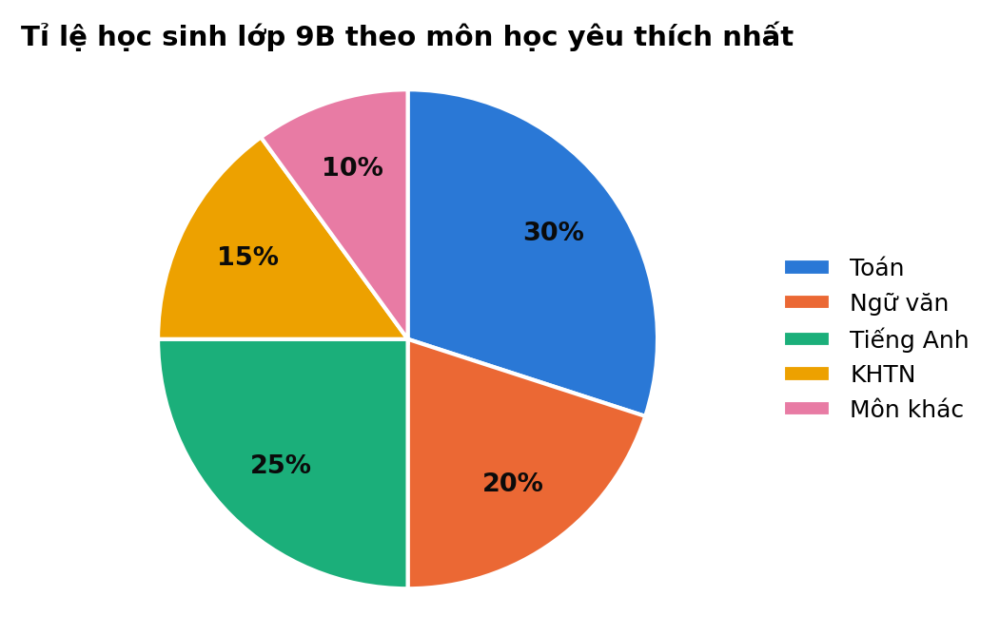{width=60%}

> A. $12$        B. $30$        C. $10$        D. $8$

**Câu 22.8 [Độ khó: 6.0/10 - Thông hiểu]: Biểu đồ đoạn thẳng dưới đây cho biết số lượt mượn sách ở thư viện một trường THCS từ tháng 9 đến tháng 1 năm sau. Tháng có số lượt mượn sách tăng nhiều nhất so với tháng liền trước là:**

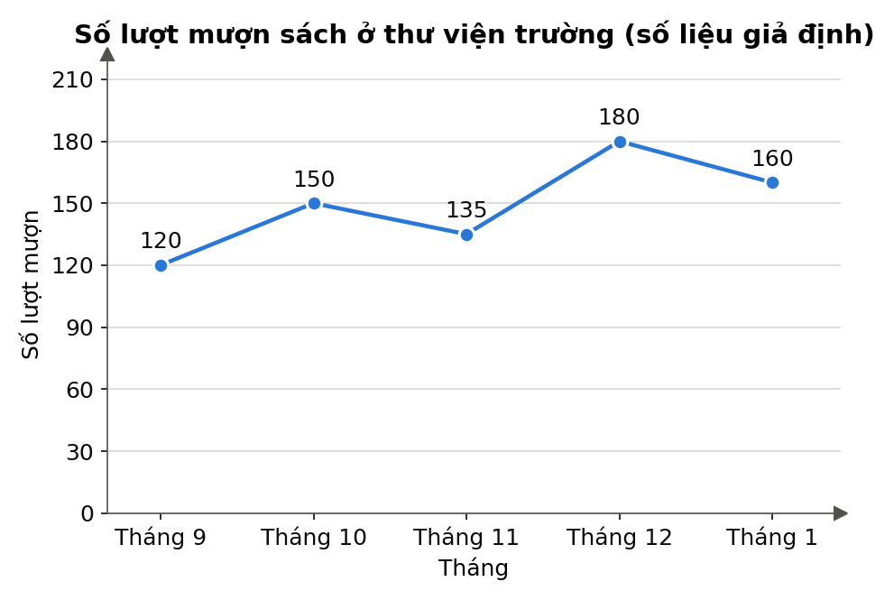{width=65%}

> A. Tháng 10        B. Tháng 11        C. Tháng 1        D. Tháng 12

**Câu 22.9 [Độ khó: 6.0/10 - Thông hiểu]: Lớp trưởng muốn biểu diễn tỉ lệ phần trăm số học sinh tham gia từng câu lạc bộ (Bóng đá, Cầu lông, Văn nghệ, Tin học) so với cả lớp, biết mỗi học sinh tham gia đúng một câu lạc bộ. Loại biểu đồ thích hợp nhất là:**
> A. Biểu đồ đoạn thẳng        B. Biểu đồ hình quạt tròn        C. Biểu đồ tranh        D. Biểu đồ cột kép

**Câu 22.10 [Độ khó: 6.5/10 - Thông hiểu]: Một mẫu số liệu có cỡ mẫu bằng 40. Biết tần số tương đối của giá trị $a$ là 12,5%. Tần số của giá trị $a$ là:**
> A. $12$        B. $8$        C. $5$        D. $35$

### 3. Bài tập Tự luận (6 bài độ khó tăng dần – Trình bày chi tiết ra vở)
**Bài 22.1 [Độ khó: 5.0/10 - Nhận biết]:** *(Dạng Bài 2 đề Nam Định 2025)*
Số người trong mỗi hộ gia đình của 30 hộ ở một xóm ven biển được ghi lại như sau (số liệu giả định):
$$\begin{array}{cccccccccc} 4 & 6 & 5 & 7 & 4 & 4 & 6 & 6 & 3 & 5 \\ 5 & 7 & 3 & 5 & 6 & 4 & 4 & 5 & 4 & 5 \\ 6 & 4 & 6 & 4 & 4 & 5 & 3 & 3 & 5 & 3 \end{array}$$
- a) Lập bảng tần số của mẫu số liệu trên.
- b) Vẽ biểu đồ cột biểu diễn bảng tần số đó.
- c) Có bao nhiêu hộ có từ 5 người trở lên? Số hộ đó chiếm bao nhiêu phần trăm số hộ được khảo sát (làm tròn kết quả đến hàng phần mười)?

**Bài 22.2 [Độ khó: 5.5/10 - Nhận biết]:** *(Dạng Bài 2 đề Ninh Bình 2026)*
Điểm kiểm tra giữa kì môn Toán của 20 học sinh tổ 1 lớp 9A như sau:
$$\begin{array}{cccccccccc} 6 & 7 & 7 & 9 & 8 & 5 & 8 & 6 & 5 & 9 \\ 10 & 8 & 6 & 7 & 9 & 8 & 7 & 8 & 7 & 6 \end{array}$$
- a) Lập bảng tần số của mẫu số liệu. Có bao nhiêu học sinh đạt điểm 8?
- b) Chọn ngẫu nhiên một học sinh trong tổ. Tính xác suất của biến cố $A$: "Học sinh được chọn có điểm kiểm tra từ 8 điểm trở lên".

**Bài 22.3 [Độ khó: 6.0/10 - Thông hiểu]:**
Kết quả khảo sát phương tiện đến trường của 36 học sinh lớp 9C (mỗi học sinh chọn một phương tiện chính) được cho trong bảng sau:

| Phương tiện | Xe đạp | Đi bộ | Xe đạp điện | Bố mẹ đưa đón |
| :--- | :---: | :---: | :---: | :---: |
| Số học sinh | 18 | 6 | 8 | 4 |

- a) Lập bảng tần số tương đối (làm tròn đến hàng phần mười của %) và kiểm tra tổng các tần số tương đối.
- b) Tính số đo góc ở tâm của các hình quạt rồi vẽ biểu đồ hình quạt tròn biểu diễn bảng tần số tương đối đó.

**Bài 22.4 [Độ khó: 6.5/10 - Thông hiểu]:**
Chiều cao (đơn vị: cm) của 25 học sinh nữ lớp 9D được ghi lại như sau:
$$\begin{array}{ccccc} 159 & 157 & 160 & 162 & 154 \\ 157 & 164 & 156 & 153 & 159 \\ 147 & 165 & 152 & 155 & 149 \\ 166 & 160 & 163 & 168 & 153 \\ 150 & 161 & 158 & 158 & 156 \end{array}$$
- a) Lập bảng tần số ghép nhóm và bảng tần số tương đối ghép nhóm với các nhóm $[145; 150)$, $[150; 155)$, $[155; 160)$, $[160; 165)$, $[165; 170)$.
- b) Nhóm nào có tần số lớn nhất? Tìm giá trị đại diện của nhóm đó. Có bao nhiêu phần trăm số học sinh nữ của lớp cao từ 160 cm trở lên?
- c) Vẽ biểu đồ tần số tương đối ghép nhóm dạng cột.

**Bài 22.5 [Độ khó: 7.0/10 - Vận dụng]:**
Biểu đồ cột kép dưới đây biểu diễn sản lượng muối (đơn vị: tấn) của hai tổ sản xuất A và B trong 5 tháng (số liệu giả định).

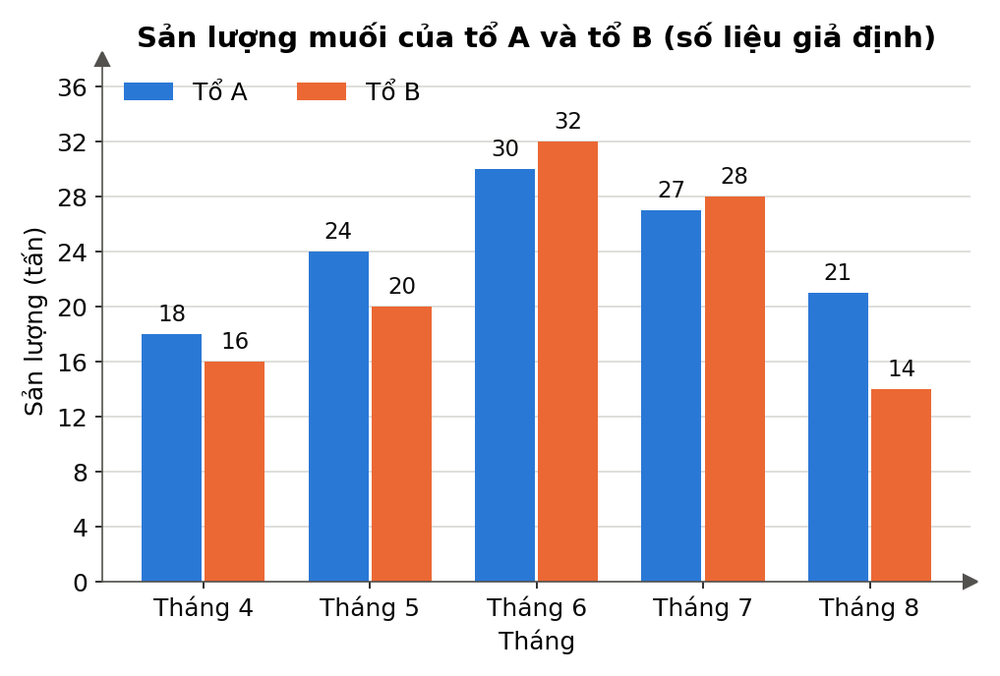{width=70%}

- a) Lập bảng thống kê sản lượng muối của hai tổ theo từng tháng.
- b) Trong những tháng nào sản lượng của tổ B cao hơn sản lượng của tổ A?
- c) Tính tổng sản lượng muối của mỗi tổ trong 5 tháng. Sản lượng tháng 6 chiếm bao nhiêu phần trăm tổng sản lượng 5 tháng của tổ A?
- d) Sản lượng của tổ B trong tháng 8 giảm bao nhiêu phần trăm so với tháng 7?

**Bài 22.6 [Độ khó: 8.0/10 - Vận dụng]:** *(Kết hợp thống kê – xác suất)*
Thời gian đi từ nhà đến trường (đơn vị: phút) của 40 học sinh lớp 9E được cho trong bảng tần số ghép nhóm sau:

| Thời gian (phút) | $[0; 10)$ | $[10; 20)$ | $[20; 30)$ | $[30; 40)$ | $[40; 50)$ |
| :--- | :---: | :---: | :---: | :---: | :---: |
| Số học sinh | 6 | $x$ | 14 | $y$ | 3 |

Biết tần số tương đối của nhóm $[10; 20)$ là 30%.
- a) Tìm $x$ và $y$.
- b) Lập bảng tần số tương đối ghép nhóm của mẫu số liệu.
- c) Chọn ngẫu nhiên một học sinh của lớp 9E. Tính xác suất để học sinh đó đi từ nhà đến trường mất từ 20 phút trở lên.

> 🔒 **LƯU Ý TRA CỨU ĐÁP ÁN:** Em hãy tự giải ra vở trước, không xem đáp án trước. Khi làm xong, hãy lật xem **ĐÁP ÁN VÀ LỜI GIẢI CHI TIẾT – Lời giải Chủ đề 22** ở phần cuối tài liệu.

---

## Chủ đề 23: Xác suất của biến cố – Phép thử, không gian mẫu và xác suất cổ điển

*(Đề mới luôn có xác suất: Nam Định 2025–2026 có 2 câu trắc nghiệm – số phần tử không gian mẫu khi lấy 1 trong 15 quả bóng, xác suất tổng số chấm hai lần gieo xúc xắc bằng 3; Ninh Bình 2026–2027 có câu trắc nghiệm không gian mẫu khi gieo xúc xắc và ý b Bài 2 tính xác suất chọn học sinh "đạt từ 8 điểm trở lên". Đây là phần dễ lấy trọn điểm nếu đếm cẩn thận.)*

### 1. Lý thuyết cốt lõi cần nhớ
- **Phép thử ngẫu nhiên:** hoạt động mà ta không biết trước kết quả, nhưng biết được tất cả các kết quả có thể xảy ra (gieo xúc xắc, tung đồng xu, rút thẻ, chọn người…).
- **Không gian mẫu** $\Omega$: tập hợp **tất cả** các kết quả có thể của phép thử; $n(\Omega)$ là số phần tử của nó.
- **Ba cách liệt kê không gian mẫu:**
  - Liệt kê trực tiếp: gieo một xúc xắc thì $\Omega = \{1; 2; 3; 4; 5; 6\}$, $n(\Omega) = 6$.
  - **Sơ đồ cây** (phép thử nhiều bước, ví dụ tung đồng xu hai lần, $S$ là sấp, $N$ là ngửa):

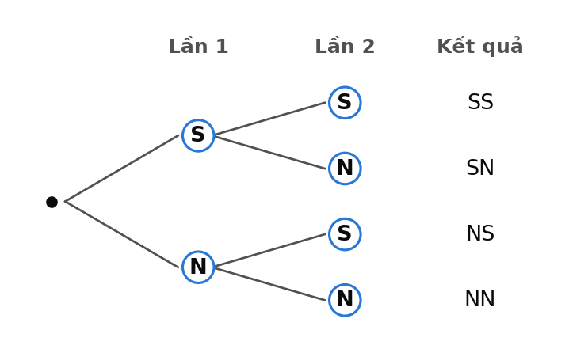{width=50%}

  - **Bảng** (gieo xúc xắc hai lần: mỗi ô là một kết quả $(i; j)$, ở đây ghi tổng số chấm $i + j$; $n(\Omega) = 6 \cdot 6 = 36$):

| Lần 1 ↓ / Lần 2 → | 1 | 2 | 3 | 4 | 5 | 6 |
|:---:|:---:|:---:|:---:|:---:|:---:|:---:|
| **1** | 2 | 3 | 4 | 5 | 6 | 7 |
| **2** | 3 | 4 | 5 | 6 | 7 | 8 |
| **3** | 4 | 5 | 6 | 7 | 8 | 9 |
| **4** | 5 | 6 | 7 | 8 | 9 | 10 |
| **5** | 6 | 7 | 8 | 9 | 10 | 11 |
| **6** | 7 | 8 | 9 | 10 | 11 | 12 |

- **Biến cố** $A$: một sự kiện liên quan đến phép thử; mỗi kết quả làm cho $A$ xảy ra gọi là **kết quả thuận lợi** cho $A$, số kết quả thuận lợi là $n(A)$.
- **Công thức xác suất** (khi các kết quả của phép thử **đồng khả năng**, như xúc xắc/đồng xu cân đối, đồng chất; các thẻ, các viên bi giống nhau): $$P(A) = \frac{n(A)}{n(\Omega)}, \qquad 0 \le P(A) \le 1$$ Biến cố chắc chắn có xác suất $1$; biến cố không thể có xác suất $0$.
- **Có thứ tự hay không?**
  - Gieo/rút **lần lượt** (có lần 1, lần 2): kết quả $(1; 2)$ khác $(2; 1)$.
  - Lấy **cùng lúc** hai đồ vật, chọn hai người: $\{A; B\}$ và $\{B; A\}$ là **một** kết quả.
  - Rút **có hoàn lại** (trả lại rồi rút tiếp) thì có thể trùng; **không hoàn lại** thì không trùng.

**⚠️ Bẫy thường gặp:**

- Gieo xúc xắc hai lần có $36$ kết quả, **không phải** $12$ hay $21$ (vì có thứ tự).
- Quên kết quả đảo: tổng bằng $3$ có hai kết quả $(1; 2)$ và $(2; 1)$.
- Lấy cùng lúc 2 viên bi mà lại đếm có thứ tự (đếm gấp đôi).
- "Ít nhất một" thường dễ đếm hơn qua phần còn lại: $n(\text{ít nhất 1 nữ}) = n(\Omega) - n(\text{không có nữ})$.
- Viết xác suất lớn hơn $1$, hoặc quên rút gọn phân số / quên câu kết luận.

**✍️ Mẫu trình bày ăn trọn điểm:**

*Đề:* Gieo một con xúc xắc cân đối, đồng chất hai lần liên tiếp. Tính xác suất của biến cố $A$: "Tổng số chấm xuất hiện trong hai lần gieo bằng $3$".

*Lời giải mẫu:*
- Không gian mẫu gồm các cặp $(i; j)$ với $i, j \in \{1; 2; \dots; 6\}$ ($i$, $j$ là số chấm lần 1, lần 2), nên $n(\Omega) = 6 \cdot 6 = 36$. Các kết quả đồng khả năng. **(0,25đ)**
- Các kết quả thuận lợi cho $A$ là $(1; 2)$ và $(2; 1)$, nên $n(A) = 2$. **(0,25đ)**
- $P(A) = \dfrac{2}{36} = \dfrac{1}{18}$. Vậy xác suất cần tìm là $\dfrac{1}{18}$. **(0,25đ)**

### 2. Bài tập Trắc nghiệm (10 câu độ khó tăng dần – mức Nhận biết/Thông hiểu như đề thi; ghi chữ cái đáp án đúng vào bài làm)
**Câu 23.1 [Độ khó: 4.0/10 - Nhận biết]: Một hộp có $12$ quả bóng được đánh số từ $1$ đến $12$. Lấy ngẫu nhiên một quả bóng từ hộp. Số phần tử của không gian mẫu là:**
> A. $1$        B. $6$        C. $11$        D. $12$

**Câu 23.2 [Độ khó: 4.5/10 - Nhận biết]: Gieo một con xúc xắc cân đối, đồng chất. Xác suất để mặt xuất hiện có số chấm là số nguyên tố là:**
> A. $\dfrac{1}{2}$        B. $\dfrac{1}{3}$        C. $\dfrac{2}{3}$        D. $\dfrac{1}{6}$

**Câu 23.3 [Độ khó: 4.5/10 - Nhận biết]: Tung một đồng xu hai lần liên tiếp ($S$: mặt sấp, $N$: mặt ngửa). Không gian mẫu của phép thử là:**
> A. $\{S; N\}$        B. $\{SS; NN\}$        C. $\{SS; SN; NS; NN\}$        D. $\{SS; SN; NN\}$

**Câu 23.4 [Độ khó: 5.0/10 - Nhận biết]: Gieo một con xúc xắc hai lần liên tiếp. Số phần tử của không gian mẫu là:**
> A. $12$        B. $36$        C. $21$        D. $6$

**Câu 23.5 [Độ khó: 5.0/10 - Thông hiểu]: Gieo một con xúc xắc cân đối, đồng chất. Xác suất của biến cố "Số chấm xuất hiện lớn hơn $6$" là:**
> A. $0$        B. $\dfrac{1}{6}$        C. $1$        D. $\dfrac{5}{6}$

**Câu 23.6 [Độ khó: 5.5/10 - Thông hiểu]: Gieo một con xúc xắc cân đối, đồng chất hai lần. Xác suất để tổng số chấm hai lần gieo bằng $4$ là:**
> A. $\dfrac{1}{9}$        B. $\dfrac{1}{6}$        C. $\dfrac{1}{36}$        D. $\dfrac{1}{12}$

**Câu 23.7 [Độ khó: 5.5/10 - Thông hiểu]: Chọn ngẫu nhiên $2$ bạn từ $4$ bạn An, Bình, Cường, Dũng để làm trực nhật. Số kết quả có thể của phép thử là:**
> A. $6$        B. $12$        C. $4$        D. $8$

**Câu 23.8 [Độ khó: 6.0/10 - Thông hiểu]: Tung đồng thời ba đồng xu cân đối. Xác suất để có đúng hai đồng xu xuất hiện mặt ngửa là:**
> A. $\dfrac{1}{4}$        B. $\dfrac{3}{8}$        C. $\dfrac{1}{2}$        D. $\dfrac{2}{3}$

**Câu 23.9 [Độ khó: 6.5/10 - Thông hiểu]: Từ các chữ số $1, 2, 3, 4$ lập tất cả các số có hai chữ số khác nhau, rồi chọn ngẫu nhiên một số. Xác suất để số được chọn chia hết cho $4$ là:**
> A. $\dfrac{1}{3}$        B. $\dfrac{1}{6}$        C. $\dfrac{1}{4}$        D. $\dfrac{1}{2}$

**Câu 23.10 [Độ khó: 6.5/10 - Thông hiểu]: Một hộp có $3$ viên bi đỏ và $2$ viên bi xanh có cùng kích thước. Lấy ngẫu nhiên đồng thời $2$ viên bi. Xác suất để hai viên bi lấy được khác màu là:**
> A. $\dfrac{2}{5}$        B. $\dfrac{1}{2}$        C. $\dfrac{3}{10}$        D. $\dfrac{3}{5}$

### 3. Bài tập Tự luận (6 bài độ khó tăng dần – Trình bày chi tiết ra vở)
**Bài 23.1 [Độ khó: 4.5/10 - Nhận biết]:**
Một hộp có $20$ tấm thẻ cùng loại, được đánh số từ $1$ đến $20$. Rút ngẫu nhiên một tấm thẻ.
- a) Viết không gian mẫu và cho biết số phần tử của nó.
- b) Tính xác suất của biến cố $A$: "Số ghi trên thẻ chia hết cho $3$".
- c) Tính xác suất của biến cố $B$: "Số ghi trên thẻ là số nguyên tố".
- d) Tính xác suất của biến cố $C$: "Số ghi trên thẻ có hai chữ số và tổng các chữ số bằng $5$".

**Bài 23.2 [Độ khó: 5.5/10 - Thông hiểu]:**
Tung một đồng xu cân đối rồi gieo một con xúc xắc cân đối, đồng chất.
- a) Vẽ sơ đồ cây và cho biết số phần tử của không gian mẫu.
- b) Tính xác suất của biến cố $A$: "Đồng xu xuất hiện mặt ngửa và xúc xắc xuất hiện mặt có số chấm chẵn".
- c) Tính xác suất của biến cố $B$: "Xúc xắc xuất hiện mặt $6$ chấm".
- d) Tính xác suất của biến cố $C$: "Đồng xu xuất hiện mặt sấp hoặc xúc xắc xuất hiện mặt $1$ chấm".

**Bài 23.3 [Độ khó: 6.0/10 - Thông hiểu]:**
Gieo một con xúc xắc cân đối, đồng chất hai lần liên tiếp. Tính xác suất của các biến cố:
- a) $A$: "Tổng số chấm hai lần gieo bằng $7$".
- b) $B$: "Tích số chấm hai lần gieo là số lẻ".
- c) $C$: "Số chấm lần gieo thứ hai gấp đôi số chấm lần gieo thứ nhất".

**Bài 23.4 [Độ khó: 7.0/10 - Vận dụng]:**
Một hộp có $4$ tấm thẻ ghi các số $1, 2, 3, 4$. Xét biến cố $A$: "Tổng hai số ghi trên hai tấm thẻ lấy ra là số chẵn". Tính $P(A)$ trong mỗi trường hợp sau:
- a) Rút một thẻ, ghi lại số rồi trả thẻ vào hộp, sau đó rút tiếp một thẻ (rút có hoàn lại).
- b) Rút lần lượt hai thẻ, thẻ rút ra không trả lại hộp.
- c) Rút cùng lúc hai thẻ.

**Bài 23.5 [Độ khó: 7.0/10 - Vận dụng]:**
Tổ 1 lớp 9A có $5$ bạn: $3$ bạn nam là Hùng, Minh, Nam và $2$ bạn nữ là Lan, Mai. Cô giáo chọn ngẫu nhiên $2$ bạn trong tổ đi dự hội nghị.
- a) Liệt kê các kết quả có thể và cho biết số phần tử của không gian mẫu.
- b) Tính xác suất để $2$ bạn được chọn gồm $1$ nam và $1$ nữ.
- c) Tính xác suất để trong $2$ bạn được chọn có ít nhất $1$ bạn nữ.
- d) Tính xác suất để bạn Lan được chọn.

**Bài 23.6 [Độ khó: 7.5/10 - Vận dụng]:**
Một hộp có $5$ viên bi đỏ và một số viên bi xanh có cùng kích thước, khối lượng. Lấy ngẫu nhiên một viên bi từ hộp, biết xác suất lấy được viên bi đỏ là $\dfrac{1}{3}$.
- a) Hỏi trong hộp có bao nhiêu viên bi xanh?
- b) Cần cho thêm vào hộp bao nhiêu viên bi đỏ (cùng loại) để xác suất lấy được viên bi đỏ là $\dfrac{1}{2}$?

> 🔒 **LƯU Ý TRA CỨU ĐÁP ÁN:** Em hãy tự giải ra vở trước, không xem đáp án trước. Khi làm xong, hãy lật xem **LỜI GIẢI CHỦ ĐỀ 23** ở phần cuối tài liệu.

---

## Chủ đề 24: Đường tròn ngoại tiếp – nội tiếp, Bốn điểm cùng thuộc một đường tròn, Đa giác đều & Phép quay (Bài hình phẳng đề thi)

*(Bài hình phẳng của đề mới chiếm 1,5 – 2,0 điểm, gồm hai ý: ý a thường là "chứng minh 4 điểm cùng thuộc một đường tròn / tứ giác nội tiếp" kèm một cặp góc bằng nhau; ý b là hệ thức tích hoặc tính độ dài theo $R$. Trắc nghiệm có câu đa giác đều, phép quay (Nam Định 2025: phép quay $120^\circ$ tam giác đều; Ninh Bình 2026: nhận dạng ngũ giác đều). Phần này thuộc Chương IX – SGK Kết nối tri thức Toán 9.)*

### 1. Lý thuyết cốt lõi cần nhớ
- **Đường tròn ngoại tiếp tam giác:** tâm là giao điểm ba đường **trung trực**.
  - Tam giác vuông: tâm là **trung điểm cạnh huyền**, $R = \dfrac{\text{cạnh huyền}}{2}$.
  - Tam giác đều cạnh $a$: tâm trùng trọng tâm, $R = \dfrac{a\sqrt{3}}{3}$; bán kính đường tròn nội tiếp $r = \dfrac{a\sqrt{3}}{6}$.
- **Đường tròn nội tiếp tam giác:** tâm là giao điểm ba đường **phân giác trong**.
- **Góc nội tiếp:** bằng nửa số đo cung bị chắn (bằng nửa góc ở tâm cùng chắn cung đó). Các góc nội tiếp cùng chắn một cung thì bằng nhau. Góc nội tiếp chắn nửa đường tròn là **góc vuông**.
- **Tứ giác nội tiếp** (bốn đỉnh cùng thuộc một đường tròn) có **tổng hai góc đối bằng $180^\circ$**. Hình chữ nhật, hình vuông, hình thang cân nội tiếp được đường tròn.
- **Ba cách chứng minh bốn điểm cùng thuộc một đường tròn** (ý a của bài hình):
  1. **Hai điểm cùng nhìn một đoạn dưới góc vuông** (hay dùng nhất): nếu $\widehat{ACB} = \widehat{ADB} = 90^\circ$ thì $A, B, C, D$ cùng thuộc đường tròn **đường kính $AB$**, tâm là trung điểm $AB$.
  2. Các điểm **cách đều** một điểm $O$: $OA = OB = OC = OD$.
  3. Tứ giác có **tổng hai góc đối bằng $180^\circ$**.

> 📌 SGK Kết nối tri thức không dạy "dấu hiệu nhận biết tứ giác nội tiếp" như một bài học riêng. Em nên dùng cách 1 hoặc cách 2. Trước khi dùng cách 3, hỏi giáo viên trên lớp xem cách trình bày đó có được chấp nhận không.

- **Ý b – hệ thức tích:** để chứng minh $MA \cdot MB = MC \cdot MD$, chuyển thành $\dfrac{MA}{MC} = \dfrac{MD}{MB}$ rồi tìm **hai tam giác đồng dạng** (g.g): thường có một **góc chung** và một cặp góc bằng nhau (cùng là góc vuông, hoặc hai góc nội tiếp cùng chắn một cung).
- **Đa giác đều:** **tất cả các cạnh bằng nhau và tất cả các góc bằng nhau** (hình thoi, hình chữ nhật thường không phải đa giác đều). $n$-giác đều có góc trong $\dfrac{(n - 2) \cdot 180^\circ}{n}$; góc ở tâm chắn một cạnh bằng $\dfrac{360^\circ}{n}$.
- **Phép quay** tâm $O$ góc $\alpha$ (thuận hoặc ngược chiều kim đồng hồ) biến điểm $A$ thành $A'$ với $OA' = OA$ và $\widehat{AOA'} = \alpha$. Các phép quay tâm $O$ giữ nguyên đa giác đều $n$ cạnh (tâm $O$) là các phép quay góc $k \cdot \dfrac{360^\circ}{n}$ ($k = 1, 2, \dots, n$).

**⚠️ Bẫy thường gặp:**

- Vẽ hình rơi vào trường hợp đặc biệt (tam giác cân, vuông) rồi "nhìn hình" mà ngộ nhận tính chất.
- Dùng điều phải chứng minh làm căn cứ; viết "dễ thấy" mà không nêu lí do.
- Nhầm góc nội tiếp với góc ở tâm (góc nội tiếp bằng **nửa** góc ở tâm cùng chắn cung).
- Quên ghi căn cứ "(cùng chắn cung …)", "(góc nội tiếp chắn nửa đường tròn)", "(tính chất tiếp tuyến)".
- Kết luận đồng dạng mà viết **sai thứ tự đỉnh tương ứng**, dẫn tới lập tỉ số sai.

**✍️ Mẫu trình bày ăn trọn điểm (ý a):**

*Đề:* Cho tam giác nhọn $ABC$ có các đường cao $AD$, $BE$. Chứng minh bốn điểm $A, B, D, E$ cùng thuộc một đường tròn và xác định tâm của đường tròn đó.

*Lời giải mẫu:*
- Vì $AD \perp BC$ nên $\widehat{ADB} = 90^\circ$; vì $BE \perp AC$ nên $\widehat{AEB} = 90^\circ$. **(0,25đ)**
- Hai điểm $D$, $E$ cùng nhìn đoạn $AB$ dưới góc vuông nên $D$, $E$ thuộc đường tròn đường kính $AB$. **(0,25đ)**
- Vậy bốn điểm $A, B, D, E$ cùng thuộc đường tròn tâm $K$ là trung điểm $AB$, bán kính $\dfrac{AB}{2}$. **(0,25đ)**

### 2. Bài tập Trắc nghiệm (8 câu độ khó tăng dần - Ghi chữ cái đứng trước đáp án đúng)
**Câu 24.1 [Độ khó: 4.0/10 - Nhận biết]: Tâm đường tròn ngoại tiếp một tam giác là giao điểm của:**
> A. ba đường trung tuyến        B. ba đường phân giác        C. ba đường cao        D. ba đường trung trực

**Câu 24.2 [Độ khó: 4.0/10 - Nhận biết]: Tam giác $ABC$ vuông tại $A$ có $BC = 10\text{ cm}$. Bán kính đường tròn ngoại tiếp tam giác là:**
> A. $10\text{ cm}$        B. $5\text{ cm}$        C. $20\text{ cm}$        D. $5\sqrt{2}\text{ cm}$

**Câu 24.3 [Độ khó: 4.5/10 - Nhận biết]: Bán kính đường tròn ngoại tiếp tam giác đều cạnh $6\text{ cm}$ là:**
> A. $2\sqrt{3}\text{ cm}$        B. $\sqrt{3}\text{ cm}$        C. $3\sqrt{3}\text{ cm}$        D. $6\sqrt{3}\text{ cm}$

**Câu 24.4 [Độ khó: 4.5/10 - Nhận biết]: Hình nào sau đây là đa giác đều?**
> A. Hình thoi có một góc $60^\circ$        B. Hình chữ nhật có hai cạnh $3\text{ cm}$ và $4\text{ cm}$        C. Hình vuông        D. Tam giác cân

**Câu 24.5 [Độ khó: 5.0/10 - Thông hiểu]: Số đo mỗi góc trong của một ngũ giác đều là:**
> A. $72^\circ$        B. $120^\circ$        C. $540^\circ$        D. $108^\circ$

**Câu 24.6 [Độ khó: 5.5/10 - Thông hiểu]: Cho tam giác đều $ABC$ có tâm $O$. Các phép quay thuận chiều kim đồng hồ tâm $O$ với góc quay $\alpha$ ($0^\circ < \alpha \le 360^\circ$) biến tam giác $ABC$ thành chính nó là:**
> A. $60^\circ$ hoặc $180^\circ$        B. $90^\circ$, $180^\circ$ hoặc $270^\circ$        C. $120^\circ$, $240^\circ$ hoặc $360^\circ$        D. $45^\circ$ hoặc $90^\circ$

**Câu 24.7 [Độ khó: 5.5/10 - Thông hiểu]: Tứ giác $ABCD$ nội tiếp đường tròn có $\widehat{A} = 70^\circ$. Số đo $\widehat{C}$ là:**
> A. $70^\circ$        B. $110^\circ$        C. $20^\circ$        D. $140^\circ$

**Câu 24.8 [Độ khó: 6.0/10 - Thông hiểu]: Cho đường tròn $(O; R)$ có dây $BC = R$ và điểm $A$ thuộc cung lớn $BC$. Số đo $\widehat{BAC}$ là:**
> A. $30^\circ$        B. $60^\circ$        C. $120^\circ$        D. $45^\circ$

### 3. Bài tập Tự luận (5 bài độ khó tăng dần - Trình bày chi tiết ra vở)
**Bài 24.1 [Độ khó: 5.0/10 - Thông hiểu]:**
Cho tam giác đều $ABC$ cạnh $6\text{ cm}$ có tâm $O$. Gọi $(O; R)$ là đường tròn ngoại tiếp và $(O; r)$ là đường tròn nội tiếp tam giác.
- a) Tính $R$ và $r$.
- b) Tính diện tích hình vành khuyên giới hạn bởi hai đường tròn trên.
- c) Biết $A, B, C$ được xếp theo chiều ngược chiều kim đồng hồ. Phép quay thuận chiều kim đồng hồ tâm $O$ góc $120^\circ$ biến các điểm $A, B, C$ lần lượt thành những điểm nào?

**Bài 24.2 [Độ khó: 5.5/10 - Thông hiểu]:**
Một viên gạch lát nền có dạng lục giác đều $ABCDEF$ tâm $O$, cạnh $20\text{ cm}$.
- a) Tính số đo góc $\widehat{ABC}$ và góc $\widehat{AOB}$.
- b) Tính diện tích viên gạch (làm tròn đến hàng phần trăm).
- c) Nêu một phép quay tâm $O$ (khác phép quay $360^\circ$) biến viên gạch thành chính nó.

**Bài 24.3 [Độ khó: 6.5/10 - Thông hiểu]:**
Cho hình vuông $ABCD$ và điểm $E$ thuộc cạnh $BC$ ($E \ne B, E \ne C$). Kẻ $BH$ vuông góc với đường thẳng $DE$ tại $H$.
- a) Chứng minh năm điểm $A, B, C, D, H$ cùng thuộc một đường tròn. Xác định tâm $O$ của đường tròn đó.
- b) Chứng minh $\widehat{AHB} = \widehat{AHD} = 45^\circ$, từ đó suy ra $HA$ là tia phân giác của $\widehat{BHD}$.

**Bài 24.4 [Độ khó: 7.0/10 - Vận dụng]:**
Cho tam giác đều $ABC$ nội tiếp đường tròn $(O)$, các đỉnh $A, B, C$ xếp theo chiều kim đồng hồ. Trên các cạnh $AB$, $BC$, $CA$ lần lượt lấy các điểm $D$, $E$, $F$ sao cho $AD = BE = CF$.
- a) Chứng minh $OD = OE = OF$.
- b) Chứng minh tam giác $DEF$ là tam giác đều.
- c) Phép quay thuận chiều kim đồng hồ tâm $O$ góc $120^\circ$ biến các điểm $A$ và $D$ thành những điểm nào?

**Bài 24.5 [Độ khó: 7.5/10 - Vận dụng]:**
Cho tam giác nhọn $ABC$ nội tiếp đường tròn $(O; R)$ có $\widehat{ACB} = 60^\circ$. Các đường cao $AD$, $BE$ cắt nhau tại $H$; gọi $K$ là trung điểm của $AB$.
- a) Chứng minh bốn điểm $A, B, D, E$ cùng thuộc đường tròn tâm $K$.
- b) Chứng minh $\widehat{DAE} = \widehat{DBE}$ và $CD \cdot CB = CE \cdot CA$.
- c) Tính độ dài $AB$ và $DE$ theo $R$.

### 4. Luyện đề Bài hình phẳng (ý a lấy trọn – ý b nhặt điểm)
*(Mỗi bài dưới đây mô phỏng bài hình phẳng của đề tuyển sinh. Đề thi không cho hình, em phải tự vẽ hình; hình minh họa có trong phần lời giải.)*

**Bài 24.6 [Độ khó: 7.0/10 - Vận dụng]:**
Từ điểm $M$ nằm ngoài đường tròn $(O; R)$ với $OM = 2R$, kẻ hai tiếp tuyến $MA$, $MB$ ($A$, $B$ là các tiếp điểm) và cát tuyến $MCD$ không đi qua $O$ ($C$ nằm giữa $M$ và $D$). Gọi $I$ là trung điểm của $CD$.
- a) Chứng minh năm điểm $M, A, I, O, B$ cùng thuộc một đường tròn.
- b) Chứng minh $\widehat{AIM} = \widehat{AOM}$.
- c) Chứng minh $MC \cdot MD = MA^2$ và tính $MC \cdot MD$ theo $R$.
- d) Tính số đo $\widehat{AMB}$ và độ dài $AB$ theo $R$.

**Bài 24.7 [Độ khó: 7.0/10 - Vận dụng]:**
Cho nửa đường tròn $(O; R)$ đường kính $AB$. Gọi $H$ là trung điểm của $OA$; đường thẳng vuông góc với $AB$ tại $H$ cắt nửa đường tròn tại $C$. Lấy điểm $M$ thuộc đoạn $CH$ ($M \ne C, M \ne H$); tia $AM$ cắt nửa đường tròn tại $K$.
- a) Chứng minh bốn điểm $B, H, M, K$ cùng thuộc một đường tròn.
- b) Chứng minh $\widehat{MKH} = \widehat{MBH}$.
- c) Chứng minh $AM \cdot AK = AH \cdot AB = AC^2$, từ đó tính $AM \cdot AK$ theo $R$.

**Bài 24.8 [Độ khó: 7.5/10 - Vận dụng]:**
Cho đường tròn $(O; R)$ có đường kính $MN$ vuông góc với dây $AB$ tại $H$ ($M$ thuộc cung nhỏ $AB$). Lấy điểm $C$ thuộc cung nhỏ $BN$ ($C \ne B, C \ne N$); $MC$ cắt $AB$ tại $D$.
- a) Chứng minh bốn điểm $C, D, H, N$ cùng thuộc một đường tròn.
- b) Chứng minh $MD \cdot MC = MH \cdot MN = MA^2$.
- c) Biết $AB = R\sqrt{3}$, tính $MD \cdot MC$ theo $R$.

**Bài 24.9 [Độ khó: 7.5/10 - Vận dụng]:**
Cho đường tròn $(O; R)$ có hai đường kính $AB$ và $CD$ vuông góc với nhau. Gọi $E$ là trung điểm của $OA$; đường thẳng $CE$ cắt $(O)$ tại điểm thứ hai $M$.
- a) Chứng minh bốn điểm $O, E, M, D$ cùng thuộc một đường tròn.
- b) Chứng minh $\widehat{OME} = \widehat{ODE}$.
- c) Chứng minh $CE \cdot CM = 2R^2$. Tính $CE$, $CM$ theo $R$.

**Bài 24.10 [Độ khó: 8.0/10 - Vận dụng]:**
Cho tam giác $ABC$ vuông tại $A$ có $AB = 6\text{ cm}$, $AC = 8\text{ cm}$. Đường tròn tâm $O$ đường kính $AB$ cắt $BC$ tại $D$ ($D \ne B$). Tiếp tuyến của $(O)$ tại $D$ cắt $AC$ tại $I$.
- a) Chứng minh bốn điểm $A, O, D, I$ cùng thuộc một đường tròn.
- b) Chứng minh $AB^2 = BD \cdot BC$ và tính $BD$.
- c) Chứng minh $I$ là trung điểm của $AC$ và $OI \parallel BC$.

> 🔒 **LƯU Ý TRA CỨU ĐÁP ÁN:** Em hãy tự giải ra vở trước, không xem đáp án trước. Khi làm xong, hãy lật xem **LỜI GIẢI CHỦ ĐỀ 24** ở phần cuối tài liệu.

---

## Chủ đề 25: Hình khối trong thực tiễn – Vật thể ghép từ hình trụ, hình nón, hình cầu

*(Đề mới có bài hình khối thực tế: Nam Định 2025–2026 Bài 5 (1,0 điểm) tính thể tích một cái ly gồm hình trụ và nửa hình cầu, làm tròn đến hai chữ số thập phân; Ninh Bình 2026–2027 Bài 6a tính diện tích mặt quả bóng (lấy $\pi = 3{,}14$). Công thức cơ bản xem lại Chủ đề 16; chủ đề này luyện **vật ghép, đổi đơn vị và làm tròn**.)*

### 1. Lý thuyết cốt lõi cần nhớ
- **Nhắc lại công thức** ($r$: bán kính đáy, $h$: chiều cao, $l$: đường sinh, $R$: bán kính cầu):
  - Hình trụ: $V = \pi r^2 h$; $S_{xq} = 2\pi r h$.
  - Hình nón: $V = \dfrac{1}{3}\pi r^2 h$; $S_{xq} = \pi r l$ với $l^2 = r^2 + h^2$.
  - Hình cầu: $S = 4\pi R^2$; $V = \dfrac{4}{3}\pi R^3$. Nửa hình cầu: $V = \dfrac{2}{3}\pi R^3$, mặt cong $2\pi R^2$.
- **Vật thể ghép:** chia thành các khối cơ bản rồi **cộng** (ly = trụ + nửa cầu, viên con nhộng = trụ + hai nửa cầu, tháp nước = trụ + nón) hoặc **trừ** (ống rỗng = trụ lớn − trụ nhỏ). Diện tích bề mặt chỉ tính **phần lộ ra ngoài** (mặt tiếp giáp giữa hai khối không tính).
- **Đổi đơn vị:** $1\text{ m}^3 = 1000\text{ dm}^3 = 1000$ lít; $1\text{ dm}^3 = 1$ lít; $1\text{ cm}^3 = 1\text{ ml}$; $1\text{ ml} = 1000\text{ mm}^3$.
- **Nước dâng:** thả vật chìm hoàn toàn vào bình hình trụ thì $V_{\text{vật}} = \pi r^2 \cdot (\text{độ cao nước dâng})$.
- **Làm tròn số lượng:** hỏi "**cần ít nhất** bao nhiêu (can, xe, máy…)" thì làm tròn **lên**; hỏi "**đổ đầy được nhiều nhất** bao nhiêu (cốc, chai…)" thì làm tròn **xuống**.

**⚠️ Bẫy thường gặp:**

- Đề cho **đường kính** mà thay thẳng vào công thức bán kính.
- Nón quên hệ số $\dfrac{1}{3}$; nửa cầu dùng nhầm công thức cả hình cầu.
- Nhầm $1\text{ m}^3 = 100$ lít (đúng là $1000$ lít).
- Làm tròn sớm ở bước giữa; không đúng yêu cầu ("lấy $\pi = 3{,}14$" khác "làm tròn đến hàng phần trăm").
- Tính diện tích sơn mà cộng cả mặt đáy tiếp đất hoặc mặt tiếp giáp giữa hai khối.

**✍️ Mẫu trình bày ăn trọn điểm:**

*Đề:* Một cái ly gồm phần thân hình trụ bán kính đáy $4\text{ cm}$, chiều cao $6\text{ cm}$ và phần đáy là nửa hình cầu bán kính $4\text{ cm}$ (phía trong ly). Tính thể tích ly (làm tròn đến hàng phần trăm).

*Lời giải mẫu:*
- Thể tích phần hình trụ: $V_1 = \pi \cdot 4^2 \cdot 6 = 96\pi\text{ (cm}^3)$. **(0,25đ)**
- Thể tích phần nửa hình cầu: $V_2 = \dfrac{2}{3}\pi \cdot 4^3 = \dfrac{128\pi}{3}\text{ (cm}^3)$. **(0,25đ)**
- Thể tích ly: $V = V_1 + V_2 = \dfrac{416\pi}{3} \approx 435{,}63\text{ (cm}^3)$. Vậy thể tích ly khoảng $435{,}63\text{ cm}^3$. **(0,25đ)**

### 2. Bài tập Trắc nghiệm (5 câu độ khó tăng dần - Ghi chữ cái đứng trước đáp án đúng)
**Câu 25.1 [Độ khó: 4.0/10 - Nhận biết]: Một bồn nước có thể tích $2{,}5\text{ m}^3$. Bồn chứa được tối đa bao nhiêu lít nước?**
> A. $25$ lít        B. $250$ lít        C. $2500$ lít        D. $25\,000$ lít

**Câu 25.2 [Độ khó: 4.5/10 - Nhận biết]: Một quả bóng bàn có dạng hình cầu đường kính $4\text{ cm}$. Diện tích mặt quả bóng là:**
> A. $16\pi\text{ cm}^2$        B. $64\pi\text{ cm}^2$        C. $4\pi\text{ cm}^2$        D. $\dfrac{32\pi}{3}\text{ cm}^2$

**Câu 25.3 [Độ khó: 5.0/10 - Thông hiểu]: Một cái bát có dạng nửa hình cầu, bán kính phía trong $6\text{ cm}$. Bát chứa được tối đa bao nhiêu nước?**
> A. $288\pi\text{ cm}^3$        B. $72\pi\text{ cm}^3$        C. $24\pi\text{ cm}^3$        D. $144\pi\text{ cm}^3$

**Câu 25.4 [Độ khó: 6.0/10 - Thông hiểu]: Một chiếc kem ốc quế gồm phần vỏ hình nón cao $10\text{ cm}$, bán kính đáy $3\text{ cm}$ chứa đầy kem và phía trên có thêm một nửa hình cầu kem bán kính $3\text{ cm}$. Thể tích kem là:**
> A. $66\pi\text{ cm}^3$        B. $48\pi\text{ cm}^3$        C. $108\pi\text{ cm}^3$        D. $36\pi\text{ cm}^3$

**Câu 25.5 [Độ khó: 6.5/10 - Thông hiểu]: Một bể chứa nước hình trụ có bán kính đáy $0{,}5\text{ m}$, chiều cao $1{,}2\text{ m}$. Dùng can loại $20$ lít để đổ đầy bể thì cần ít nhất bao nhiêu can (lấy $\pi \approx 3{,}14$)?**
> A. $47$ can        B. $189$ can        C. $48$ can        D. $5$ can

### 3. Bài tập Tự luận (5 bài độ khó tăng dần - Trình bày chi tiết ra vở)
**Bài 25.1 [Độ khó: 4.5/10 - Nhận biết]:**
Một quả bóng đá có dạng hình cầu đường kính $22\text{ cm}$ (lấy $\pi \approx 3{,}14$).
- a) Tính diện tích mặt ngoài quả bóng.
- b) Tính thể tích quả bóng (làm tròn đến hàng phần trăm), rồi đổi ra lít (làm tròn đến hàng phần trăm).

**Bài 25.2 [Độ khó: 5.5/10 - Thông hiểu]:**
Một tháp nước gồm thân hình trụ bán kính đáy $2\text{ m}$, cao $5\text{ m}$ và mái che hình nón có cùng bán kính đáy, chiều cao $1{,}5\text{ m}$ (lấy $\pi \approx 3{,}14$).

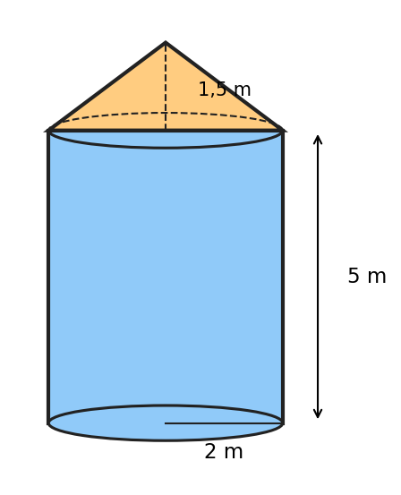{width=30%}

- a) Phần thân tháp chứa được tối đa bao nhiêu lít nước?
- b) Tính độ dài đường sinh và diện tích xung quanh của mái che.
- c) Người ta sơn mặt xung quanh của thân tháp và mái che với giá $35\,000$ đồng/$\text{m}^2$. Tính số tiền sơn.

**Bài 25.3 [Độ khó: 6.5/10 - Thông hiểu]:**
Một bình thủy tinh hình trụ có bán kính đáy (phía trong) $4\text{ cm}$, cao $15\text{ cm}$, đang chứa nước cao $10\text{ cm}$.
- a) Thả một viên đá vào bình (viên đá chìm hoàn toàn) thì mực nước dâng thêm $2{,}5\text{ cm}$. Tính thể tích viên đá (làm tròn đến hàng phần trăm).
- b) Sau đó thả tiếp các viên bi sắt hình cầu bán kính $1\text{ cm}$. Cần ít nhất bao nhiêu viên bi để mực nước dâng thêm ít nhất $1\text{ cm}$ nữa? Khi đó nước có tràn ra ngoài không?

**Bài 25.4 [Độ khó: 7.0/10 - Vận dụng]:**
Một viên thuốc con nhộng có dạng hình trụ ghép với hai nửa hình cầu ở hai đầu; chiều dài cả viên là $20\text{ mm}$, đường kính $6\text{ mm}$ (hình vẽ).

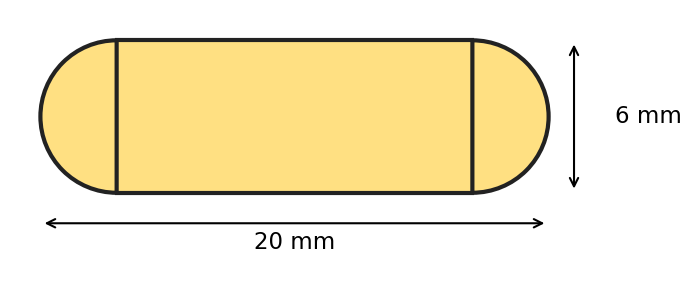{width=45%}

- a) Tính thể tích viên thuốc (làm tròn đến hàng phần trăm).
- b) Tính diện tích vỏ viên thuốc (làm tròn đến hàng phần trăm).
- c) Một hộp có $100$ viên thuốc như vậy chứa tổng cộng bao nhiêu mi-li-lít thuốc (làm tròn đến hàng phần trăm)?

**Bài 25.5 [Độ khó: 7.5/10 - Vận dụng]:**
Một nhà màng trồng rau có dạng nửa hình trụ nằm ngang, bán kính $3\text{ m}$, chiều dài $20\text{ m}$. Toàn bộ mặt cong và hai đầu hồi (hai nửa hình tròn) được phủ màng ni lông (lấy $\pi \approx 3{,}14$).

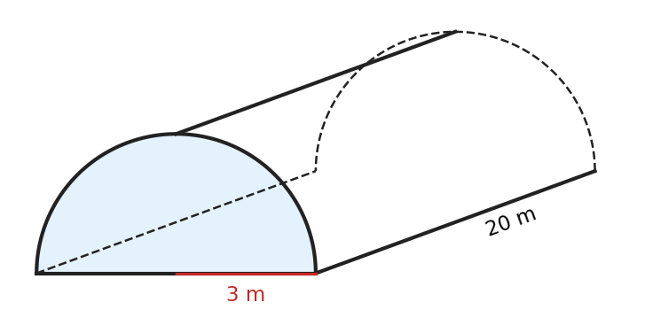{width=45%}

- a) Tính diện tích màng ni lông cần dùng và chi phí phủ màng, biết giá màng là $20\,000$ đồng/$\text{m}^2$.
- b) Tính thể tích không khí bên trong nhà màng.
- c) Mỗi máy quạt thông gió phục vụ được tối đa $50\text{ m}^3$ không khí. Cần ít nhất bao nhiêu máy?

> 🔒 **LƯU Ý TRA CỨU ĐÁP ÁN:** Em hãy tự giải ra vở trước, không xem đáp án trước. Khi làm xong, hãy lật xem **LỜI GIẢI CHỦ ĐỀ 25** ở phần cuối tài liệu.

---

```{=openxml}
<w:p><w:r><w:br w:type="page"/></w:r></w:p>
```

# ĐÁP ÁN & LỜI GIẢI CHI TIẾT CHỦ ĐỀ 21 – 25

*Chỉ đối chiếu phần này SAU KHI đã tự làm xong bài ra vở. Các bước có ghi (0,25đ) là gợi ý barem để em tự chấm.*

### Lời giải Chủ đề 21 (Định lí Vi-ét với biểu thức không đối xứng & Phương trình bậc hai trong thực tế)

**Đáp án trắc nghiệm:**

| Câu | Đáp án | Giải thích ngắn |
| :---: | :---: | :--- |
| 21.1 | **C** | Chỉ C có $ac = 3 \cdot (-7) < 0$; A, B có $ac > 0$; D có nghiệm kép $x = -2$. |
| 21.2 | **B** | Gọi chiều rộng là $x > 0$: $x(x + 4) = 96 \Leftrightarrow (x - 8)(x + 12) = 0 \Rightarrow x = 8$. |
| 21.3 | **D** | $x_1^2 - 3x_1 - 5 = 0 \Rightarrow x_1^2 = 3x_1 + 5$ (chuyển vế đổi dấu). |
| 21.4 | **A** | $\Delta = 37 > 0$, $P = 3 > 0$, $S = 7 > 0$ nên hai nghiệm phân biệt cùng dương. |
| 21.5 | **C** | $x_1^2 = x_1 + 3$ nên $T = x_1 + x_2 + 3 = 1 + 3 = 4$ (B là $x_1^2 + x_2^2$). |
| 21.6 | **D** | Trái dấu $\Leftrightarrow ac < 0 \Leftrightarrow 2m - 6 < 0 \Leftrightarrow m < 3$. |

**Lời giải tự luận:**

**Bài 21.1:**
*Lời giải:*
- **a)** Sau $3$ giây, vật rơi được $s = 4{,}9 \cdot 3^2 = 44{,}1$ (m). **(0,25đ)**
  Vật còn cách mặt đất $122{,}5 - 44{,}1 = 78{,}4$ (m). **(0,25đ)**
- **b)** Vật chạm đất khi $s = 122{,}5$: $4{,}9t^2 = 122{,}5 \Leftrightarrow t^2 = 25$. **(0,25đ)**
  Vì $t > 0$ nên $t = 5$ (giây). **(0,25đ)**

**Kết luận:** a) $78{,}4\text{ m}$; b) sau $5$ giây vật chạm đất.

**Bài 21.2:**
*Lời giải:*
- **a)** $\Delta' = (-3)^2 - 1 \cdot 4 = 5 > 0$ nên phương trình có hai nghiệm phân biệt. **(0,25đ)**
  Theo Vi-ét: $S = x_1 + x_2 = 6 > 0$, $P = x_1x_2 = 4 > 0$ nên hai nghiệm cùng dương. **(0,25đ)**
- **b)** $x_1$ là nghiệm nên $x_1^2 - 6x_1 + 4 = 0 \Rightarrow x_1^2 = 6x_1 - 4$. **(0,25đ)**
  $M = 6x_1 - 4 + 6x_2 = 6(x_1 + x_2) - 4 = 6 \cdot 6 - 4 = 32$. **(0,25đ)**
- **c)** Vì $x_1, x_2 > 0$ nên $N$ xác định và $N > 0$. Ta có $N^2 = x_1 + x_2 + 2\sqrt{x_1x_2} = 6 + 2\sqrt{4} = 10$. **(0,25đ)**
  Do $N > 0$ nên $N = \sqrt{10}$. **(0,25đ)**

**Kết luận:** b) $M = 32$; c) $N = \sqrt{10}$.

**Bài 21.3:**
*Lời giải:*
- $\Delta = (-1)^2 - 4 \cdot 1 \cdot (-1) = 5 > 0$ nên phương trình có hai nghiệm phân biệt. Theo Vi-ét: $x_1 + x_2 = 1$; $x_1x_2 = -1$. **(0,25đ)**
- Vì $x_1$ là nghiệm nên $x_1^2 = x_1 + 1$. **(0,25đ)**
- **a)** $x_1x_2^2 = (x_1x_2) \cdot x_2 = -x_2$. Do đó $C = (x_1 + 1) + x_2 + 2026 = (x_1 + x_2) + 2027 = 1 + 2027 = 2028$. **(0,25đ)**
- **b)** $x_1^3 = x_1 \cdot x_1^2 = x_1(x_1 + 1) = x_1^2 + x_1 = (x_1 + 1) + x_1 = 2x_1 + 1$. **(0,25đ)**
  $D = 2x_1 + 1 + 2x_2 + 1 = 2(x_1 + x_2) + 2 = 2 \cdot 1 + 2 = 4$. **(0,25đ)**

**Kết luận:** a) $C = 2028$; b) $D = 4$.

**Bài 21.4:**
*Lời giải:*
- Gọi số mét đường tổ dự định làm mỗi ngày là $x$ (m), điều kiện $x > 0$. **(0,25đ)**
- Thời gian dự định là $\dfrac{120}{x}$ (ngày); thực tế mỗi ngày làm $x + 2$ (m) nên thời gian thực tế là $\dfrac{120}{x + 2}$ (ngày). Vì hoàn thành sớm $2$ ngày nên: $$\frac{120}{x} - \frac{120}{x + 2} = 2$$ **(0,25đ)**
- Quy đồng, khử mẫu: $120(x + 2) - 120x = 2x(x + 2) \Leftrightarrow 2x^2 + 4x - 240 = 0 \Leftrightarrow x^2 + 2x - 120 = 0$.
  $\Delta' = 1 + 120 = 121 \Rightarrow x = -1 + 11 = 10$ (thỏa mãn) hoặc $x = -1 - 11 = -12$ (loại). **(0,25đ)**
- Thử lại: dự định $120 : 10 = 12$ ngày, thực tế $120 : 12 = 10$ ngày, sớm $2$ ngày (đúng). **(0,25đ)**

**Kết luận:** Theo dự định, mỗi ngày tổ làm $10\text{ m}$ đường.

**Bài 21.5:**
*Lời giải:*
- **a)** $\Delta = 9^2 - 4 \cdot 1 \cdot 2 = 73 > 0$ nên phương trình có hai nghiệm phân biệt. **(0,25đ)**
  Theo Vi-ét: $S = x_1 + x_2 = -9 < 0$, $P = x_1x_2 = 2 > 0$ nên hai nghiệm cùng âm. **(0,25đ)**
- **b)** $x_1$ là nghiệm nên $x_1^2 = -9x_1 - 2$. Suy ra $$(x_1 - 2)^2 = x_1^2 - 4x_1 + 4 = (-9x_1 - 2) - 4x_1 + 4 = -13x_1 + 2.$$ **(0,25đ)**
  Do đó $\sqrt{-13x_1 + 2} = \sqrt{(x_1 - 2)^2} = |x_1 - 2| = 2 - x_1$ (vì $x_1 < 0$ nên $x_1 - 2 < 0$). **(0,25đ)**
  $A = 2 - x_1 - x_2 = 2 - (x_1 + x_2) = 2 - (-9) = 11$. **(0,25đ)**

**Kết luận:** $A = 11$.

**Bài 21.6:**
*Lời giải:*
- **a)** $\Delta' = (-1)^2 - 1 \cdot (m - 1) = 2 - m$. Phương trình có nghiệm $\Leftrightarrow \Delta' \ge 0 \Leftrightarrow m \le 2$. **(0,25đ)**
- **b)** Với $m \le 2$, theo Vi-ét: $x_1 + x_2 = 2$; $x_1x_2 = m - 1$. **(0,25đ)**
  $x_1$ là nghiệm nên $x_1^2 = 2x_1 - m + 1$. Khi đó $x_1^2 + 2x_2 = 2(x_1 + x_2) - m + 1 = 5 - m$. **(0,25đ)**
  $5 - m = 3m \Leftrightarrow m = \dfrac{5}{4}$ (thỏa mãn $m \le 2$). **(0,25đ)**
- **c)** Với $m \le 2$. Vì hai vế không âm nên $|x_1| + |x_2| = 4 \Leftrightarrow x_1^2 + x_2^2 + 2|x_1x_2| = 16$
  $\Leftrightarrow (x_1 + x_2)^2 - 2x_1x_2 + 2|x_1x_2| = 16 \Leftrightarrow 4 - 2(m - 1) + 2|m - 1| = 16$. **(0,25đ)**
  - Nếu $1 \le m \le 2$: $|m - 1| = m - 1$, phương trình thành $4 = 16$ (vô lí).
  - Nếu $m < 1$: $|m - 1| = 1 - m$, phương trình thành $8 - 4m = 16 \Leftrightarrow m = -2$ (thỏa mãn). **(0,25đ)**

**Kết luận:** a) $m \le 2$; b) $m = \dfrac{5}{4}$; c) $m = -2$.

**Bài 21.7:**
*Lời giải:*
- **a)** $\Delta = (-5)^2 - 4 \cdot 3 = 13 > 0$; $S = x_1 + x_2 = 5 > 0$; $P = x_1x_2 = 3 > 0$ nên hai nghiệm phân biệt cùng dương. **(0,25đ)**
- **b)** $x_1$ là nghiệm nên $x_1^2 = 5x_1 - 3$, suy ra $(x_1 - 3)^2 = x_1^2 - 6x_1 + 9 = 5x_1 - 3 - 6x_1 + 9 = 6 - x_1$. **(0,25đ)**
  Do đó $\sqrt{6 - x_1} = |x_1 - 3|$. Vì $x_1 < x_2$ và $x_1 + x_2 = 5$ nên $2x_1 < 5$, tức $x_1 < \dfrac{5}{2} < 3$. Suy ra $|x_1 - 3| = 3 - x_1$. **(0,25đ)**
  $B = 3 - x_1 - x_2 = 3 - 5 = -2$. **(0,25đ)**
  *Lưu ý:* nếu đổi vai (lấy $x_1$ là nghiệm lớn) thì kết quả khác, vì vậy điều kiện $x_1 < x_2$ là cần thiết.

**Kết luận:** $B = -2$.

---

### Lời giải Chủ đề 22 (Thống kê – Tần số, tần số tương đối, ghép nhóm và biểu đồ)

**Đáp án trắc nghiệm:**

| Câu | Đáp án | Giải thích ngắn |
| :---: | :---: | :--- |
| 22.1 | **C** | Cỡ mẫu là tổng các tần số: $n = 5 + 12 + 15 + 8 = 40$ (không phải tổng các giá trị $6 + 7 + 8 + 9 = 30$). |
| 22.2 | **B** | Giá trị 8 xuất hiện 4 lần (vị trí thứ 2, 4, 6, 9). |
| 22.3 | **D** | $f = \dfrac{6}{24} \cdot 100\% = 25\%$. |
| 22.4 | **A** | "Từ 60 phút trở lên" gồm hai nhóm $[60; 90)$ và $[90; 120)$: $12 + 8 = 20$ học sinh. |
| 22.5 | **C** | $160 \le 160 < 165$; nhóm $[a; b)$ không chứa đầu mút phải $b$ nên 160 không thuộc $[155; 160)$. |
| 22.6 | **B** | $15\% \cdot 360^\circ = 0{,}15 \cdot 360^\circ = 54^\circ$. |
| 22.7 | **A** | Môn Toán chiếm 30%: $30\% \cdot 40 = 12$ học sinh (30 là tỉ lệ %, không phải số học sinh). |
| 22.8 | **D** | So với tháng trước: tháng 10 tăng 30, tháng 11 giảm 15, tháng 12 tăng 45, tháng 1 giảm 20. |
| 22.9 | **B** | Biểu diễn tỉ lệ của từng phần so với tổng thể thì dùng biểu đồ hình quạt tròn. |
| 22.10 | **C** | $m = 12{,}5\% \cdot 40 = 0{,}125 \cdot 40 = 5$. |

**Bài 22.1:**
*Lời giải:*
- **a)** Các giá trị khác nhau của mẫu: 3, 4, 5, 6, 7. Đếm số lần xuất hiện của mỗi giá trị, ta được bảng tần số: **(0,25đ)**

| Số người trong hộ ($x$) | 3 | 4 | 5 | 6 | 7 | Cộng |
| :--- | :---: | :---: | :---: | :---: | :---: | :---: |
| Số hộ (tần số $m$) | 5 | 9 | 8 | 6 | 2 | $n = 30$ |

Kiểm tra: $5 + 9 + 8 + 6 + 2 = 30$, đúng bằng số hộ được khảo sát. **(0,25đ)**

- **b)** Vẽ biểu đồ cột: trục ngang ghi số người trong hộ (3; 4; 5; 6; 7), trục đứng ghi số hộ, chia đều từ 0 đến 10; ghi tên biểu đồ và đơn vị **(0,25đ)**; vẽ 5 cột rộng bằng nhau, cách đều, chiều cao lần lượt 5; 9; 8; 6; 2 và ghi số trên đầu mỗi cột **(0,25đ)**.

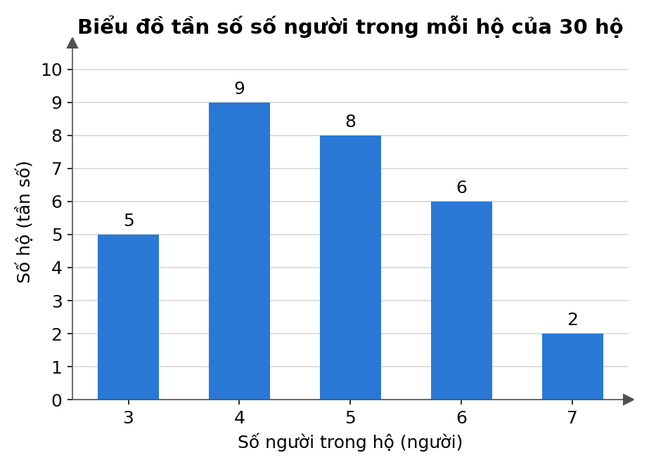{width=60%}

- **c)** Số hộ có từ 5 người trở lên là: $8 + 6 + 2 = 16$ (hộ). **(0,25đ)**
Tỉ lệ: $\dfrac{16}{30} \cdot 100\% \approx 53{,}3\%$. **(0,25đ)**

**Kết luận:** Có 16 hộ có từ 5 người trở lên, chiếm khoảng 53,3% số hộ được khảo sát.

**Bài 22.2:**
*Lời giải:*
- **a)** Bảng tần số: **(0,25đ)**

| Điểm | 5 | 6 | 7 | 8 | 9 | 10 | Cộng |
| :--- | :---: | :---: | :---: | :---: | :---: | :---: | :---: |
| Số học sinh | 2 | 4 | 5 | 5 | 3 | 1 | $n = 20$ |

Kiểm tra: $2 + 4 + 5 + 5 + 3 + 1 = 20$. Vậy có **5 học sinh** đạt điểm 8. **(0,25đ)**

- **b)** Phép thử: chọn ngẫu nhiên 1 học sinh trong 20 học sinh, nên $n(\Omega) = 20$. Vì chọn ngẫu nhiên nên các kết quả có thể là đồng khả năng. **(0,25đ)**
Các kết quả thuận lợi cho $A$ là các học sinh đạt 8, 9 hoặc 10 điểm: $n(A) = 5 + 3 + 1 = 9$.
Vậy $P(A) = \dfrac{n(A)}{n(\Omega)} = \dfrac{9}{20} = 0{,}45$. **(0,25đ)**

**Kết luận:** Có 5 học sinh đạt điểm 8; $P(A) = \dfrac{9}{20}$.

**Bài 22.3:**
*Lời giải:*
- **a)** Cỡ mẫu $n = 18 + 6 + 8 + 4 = 36$. Tần số tương đối của từng phương tiện: **(0,25đ)**
$$\frac{18}{36} \cdot 100\% = 50{,}0\%; \quad \frac{6}{36} \cdot 100\% \approx 16{,}7\%; \quad \frac{8}{36} \cdot 100\% \approx 22{,}2\%; \quad \frac{4}{36} \cdot 100\% \approx 11{,}1\%$$
Bảng tần số tương đối:

| Phương tiện | Xe đạp | Đi bộ | Xe đạp điện | Bố mẹ đưa đón | Cộng |
| :--- | :---: | :---: | :---: | :---: | :---: |
| Tần số tương đối | 50,0% | 16,7% | 22,2% | 11,1% | 100% |

Kiểm tra: $50{,}0 + 16{,}7 + 22{,}2 + 11{,}1 = 100{,}0$, tổng đúng bằng $100\%$. **(0,25đ)**

- **b)** Mỗi học sinh ứng với góc ở tâm $\dfrac{360^\circ}{36} = 10^\circ$. Số đo góc ở tâm của các hình quạt: **(0,25đ)**
$$\text{Xe đạp: } 18 \cdot 10^\circ = 180^\circ; \quad \text{Đi bộ: } 6 \cdot 10^\circ = 60^\circ; \quad \text{Xe đạp điện: } 8 \cdot 10^\circ = 80^\circ; \quad \text{Bố mẹ đưa đón: } 4 \cdot 10^\circ = 40^\circ$$
Kiểm tra: $180^\circ + 60^\circ + 80^\circ + 40^\circ = 360^\circ$. Vẽ đường tròn, dùng thước đo góc chia các hình quạt theo các góc trên, ghi tỉ lệ %, chú giải và tên biểu đồ. **(0,25đ)**

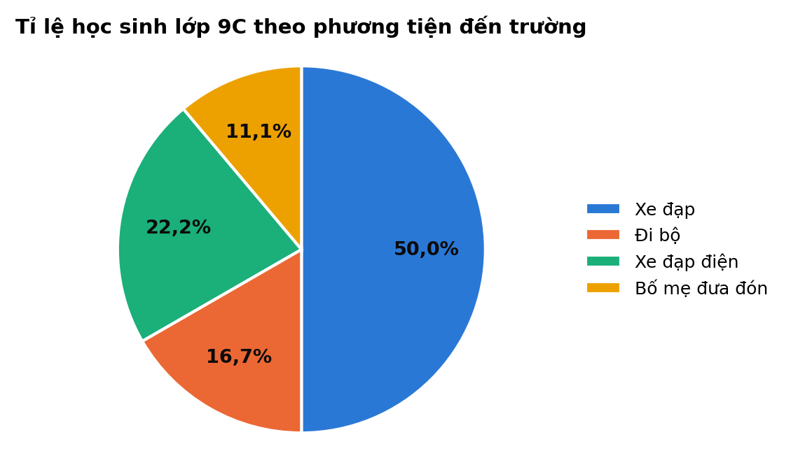{width=60%}

*Lưu ý:* Nếu dùng % đã làm tròn thì $16{,}7\% \cdot 360^\circ = 60{,}12^\circ$ – lệch so với giá trị đúng $60^\circ$. Vì vậy nên tính góc bằng $\dfrac{m_i}{n} \cdot 360^\circ$.

**Bài 22.4:**
*Lời giải:*
- **a)** Xếp từng giá trị vào nhóm (chú ý các giá trị đúng bằng đầu mút: 150 thuộc $[150; 155)$; 155 thuộc $[155; 160)$; hai giá trị 160 thuộc $[160; 165)$; 165 thuộc $[165; 170)$): **(0,25đ)**
  - $[145; 150)$: 147, 149 – có 2 giá trị.
  - $[150; 155)$: 150, 152, 153, 153, 154 – có 5 giá trị.
  - $[155; 160)$: 155, 156, 156, 157, 157, 158, 158, 159, 159 – có 9 giá trị.
  - $[160; 165)$: 160, 160, 161, 162, 163, 164 – có 6 giá trị.
  - $[165; 170)$: 165, 166, 168 – có 3 giá trị.

Bảng tần số và tần số tương đối ghép nhóm ($n = 25$; mỗi học sinh ứng với $\dfrac{100\%}{25} = 4\%$): **(0,25đ)**

| Chiều cao (cm) | $[145; 150)$ | $[150; 155)$ | $[155; 160)$ | $[160; 165)$ | $[165; 170)$ | Cộng |
| :--- | :---: | :---: | :---: | :---: | :---: | :---: |
| Tần số | 2 | 5 | 9 | 6 | 3 | 25 |
| Tần số tương đối | 8% | 20% | 36% | 24% | 12% | 100% |

- **b)** Nhóm $[155; 160)$ có tần số lớn nhất (9 học sinh). Giá trị đại diện của nhóm này là $\dfrac{155 + 160}{2} = 157{,}5$ (cm). **(0,25đ)**
Tỉ lệ học sinh nữ cao từ 160 cm trở lên (hai nhóm $[160; 165)$ và $[165; 170)$): $24\% + 12\% = 36\%$. **(0,25đ)**

- **c)** Biểu đồ tần số tương đối ghép nhóm dạng cột: trục ngang ghi các đầu mút 145; 150; …; 170 (cm), trục đứng ghi tần số tương đối (%); mỗi cột có chân trải từ đầu mút trái đến đầu mút phải của nhóm, chiều cao bằng tần số tương đối của nhóm, ghi số % trên đầu cột. **(0,25đ)** *(Cũng có thể vẽ các cột tách rời nhau, dưới mỗi cột ghi tên nhóm.)*

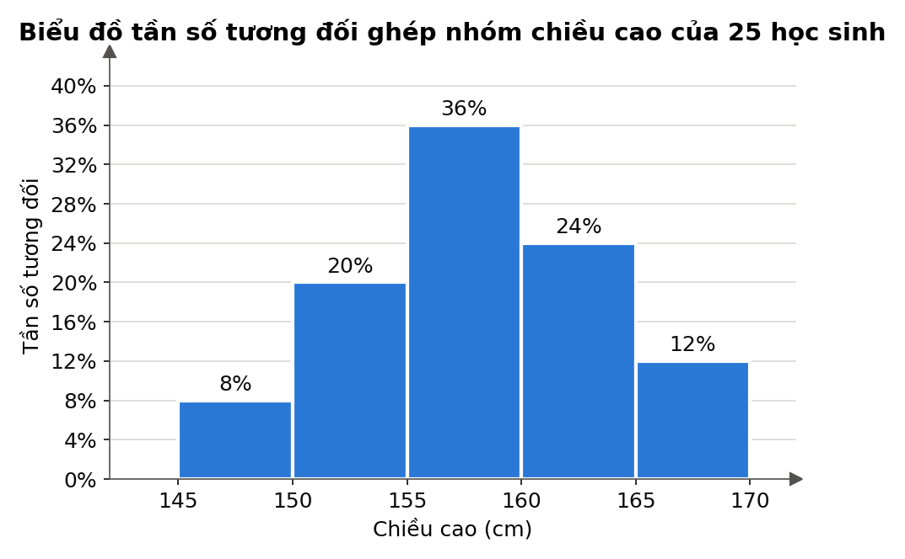{width=65%}

**Kết luận:** Nhóm $[155; 160)$ có tần số lớn nhất, giá trị đại diện 157,5 cm; có 36% số học sinh nữ cao từ 160 cm trở lên.

**Bài 22.5:**
*Lời giải:*
- **a)** Đọc số liệu trên biểu đồ, ta có bảng thống kê (đơn vị: tấn): **(0,25đ)**

| Tháng | 4 | 5 | 6 | 7 | 8 |
| :--- | :---: | :---: | :---: | :---: | :---: |
| Tổ A | 18 | 24 | 30 | 27 | 21 |
| Tổ B | 16 | 20 | 32 | 28 | 14 |

- **b)** So sánh từng tháng: tháng 6 ($32 > 30$) và tháng 7 ($28 > 27$) là các tháng tổ B có sản lượng cao hơn tổ A. **(0,25đ)**
- **c)** Tổng sản lượng của tổ A: $18 + 24 + 30 + 27 + 21 = 120$ (tấn).
Tổng sản lượng của tổ B: $16 + 20 + 32 + 28 + 14 = 110$ (tấn). **(0,25đ)**
Sản lượng tháng 6 của tổ A chiếm: $\dfrac{30}{120} \cdot 100\% = 25\%$ tổng sản lượng 5 tháng của tổ A. **(0,25đ)**
- **d)** Sản lượng của tổ B tháng 8 giảm so với tháng 7 là: $28 - 14 = 14$ (tấn). **(0,25đ)**
Tỉ lệ giảm: $\dfrac{14}{28} \cdot 100\% = 50\%$. **(0,25đ)**

**Kết luận:** b) Tháng 6 và tháng 7; c) Tổ A: 120 tấn, tổ B: 110 tấn, tháng 6 chiếm 25%; d) Giảm 50%.

**Bài 22.6:**
*Lời giải:*
- **a)** Điều kiện: $x, y$ là các số tự nhiên.
Tần số tương đối của nhóm $[10; 20)$ là 30% nên $\dfrac{x}{40} \cdot 100\% = 30\%$, suy ra $x = 0{,}3 \cdot 40 = 12$ (thỏa mãn). **(0,25đ)**
Cỡ mẫu bằng 40 nên $6 + x + 14 + y + 3 = 40 \Rightarrow 6 + 12 + 14 + y + 3 = 40 \Rightarrow y = 5$ (thỏa mãn). **(0,25đ)**
- **b)** Bảng tần số tương đối ghép nhóm ($n = 40$, mỗi học sinh ứng với $2{,}5\%$): **(0,25đ)**

| Thời gian (phút) | $[0; 10)$ | $[10; 20)$ | $[20; 30)$ | $[30; 40)$ | $[40; 50)$ | Cộng |
| :--- | :---: | :---: | :---: | :---: | :---: | :---: |
| Tần số | 6 | 12 | 14 | 5 | 3 | 40 |
| Tần số tương đối | 15% | 30% | 35% | 12,5% | 7,5% | 100% |

- **c)** Phép thử: chọn ngẫu nhiên 1 học sinh trong 40 học sinh, nên $n(\Omega) = 40$; các kết quả là đồng khả năng.
Gọi $B$ là biến cố "Học sinh được chọn đi từ nhà đến trường mất từ 20 phút trở lên". Các kết quả thuận lợi cho $B$ là các học sinh thuộc ba nhóm $[20; 30)$, $[30; 40)$, $[40; 50)$: $n(B) = 14 + 5 + 3 = 22$.
Vậy $P(B) = \dfrac{22}{40} = \dfrac{11}{20} = 0{,}55$. **(0,25đ)**

**Kết luận:** $x = 12$, $y = 5$; $P(B) = \dfrac{11}{20}$.

---

### Lời giải Chủ đề 23 (Xác suất của biến cố)

**Đáp án trắc nghiệm:**

| Câu | Đáp án | Giải thích ngắn |
| :---: | :---: | :--- |
| 23.1 | **D** | Mỗi quả bóng là một kết quả nên $n(\Omega) = 12$. |
| 23.2 | **A** | Số nguyên tố trong $\{1; \dots; 6\}$ là $2; 3; 5$: $P = \dfrac{3}{6} = \dfrac{1}{2}$ (số $1$ không là số nguyên tố). |
| 23.3 | **C** | Có thứ tự: lần 1 sấp – lần 2 ngửa ($SN$) khác lần 1 ngửa – lần 2 sấp ($NS$). |
| 23.4 | **B** | $6 \cdot 6 = 36$ (các cặp có thứ tự); $21$ là số cặp không kể thứ tự – sai. |
| 23.5 | **A** | Không có mặt nào lớn hơn $6$ chấm: biến cố không thể, xác suất bằng $0$. |
| 23.6 | **D** | Kết quả thuận lợi $(1; 3), (2; 2), (3; 1)$: $P = \dfrac{3}{36} = \dfrac{1}{12}$. |
| 23.7 | **A** | Các cặp: AB, AC, AD, BC, BD, CD – có $6$ kết quả (chọn 2 người không kể thứ tự). |
| 23.8 | **B** | $n(\Omega) = 8$; đúng hai ngửa: $NNS, NSN, SNN$ nên $P = \dfrac{3}{8}$. |
| 23.9 | **C** | Có $12$ số; chia hết cho $4$: $12; 24; 32$ nên $P = \dfrac{3}{12} = \dfrac{1}{4}$. |
| 23.10 | **D** | $n(\Omega) = 10$ cặp; khác màu: $3 \cdot 2 = 6$ cặp nên $P = \dfrac{6}{10} = \dfrac{3}{5}$ (A là xác suất cùng màu). |

**Lời giải tự luận:**

**Bài 23.1:**
*Lời giải:*
- **a)** $\Omega = \{1; 2; 3; \dots; 20\}$, $n(\Omega) = 20$. Các thẻ cùng loại nên các kết quả đồng khả năng. **(0,25đ)**
- **b)** Kết quả thuận lợi cho $A$: $3; 6; 9; 12; 15; 18$, nên $n(A) = 6$ và $P(A) = \dfrac{6}{20} = \dfrac{3}{10}$. **(0,25đ)**
- **c)** Kết quả thuận lợi cho $B$: $2; 3; 5; 7; 11; 13; 17; 19$, nên $n(B) = 8$ và $P(B) = \dfrac{8}{20} = \dfrac{2}{5}$. **(0,25đ)**
- **d)** Các số có hai chữ số từ $10$ đến $20$ có tổng các chữ số bằng $5$: chỉ có $14$. Vậy $P(C) = \dfrac{1}{20}$. **(0,25đ)**

**Kết luận:** $n(\Omega) = 20$; $P(A) = \dfrac{3}{10}$; $P(B) = \dfrac{2}{5}$; $P(C) = \dfrac{1}{20}$.

**Bài 23.2:**
*Lời giải:*
- **a)** Sơ đồ cây ($S$: sấp, $N$: ngửa; số là số chấm của xúc xắc):

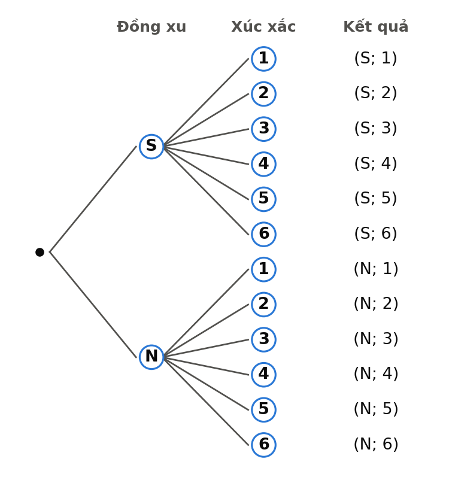{width=50%}

  Mỗi mặt đồng xu đi với $6$ mặt xúc xắc nên $n(\Omega) = 2 \cdot 6 = 12$. **(0,25đ)**
- **b)** Kết quả thuận lợi cho $A$: $(N; 2), (N; 4), (N; 6)$, nên $P(A) = \dfrac{3}{12} = \dfrac{1}{4}$. **(0,25đ)**
- **c)** Kết quả thuận lợi cho $B$: $(S; 6), (N; 6)$, nên $P(B) = \dfrac{2}{12} = \dfrac{1}{6}$. **(0,25đ)**
- **d)** Kết quả thuận lợi cho $C$: $6$ kết quả có đồng xu sấp $(S; 1), \dots, (S; 6)$ và thêm $(N; 1)$, tổng cộng $7$ kết quả. Vậy $P(C) = \dfrac{7}{12}$. **(0,25đ)**
  *Lưu ý:* không đếm $(S; 1)$ hai lần.

**Bài 23.3:**
*Lời giải:*
- Không gian mẫu gồm $36$ cặp $(i; j)$ đồng khả năng (xem bảng ở phần lý thuyết). **(0,25đ)**
- **a)** Thuận lợi cho $A$: $(1; 6), (2; 5), (3; 4), (4; 3), (5; 2), (6; 1)$, nên $P(A) = \dfrac{6}{36} = \dfrac{1}{6}$. **(0,25đ)**
- **b)** Tích lẻ khi cả hai số đều lẻ: mỗi lần có $3$ khả năng ($1; 3; 5$), nên $n(B) = 3 \cdot 3 = 9$ và $P(B) = \dfrac{9}{36} = \dfrac{1}{4}$. **(0,25đ)**
- **c)** Thuận lợi cho $C$: $(1; 2), (2; 4), (3; 6)$, nên $P(C) = \dfrac{3}{36} = \dfrac{1}{12}$. **(0,25đ)**

**Bài 23.4:**
*Lời giải:* Tổng hai số là số chẵn khi hai số **cùng chẵn** hoặc **cùng lẻ**.
- **a)** Có hoàn lại: mỗi lần có $4$ khả năng nên $n(\Omega) = 4 \cdot 4 = 16$. Thuận lợi: $(1; 1), (1; 3), (3; 1), (3; 3), (2; 2), (2; 4), (4; 2), (4; 4)$, tức $n(A) = 8$. Vậy $P(A) = \dfrac{8}{16} = \dfrac{1}{2}$. **(0,25đ)**
- **b)** Lần lượt, không hoàn lại: $n(\Omega) = 4 \cdot 3 = 12$ (hai số khác nhau, có thứ tự). Thuận lợi: $(1; 3), (3; 1), (2; 4), (4; 2)$, tức $n(A) = 4$. Vậy $P(A) = \dfrac{4}{12} = \dfrac{1}{3}$. **(0,25đ)**
- **c)** Cùng lúc: các kết quả là $\{1; 2\}, \{1; 3\}, \{1; 4\}, \{2; 3\}, \{2; 4\}, \{3; 4\}$, $n(\Omega) = 6$. Thuận lợi: $\{1; 3\}, \{2; 4\}$. Vậy $P(A) = \dfrac{2}{6} = \dfrac{1}{3}$. **(0,25đ)**
- *Nhận xét:* rút có hoàn lại cho kết quả khác; rút lần lượt không hoàn lại và rút cùng lúc cho **cùng** xác suất (dù số phần tử không gian mẫu khác nhau). **(0,25đ)**

**Bài 23.5:**
*Lời giải:*
- **a)** Các kết quả (không kể thứ tự): $\{$Hùng; Minh$\}$, $\{$Hùng; Nam$\}$, $\{$Hùng; Lan$\}$, $\{$Hùng; Mai$\}$, $\{$Minh; Nam$\}$, $\{$Minh; Lan$\}$, $\{$Minh; Mai$\}$, $\{$Nam; Lan$\}$, $\{$Nam; Mai$\}$, $\{$Lan; Mai$\}$. Vậy $n(\Omega) = 10$. **(0,25đ)**
- **b)** Mỗi bạn nam đi với một trong $2$ bạn nữ: $3 \cdot 2 = 6$ kết quả, nên $P = \dfrac{6}{10} = \dfrac{3}{5}$. **(0,25đ)**
- **c)** Không có bạn nữ nào khi chọn 2 trong 3 bạn nam: $\{$Hùng; Minh$\}$, $\{$Hùng; Nam$\}$, $\{$Minh; Nam$\}$ – có $3$ kết quả. Số kết quả có ít nhất $1$ nữ là $10 - 3 = 7$, nên $P = \dfrac{7}{10}$. **(0,25đ)**
- **d)** Lan đi cùng một trong $4$ bạn còn lại: $4$ kết quả, nên $P = \dfrac{4}{10} = \dfrac{2}{5}$. **(0,25đ)**

**Bài 23.6:**
*Lời giải:*
- **a)** Gọi số viên bi xanh là $x$ ($x \in \mathbb{N}$). Tổng số bi là $5 + x$, các viên bi đồng khả năng được lấy. **(0,25đ)**
  $P(\text{đỏ}) = \dfrac{5}{5 + x} = \dfrac{1}{3} \Leftrightarrow 5 + x = 15 \Leftrightarrow x = 10$ (thỏa mãn). Vậy hộp có $10$ viên bi xanh. **(0,25đ)**
- **b)** Gọi số bi đỏ cần thêm là $y$ ($y \in \mathbb{N}$). Khi đó có $5 + y$ bi đỏ trong tổng số $15 + y$ viên. **(0,25đ)**
  $\dfrac{5 + y}{15 + y} = \dfrac{1}{2} \Leftrightarrow 10 + 2y = 15 + y \Leftrightarrow y = 5$ (thỏa mãn). Vậy cần thêm $5$ viên bi đỏ. **(0,25đ)**

---

### Lời giải Chủ đề 24 (Đường tròn ngoại tiếp – nội tiếp, Bốn điểm cùng thuộc một đường tròn, Đa giác đều & Phép quay)

**Đáp án trắc nghiệm:**

| Câu | Đáp án | Giải thích ngắn |
| :---: | :---: | :--- |
| 24.1 | **D** | Tâm đường tròn ngoại tiếp cách đều ba đỉnh nên nằm trên ba đường trung trực. |
| 24.2 | **B** | Tam giác vuông: $R = \dfrac{BC}{2} = 5\text{ cm}$. |
| 24.3 | **A** | $R = \dfrac{a\sqrt{3}}{3} = \dfrac{6\sqrt{3}}{3} = 2\sqrt{3}\text{ cm}$ (B là bán kính đường tròn nội tiếp). |
| 24.4 | **C** | Hình vuông có các cạnh bằng nhau và các góc bằng nhau; hình thoi có góc không bằng nhau, hình chữ nhật có cạnh không bằng nhau. |
| 24.5 | **D** | $\dfrac{(5 - 2) \cdot 180^\circ}{5} = 108^\circ$ (C là tổng các góc). |
| 24.6 | **C** | Góc quay là bội của $\dfrac{360^\circ}{3} = 120^\circ$. |
| 24.7 | **B** | Tứ giác nội tiếp: $\widehat{A} + \widehat{C} = 180^\circ \Rightarrow \widehat{C} = 110^\circ$. |
| 24.8 | **A** | $OB = OC = BC = R$ nên $\widehat{BOC} = 60^\circ$; góc nội tiếp $\widehat{BAC} = \dfrac{1}{2}\widehat{BOC} = 30^\circ$. |

**Lời giải tự luận:**

**Bài 24.1:**

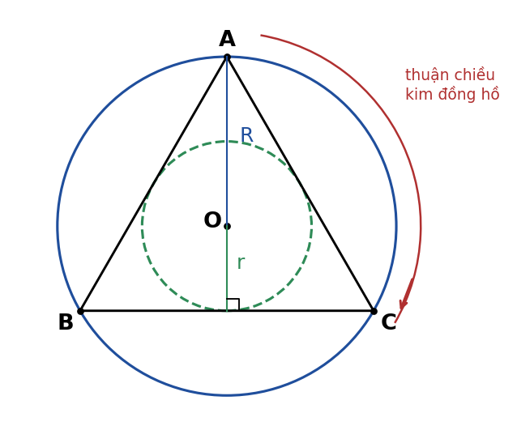{width=40%}

*Lời giải:*
- **a)** Gọi $H$ là trung điểm $BC$, đường cao $AH = \dfrac{6\sqrt{3}}{2} = 3\sqrt{3}\text{ (cm)}$. Tâm $O$ là trọng tâm nên $R = OA = \dfrac{2}{3}AH = 2\sqrt{3}\text{ (cm)}$, $r = OH = \dfrac{1}{3}AH = \sqrt{3}\text{ (cm)}$. **(0,5đ)**
- **b)** $S = \pi(R^2 - r^2) = \pi(12 - 3) = 9\pi\text{ (cm}^2)$. **(0,25đ)**
- **c)** $\widehat{AOB} = \widehat{BOC} = \widehat{COA} = 120^\circ$. Vì $A, B, C$ xếp ngược chiều kim đồng hồ nên quay thuận chiều kim đồng hồ $120^\circ$: $A \mapsto C$, $B \mapsto A$, $C \mapsto B$. **(0,25đ)**

**Bài 24.2:**

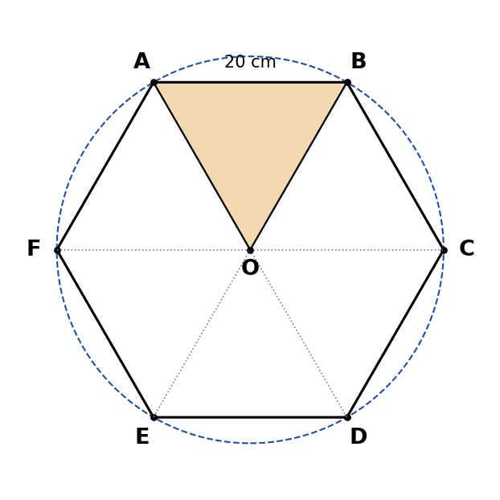{width=40%}

*Lời giải:*
- **a)** $\widehat{ABC} = \dfrac{(6 - 2) \cdot 180^\circ}{6} = 120^\circ$; $\widehat{AOB} = \dfrac{360^\circ}{6} = 60^\circ$. **(0,5đ)**
- **b)** Tam giác $OAB$ cân tại $O$ có $\widehat{AOB} = 60^\circ$ nên là tam giác đều cạnh $20\text{ cm}$, diện tích $\dfrac{20^2\sqrt{3}}{4} = 100\sqrt{3}\text{ (cm}^2)$. **(0,25đ)**
  Viên gạch gồm $6$ tam giác đều như vậy: $S = 600\sqrt{3} \approx 1039{,}23\text{ (cm}^2)$. **(0,25đ)**
- **c)** Ví dụ phép quay thuận chiều kim đồng hồ tâm $O$ góc $60^\circ$ (biến $A \mapsto B$, $B \mapsto C$, …). **(0,25đ)**

**Bài 24.3:**

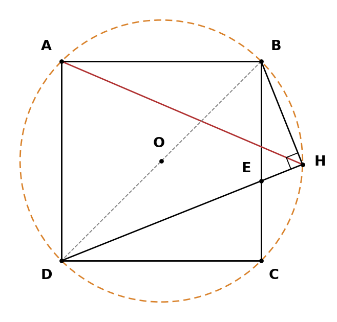{width=40%}

*Lời giải:*
- **a)** $ABCD$ là hình vuông nên $\widehat{BAD} = \widehat{BCD} = 90^\circ$; $BH \perp DE$ nên $\widehat{BHD} = 90^\circ$. **(0,25đ)**
  Ba điểm $A, C, H$ cùng nhìn đoạn $BD$ dưới góc vuông nên năm điểm $A, B, C, D, H$ cùng thuộc đường tròn đường kính $BD$. **(0,25đ)**
  Tâm $O$ là trung điểm $BD$ (giao điểm hai đường chéo hình vuông), bán kính $\dfrac{BD}{2}$. **(0,25đ)**
- **b)** Trong đường tròn $(O)$: $\widehat{AHB} = \widehat{ADB}$ (cùng chắn cung $AB$), mà $\widehat{ADB} = 45^\circ$ (đường chéo hình vuông là phân giác) nên $\widehat{AHB} = 45^\circ$. **(0,25đ)**
  Tương tự $\widehat{AHD} = \widehat{ABD} = 45^\circ$ (cùng chắn cung $AD$). Mà $\widehat{BHD} = 90^\circ = \widehat{AHB} + \widehat{AHD}$ nên $HA$ là tia phân giác của $\widehat{BHD}$. **(0,25đ)**

**Bài 24.4:**

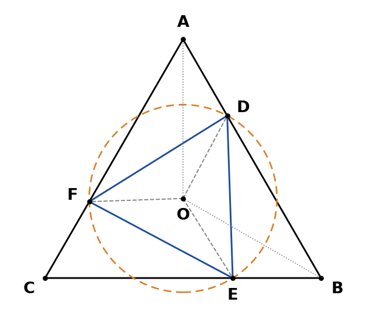{width=40%}

*Lời giải:*
- **a)** $O$ là tâm tam giác đều nên $OA = OB = OC$ và $OA, OB, OC$ là các tia phân giác, do đó $\widehat{OAD} = \widehat{OBE} = \widehat{OCF} = 30^\circ$. **(0,25đ)**
  $\Delta OAD = \Delta OBE = \Delta OCF$ (c.g.c) vì $OA = OB = OC$, $\widehat{OAD} = \widehat{OBE} = \widehat{OCF}$, $AD = BE = CF$. Suy ra $OD = OE = OF$. **(0,25đ)**
- **b)** Vì $AB = BC = CA$ và $AD = BE = CF$ nên $BD = CE = AF$. **(0,25đ)**
  $\Delta ADF = \Delta BED = \Delta CFE$ (c.g.c: $AD = BE = CF$; $\widehat{A} = \widehat{B} = \widehat{C} = 60^\circ$; $AF = BD = CE$), suy ra $DF = ED = FE$. Vậy tam giác $DEF$ đều. **(0,25đ)**
- **c)** $\widehat{AOB} = 120^\circ$, $A, B, C$ xếp theo chiều kim đồng hồ nên phép quay biến $A \mapsto B$, $B \mapsto C$; điểm $D$ trên $AB$ với $AD$ cho trước được biến thành điểm trên $BC$ cách $B$ một đoạn bằng $AD$, đó là $E$. Vậy $A \mapsto B$, $D \mapsto E$. **(0,25đ)**

**Bài 24.5:**

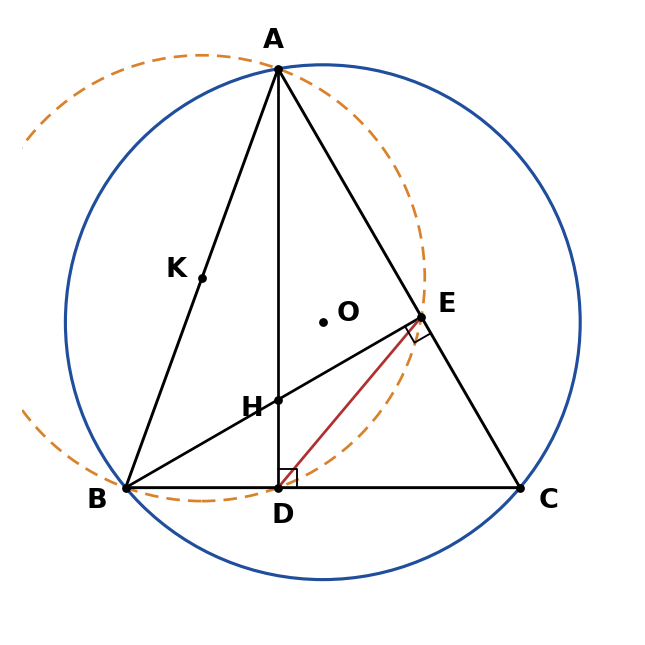{width=40%}

*Lời giải:*
- **a)** $\widehat{ADB} = \widehat{AEB} = 90^\circ$ (vì $AD \perp BC$, $BE \perp AC$) nên $D$, $E$ thuộc đường tròn đường kính $AB$. Vậy $A, B, D, E$ cùng thuộc đường tròn tâm $K$ (trung điểm $AB$). **(0,5đ)**
- **b)** Trong đường tròn $(K)$: $\widehat{DAE} = \widehat{DBE}$ (cùng chắn cung $DE$). **(0,25đ)**
  $\Delta CDA \backsim \Delta CEB$ (g.g) vì $\widehat{C}$ chung và $\widehat{CDA} = \widehat{CEB} = 90^\circ$. Suy ra $\dfrac{CD}{CE} = \dfrac{CA}{CB} \Rightarrow CD \cdot CB = CE \cdot CA$. **(0,25đ)**
- **c)** $\widehat{AOB} = 2\widehat{ACB} = 120^\circ$ (góc ở tâm và góc nội tiếp cùng chắn cung $AB$). Tam giác $OAB$ cân nên $OK \perp AB$ và $\widehat{AOK} = 60^\circ$, do đó $AK = OA \sin 60^\circ = \dfrac{R\sqrt{3}}{2}$, suy ra $AB = R\sqrt{3}$. **(0,25đ)**
  Từ b): $\dfrac{CD}{CA} = \dfrac{CE}{CB}$, lại có $\widehat{C}$ chung nên $\Delta CDE \backsim \Delta CAB$ (c.g.c), suy ra $\dfrac{DE}{AB} = \dfrac{CD}{CA} = \cos 60^\circ = \dfrac{1}{2}$ (trong tam giác $ADC$ vuông tại $D$). Vậy $DE = \dfrac{R\sqrt{3}}{2}$. **(0,25đ)**

**Bài 24.6:**

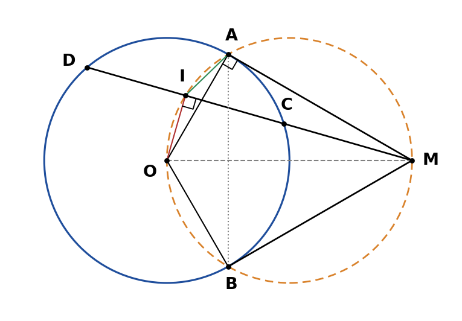{width=45%}

*Lời giải:*
- **a)** $MA$, $MB$ là tiếp tuyến nên $\widehat{OAM} = \widehat{OBM} = 90^\circ$. $I$ là trung điểm dây $CD$ không qua tâm nên $OI \perp CD$, tức $\widehat{OIM} = 90^\circ$. **(0,25đ)**
  Ba điểm $A, I, B$ cùng nhìn $MO$ dưới góc vuông nên $M, A, I, O, B$ cùng thuộc đường tròn đường kính $MO$. **(0,25đ)**
- **b)** Trong đường tròn đường kính $MO$: $\widehat{AIM} = \widehat{AOM}$ (cùng chắn cung $AM$). **(0,5đ)**
- **c)** **Phần nhặt điểm (≈0,25đ):** $MA^2 = MO^2 - OA^2 = 4R^2 - R^2 = 3R^2$ (Pythagore trong $\Delta OAM$ vuông tại $A$). **(0,25đ)**
  Vì $I$ là trung điểm $CD$: $MC \cdot MD = (MI - IC)(MI + IC) = MI^2 - IC^2 = (MO^2 - OI^2) - (OC^2 - OI^2) = MO^2 - R^2 = MA^2$. Vậy $MC \cdot MD = MA^2 = 3R^2$. **(0,25đ)**
- **d)** Trong $\Delta OAM$ vuông tại $A$: $\sin\widehat{AMO} = \dfrac{OA}{OM} = \dfrac{1}{2} \Rightarrow \widehat{AMO} = 30^\circ$, nên $\widehat{AMB} = 2\widehat{AMO} = 60^\circ$ ($MO$ là phân giác góc $AMB$). **(0,25đ)**
  $\Delta AMB$ cân tại $M$ ($MA = MB$) có góc $60^\circ$ nên đều: $AB = MA = R\sqrt{3}$. **(0,25đ)**

**Bài 24.7:**

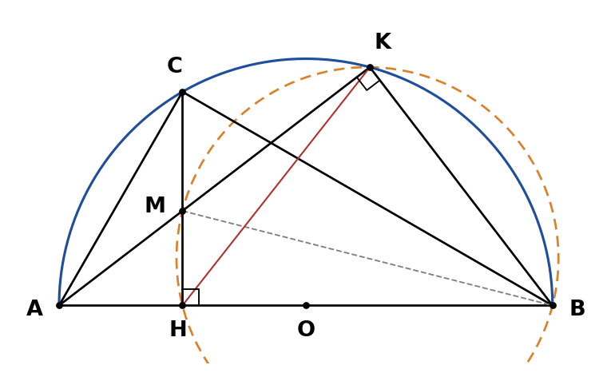{width=45%}

*Lời giải:*
- **a)** $\widehat{AKB} = 90^\circ$ (góc nội tiếp chắn nửa đường tròn) nên $\widehat{MKB} = 90^\circ$; $\widehat{MHB} = 90^\circ$ (vì $CH \perp AB$). **(0,25đ)**
  Hai điểm $K, H$ cùng nhìn $MB$ dưới góc vuông nên $B, H, M, K$ cùng thuộc đường tròn đường kính $MB$. **(0,25đ)**
- **b)** Trong đường tròn đường kính $MB$: $\widehat{MKH} = \widehat{MBH}$ (cùng chắn cung $MH$). **(0,5đ)**
- **c)** $\Delta AHM \backsim \Delta AKB$ (g.g: $\widehat{A}$ chung, $\widehat{AHM} = \widehat{AKB} = 90^\circ$) $\Rightarrow \dfrac{AH}{AK} = \dfrac{AM}{AB} \Rightarrow AM \cdot AK = AH \cdot AB$. **(0,25đ)**
  $\widehat{ACB} = 90^\circ$ (chắn nửa đường tròn), $CH \perp AB$ nên $\Delta ACH \backsim \Delta ABC$ (g.g, $\widehat{A}$ chung) $\Rightarrow AC^2 = AH \cdot AB$. **(0,25đ)**
  $AH = \dfrac{R}{2}$, $AB = 2R$ nên $AM \cdot AK = \dfrac{R}{2} \cdot 2R = R^2$ (và $AC = R$). **(0,25đ)**

**Bài 24.8:**

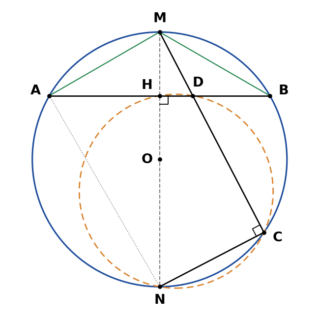{width=40%}

*Lời giải:*
- **a)** $\widehat{MCN} = 90^\circ$ (góc nội tiếp chắn nửa đường tròn) nên $\widehat{DCN} = 90^\circ$; $\widehat{DHN} = 90^\circ$ (vì $MN \perp AB$). **(0,25đ)**
  Hai điểm $C, H$ cùng nhìn $DN$ dưới góc vuông nên $C, D, H, N$ cùng thuộc đường tròn đường kính $DN$. **(0,25đ)**
- **b)** $\Delta MHD \backsim \Delta MCN$ (g.g: $\widehat{M}$ chung, $\widehat{MHD} = \widehat{MCN} = 90^\circ$) $\Rightarrow \dfrac{MH}{MC} = \dfrac{MD}{MN} \Rightarrow MD \cdot MC = MH \cdot MN$. **(0,25đ)**
  $\widehat{MAN} = 90^\circ$ (chắn nửa đường tròn), $AH \perp MN$ nên $\Delta MAH \backsim \Delta MNA$ (g.g) $\Rightarrow MA^2 = MH \cdot MN$. **(0,25đ)**
- **c)** Đường kính vuông góc với dây thì đi qua trung điểm dây: $AH = \dfrac{R\sqrt{3}}{2}$, $OH = \sqrt{R^2 - \dfrac{3R^2}{4}} = \dfrac{R}{2}$. Vì $M$ thuộc cung nhỏ $AB$ nên $MH = R - \dfrac{R}{2} = \dfrac{R}{2}$. **(0,25đ)**
  $MD \cdot MC = MH \cdot MN = \dfrac{R}{2} \cdot 2R = R^2$. **(0,25đ)**

**Bài 24.9:**

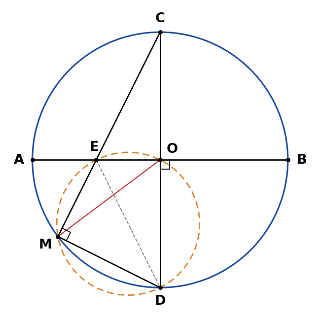{width=40%}

*Lời giải:*
- **a)** $\widehat{CMD} = 90^\circ$ (chắn nửa đường tròn) nên $\widehat{EMD} = 90^\circ$; $\widehat{EOD} = 90^\circ$ (vì $AB \perp CD$). **(0,25đ)**
  Hai điểm $M, O$ cùng nhìn $ED$ dưới góc vuông nên $O, E, M, D$ cùng thuộc đường tròn đường kính $ED$. **(0,25đ)**
- **b)** Trong đường tròn đường kính $ED$: $\widehat{OME} = \widehat{ODE}$ (cùng chắn cung $OE$). **(0,5đ)**
- **c)** $\Delta COE \backsim \Delta CMD$ (g.g: $\widehat{C}$ chung, $\widehat{COE} = \widehat{CMD} = 90^\circ$) $\Rightarrow \dfrac{CO}{CM} = \dfrac{CE}{CD} \Rightarrow CE \cdot CM = CO \cdot CD = R \cdot 2R = 2R^2$. **(0,25đ)**
  $CE = \sqrt{CO^2 + OE^2} = \sqrt{R^2 + \dfrac{R^2}{4}} = \dfrac{R\sqrt{5}}{2}$; $CM = \dfrac{2R^2}{CE} = \dfrac{4R}{\sqrt{5}} = \dfrac{4R\sqrt{5}}{5}$. **(0,25đ)**

**Bài 24.10:**

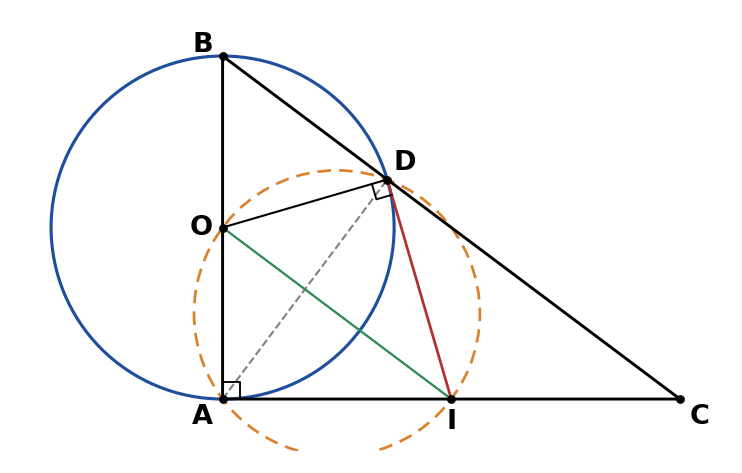{width=40%}

*Lời giải:*
- **a)** $AC \perp AB$ tại $A$ nên $AC$ là tiếp tuyến của $(O)$ tại $A$: $\widehat{OAI} = 90^\circ$; $ID$ là tiếp tuyến tại $D$: $\widehat{ODI} = 90^\circ$. **(0,25đ)**
  Hai điểm $A, D$ cùng nhìn $OI$ dưới góc vuông nên $A, O, D, I$ cùng thuộc đường tròn đường kính $OI$. **(0,25đ)**
- **b)** $\widehat{ADB} = 90^\circ$ (chắn nửa đường tròn). $\Delta ABD \backsim \Delta CBA$ (g.g: $\widehat{B}$ chung, $\widehat{ADB} = \widehat{CAB} = 90^\circ$) $\Rightarrow \dfrac{AB}{CB} = \dfrac{BD}{BA} \Rightarrow AB^2 = BD \cdot BC$. **(0,25đ)**
  $BC = \sqrt{6^2 + 8^2} = 10\text{ (cm)}$, nên $BD = \dfrac{36}{10} = 3{,}6\text{ (cm)}$. **(0,25đ)**
- **c)** $IA$, $ID$ là hai tiếp tuyến cắt nhau tại $I$ nên $IA = ID$, suy ra $\widehat{IAD} = \widehat{IDA}$. **(0,25đ)**
  Trong $\Delta ADC$ vuông tại $D$: $\widehat{IDC} = 90^\circ - \widehat{IDA}$ và $\widehat{ICD} = 90^\circ - \widehat{IAD}$, nên $\widehat{IDC} = \widehat{ICD}$, suy ra $ID = IC$. Vậy $IA = IC$, $I$ là trung điểm $AC$. **(0,25đ)**
  $O$, $I$ lần lượt là trung điểm $AB$, $AC$ nên $OI$ là đường trung bình của $\Delta ABC$, do đó $OI \parallel BC$. **(0,25đ)**

---

### Lời giải Chủ đề 25 (Hình khối trong thực tiễn)

**Đáp án trắc nghiệm:**

| Câu | Đáp án | Giải thích ngắn |
| :---: | :---: | :--- |
| 25.1 | **C** | $1\text{ m}^3 = 1000$ lít nên $2{,}5\text{ m}^3 = 2500$ lít. |
| 25.2 | **A** | $R = 2$: $S = 4\pi \cdot 2^2 = 16\pi$ (B dùng nhầm đường kính; D là thể tích). |
| 25.3 | **D** | $V = \dfrac{2}{3}\pi \cdot 6^3 = 144\pi$ (A là thể tích cả hình cầu). |
| 25.4 | **B** | Nón: $\dfrac{1}{3}\pi \cdot 9 \cdot 10 = 30\pi$; nửa cầu: $\dfrac{2}{3}\pi \cdot 27 = 18\pi$; tổng $48\pi$ (C quên $\dfrac{1}{3}$; A dùng cả hình cầu). |
| 25.5 | **C** | $V = 3{,}14 \cdot 0{,}5^2 \cdot 1{,}2 = 0{,}942\text{ m}^3 = 942$ lít; $942 : 20 = 47{,}1$ nên cần ít nhất $48$ can (A làm tròn xuống – thiếu nước). |

**Lời giải tự luận:**

**Bài 25.1:**
*Lời giải:*
- Bán kính quả bóng: $R = 22 : 2 = 11\text{ (cm)}$. **(0,25đ)**
- **a)** $S = 4\pi R^2 \approx 4 \cdot 3{,}14 \cdot 11^2 = 1519{,}76\text{ (cm}^2)$. **(0,25đ)**
- **b)** $V = \dfrac{4}{3}\pi R^3 \approx \dfrac{4}{3} \cdot 3{,}14 \cdot 1331 \approx 5572{,}45\text{ (cm}^3)$. **(0,25đ)**
  $5572{,}45\text{ cm}^3 = 5{,}57245\text{ dm}^3 \approx 5{,}57$ lít. **(0,25đ)**

**Bài 25.2:**
*Lời giải:*
- **a)** Thể tích thân tháp: $V = \pi r^2 h \approx 3{,}14 \cdot 2^2 \cdot 5 = 62{,}8\text{ (m}^3) = 62\,800$ lít. **(0,25đ)**
- **b)** Đường sinh của mái: $l = \sqrt{r^2 + h^2} = \sqrt{2^2 + 1{,}5^2} = \sqrt{6{,}25} = 2{,}5\text{ (m)}$. **(0,25đ)**
  Diện tích xung quanh mái: $S_{xq} = \pi r l \approx 3{,}14 \cdot 2 \cdot 2{,}5 = 15{,}7\text{ (m}^2)$. **(0,25đ)**
- **c)** Diện tích xung quanh thân tháp: $2\pi r h \approx 2 \cdot 3{,}14 \cdot 2 \cdot 5 = 62{,}8\text{ (m}^2)$. Tổng diện tích sơn: $62{,}8 + 15{,}7 = 78{,}5\text{ (m}^2)$. **(0,25đ)**
  Số tiền sơn: $78{,}5 \cdot 35\,000 = 2\,747\,500$ (đồng). **(0,25đ)**

**Kết luận:** a) $62\,800$ lít; b) $l = 2{,}5\text{ m}$, $S_{xq} = 15{,}7\text{ m}^2$; c) $2\,747\,500$ đồng.

**Bài 25.3:**
*Lời giải:*
- **a)** Thể tích viên đá bằng thể tích phần nước dâng lên (một hình trụ bán kính $4\text{ cm}$, cao $2{,}5\text{ cm}$): $V = \pi \cdot 4^2 \cdot 2{,}5 = 40\pi \approx 125{,}66\text{ (cm}^3)$. **(0,25đ)**
- **b)** Để nước dâng thêm $1\text{ cm}$ cần thể tích $\pi \cdot 4^2 \cdot 1 = 16\pi\text{ (cm}^3)$. Mỗi viên bi có thể tích $\dfrac{4}{3}\pi \cdot 1^3 = \dfrac{4\pi}{3}\text{ (cm}^3)$. **(0,25đ)**
  Số viên bi cần: $16\pi : \dfrac{4\pi}{3} = 12$. Vậy cần ít nhất $12$ viên bi. **(0,25đ)**
  Khi đó mực nước cao $10 + 2{,}5 + 1 = 13{,}5\text{ (cm)} < 15\text{ cm}$ nên nước không tràn ra ngoài. **(0,25đ)**

**Bài 25.4:**
*Lời giải:*
- Bán kính $r = 6 : 2 = 3\text{ (mm)}$; hai nửa hình cầu ghép thành một hình cầu bán kính $3\text{ mm}$; phần hình trụ dài $20 - 2 \cdot 3 = 14\text{ (mm)}$. **(0,25đ)**
- **a)** $V = \pi \cdot 3^2 \cdot 14 + \dfrac{4}{3}\pi \cdot 3^3 = 126\pi + 36\pi = 162\pi \approx 508{,}94\text{ (mm}^3)$. **(0,25đ)**
- **b)** $S = 2\pi \cdot 3 \cdot 14 + 4\pi \cdot 3^2 = 84\pi + 36\pi = 120\pi \approx 376{,}99\text{ (mm}^2)$. **(0,25đ)**
- **c)** $100$ viên: $100 \cdot 162\pi = 16\,200\pi \approx 50\,893{,}8\text{ (mm}^3)$. Vì $1\text{ ml} = 1\text{ cm}^3 = 1000\text{ mm}^3$ nên khoảng $50{,}89\text{ ml}$. **(0,25đ)**

**Bài 25.5:**
*Lời giải:*
- **a)** Mặt cong là nửa mặt xung quanh hình trụ: $\dfrac{1}{2} \cdot 2\pi \cdot 3 \cdot 20 = 60\pi\text{ (m}^2)$. Hai đầu hồi là hai nửa hình tròn, ghép thành một hình tròn: $\pi \cdot 3^2 = 9\pi\text{ (m}^2)$. **(0,25đ)**
  Diện tích màng: $60\pi + 9\pi = 69\pi \approx 216{,}66\text{ (m}^2)$; chi phí: $216{,}66 \cdot 20\,000 = 4\,333\,200$ (đồng). **(0,25đ)**
- **b)** $V = \dfrac{1}{2}\pi \cdot 3^2 \cdot 20 = 90\pi \approx 282{,}6\text{ (m}^3)$. **(0,25đ)**
- **c)** $282{,}6 : 50 = 5{,}652$ nên cần ít nhất $6$ máy quạt. **(0,25đ)**

**Kết luận:** a) $216{,}66\text{ m}^2$, $4\,333\,200$ đồng; b) $282{,}6\text{ m}^3$; c) $6$ máy.

---

