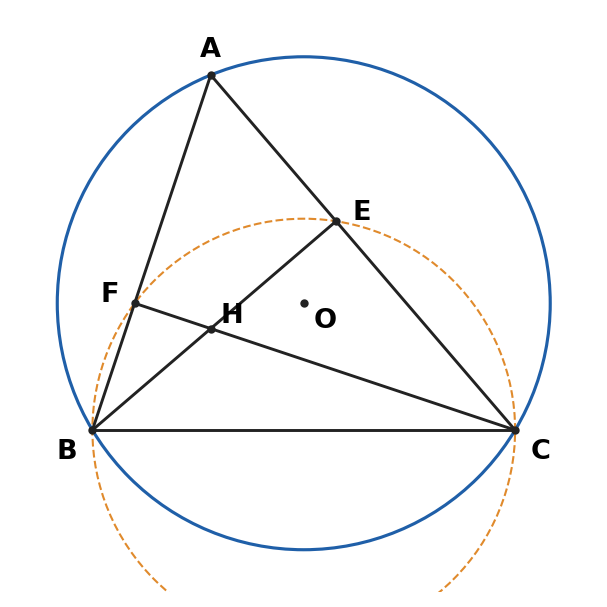

# ĐỀ LUYỆN SỐ 01 – THEO CẤU TRÚC ĐỀ TUYỂN SINH VÀO 10 MÔN TOÁN CỦA SỞ GD&ĐT NINH BÌNH
**Thời gian làm bài: 120 phút – Thang điểm 10**

*Đề tự biên soạn để luyện tập, không phải đề chính thức. Đề theo khung của đề chính thức năm 2026: 8 câu trắc nghiệm và 6 bài tự luận; độ khó nhẹ hơn đề thật một chút. Dùng vào cuối tháng 3/2027 (sau khi học xong Vi-ét, thống kê – xác suất). Bấm giờ 120 phút, làm theo chiến thuật 3 lượt trong Lộ trình.*

---

## Phần I. Trắc nghiệm (2,0 điểm)
*Hãy chọn chữ cái đứng trước phương án trả lời đúng và ghi chữ cái đó vào bài làm.*

**Câu 1.** Các nghiệm của phương trình $x^2 - 7x + 10 = 0$ là:
> A. $x = 2$ và $x = 5$        B. $x = -2$ và $x = -5$        C. $x = 1$ và $x = 10$        D. $x = -1$ và $x = -10$

**Câu 2.** Căn bậc ba của $-8$ là:
> A. $2$        B. $-2$        C. $\pm 2$        D. không xác định

**Câu 3.** Nghiệm của bất phương trình $3x - 6 > 0$ là:
> A. $x > -2$        B. $x < 2$        C. $x > 2$        D. $x < -2$

**Câu 4.** Bảng tần số ghép nhóm sau cho biết cân nặng (kg) của học sinh lớp 9A:

| Cân nặng (kg) | $[40; 45)$ | $[45; 50)$ | $[50; 55)$ | $[55; 60)$ |
|:---:|:---:|:---:|:---:|:---:|
| Tần số | 8 | 15 | 12 | 5 |

Số học sinh có cân nặng từ $45\text{ kg}$ đến dưới $50\text{ kg}$ là:
> A. $8$        B. $12$        C. $5$        D. $15$

**Câu 5.** Tung một đồng xu cân đối hai lần liên tiếp. Số phần tử của không gian mẫu là:
> A. $2$        B. $3$        C. $4$        D. $8$

**Câu 6.** Cho tam giác $ABC$ vuông tại $A$ có $AB = 3\text{ cm}$, $BC = 5\text{ cm}$. Giá trị của $\sin C$ là:
> A. $\dfrac{3}{5}$        B. $\dfrac{4}{5}$        C. $\dfrac{3}{4}$        D. $\dfrac{4}{3}$

**Câu 7.** Phép quay ngược chiều kim đồng hồ tâm $O$ với góc quay nào sau đây biến hình vuông $ABCD$ tâm $O$ thành chính nó?
> A. $45^\circ$        B. $60^\circ$        C. $120^\circ$        D. $90^\circ$

**Câu 8.** Thể tích của hình cầu bán kính $3\text{ cm}$ là:
> A. $12\pi\text{ cm}^3$        B. $36\pi\text{ cm}^3$        C. $108\pi\text{ cm}^3$        D. $9\pi\text{ cm}^3$

## Phần II. Tự luận (8,0 điểm)

**Bài 1 (1,5 điểm).**
- a) Tính giá trị biểu thức $A = \sqrt{(\sqrt{3} - 2)^2} + \sqrt{3}$.
- b) Rút gọn biểu thức $B = \dfrac{\sqrt{x} + 1}{\sqrt{x} - 1} - \dfrac{\sqrt{x} - 1}{\sqrt{x} + 1} - \dfrac{4}{x - 1}$ với $x \ge 0$, $x \ne 1$.

**Bài 2 (1,0 điểm).** Điểm kiểm tra môn Toán của $20$ học sinh tổ 1 được ghi lại như sau:

$$6 \quad 7 \quad 8 \quad 7 \quad 9 \quad 8 \quad 7 \quad 6 \quad 8 \quad 10 \quad 7 \quad 8 \quad 9 \quad 7 \quad 8 \quad 5 \quad 8 \quad 7 \quad 9 \quad 8$$

- a) Lập bảng tần số của mẫu số liệu trên.
- b) Chọn ngẫu nhiên một học sinh của tổ. Tính xác suất của biến cố "Học sinh được chọn đạt từ $8$ điểm trở lên".

**Bài 3 (1,5 điểm).**
1. Cho hàm số $y = ax^2$ ($a \ne 0$) có đồ thị đi qua điểm $A(2; 8)$.
   - a) Tìm hệ số $a$.
   - b) Tìm các điểm thuộc đồ thị hàm số có tung độ bằng $18$.
2. Gọi $x_1, x_2$ là hai nghiệm của phương trình $x^2 - 3x + 1 = 0$. Không giải phương trình, hãy tính giá trị của biểu thức $T = x_1^2 + 3x_2 - x_1x_2$.

**Bài 4 (1,0 điểm).** Bác Lan mua $3\text{ kg}$ gạo nếp và $5\text{ kg}$ gạo tẻ hết $190\,000$ đồng. Bác Hòa mua $2\text{ kg}$ gạo nếp và $10\text{ kg}$ gạo tẻ cùng loại hết $260\,000$ đồng. Tính giá tiền mỗi ki-lô-gam gạo nếp và gạo tẻ.

**Bài 5 (1,5 điểm).** Cho tam giác nhọn $ABC$ ($AB < AC$) nội tiếp đường tròn $(O)$. Các đường cao $BE$, $CF$ cắt nhau tại $H$.
- a) Chứng minh bốn điểm $B, C, E, F$ cùng thuộc một đường tròn.
- b) Chứng minh $AE \cdot AC = AF \cdot AB$.

**Bài 6 (1,5 điểm).** *(Lấy $\pi \approx 3{,}14$.)*
- a) Một quả bóng có dạng hình cầu đường kính $20\text{ cm}$. Tính diện tích mặt quả bóng.
- b) Một sân trường hình chữ nhật có kích thước $20\text{ m} \times 12\text{ m}$. Người ta làm một bồn hoa hình tròn bán kính $2\text{ m}$ ở giữa sân và bốn bồn cây hình quạt tròn (góc ở tâm $90^\circ$, bán kính $1{,}5\text{ m}$, tâm là bốn góc sân). Phần còn lại được lát gạch với giá $150\,000$ đồng/$\text{m}^2$. Tính diện tích phần lát gạch và số tiền lát gạch.

```{=openxml}
<w:p><w:r><w:br w:type="page"/></w:r></w:p>
```

# ĐÁP ÁN & HƯỚNG DẪN CHẤM – ĐỀ LUYỆN SỐ 01

## Phần I. Trắc nghiệm (mỗi câu đúng 0,25 điểm)

| Câu | 1 | 2 | 3 | 4 | 5 | 6 | 7 | 8 |
|:---:|:---:|:---:|:---:|:---:|:---:|:---:|:---:|:---:|
| Đáp án | A | B | C | D | C | A | D | B |

## Phần II. Tự luận

| Bài | Nội dung | Điểm |
|:---:|:---|:---:|
| 1a | $\sqrt{(\sqrt{3} - 2)^2} = \lvert\sqrt{3} - 2\rvert = 2 - \sqrt{3}$ (vì $\sqrt{3} < 2$) | 0,25 |
| | $A = 2 - \sqrt{3} + \sqrt{3} = 2$ | 0,25 |
| 1b | Với $x \ge 0, x \ne 1$: $B = \dfrac{(\sqrt{x} + 1)^2 - (\sqrt{x} - 1)^2 - 4}{(\sqrt{x} - 1)(\sqrt{x} + 1)}$ | 0,25 |
| | $= \dfrac{x + 2\sqrt{x} + 1 - x + 2\sqrt{x} - 1 - 4}{(\sqrt{x} - 1)(\sqrt{x} + 1)} = \dfrac{4\sqrt{x} - 4}{(\sqrt{x} - 1)(\sqrt{x} + 1)}$ | 0,5 |
| | $= \dfrac{4(\sqrt{x} - 1)}{(\sqrt{x} - 1)(\sqrt{x} + 1)} = \dfrac{4}{\sqrt{x} + 1}$ | 0,25 |
| 2a | Bảng tần số: điểm $5; 6; 7; 8; 9; 10$ có tần số lần lượt $1; 2; 6; 7; 3; 1$ (tổng $N = 20$) | 0,5 |
| 2b | Số học sinh đạt từ 8 điểm trở lên: $7 + 3 + 1 = 11$ | 0,25 |
| | $P = \dfrac{11}{20} = 0{,}55$ | 0,25 |
| 3.1a | $A(2; 8)$ thuộc đồ thị nên $8 = a \cdot 2^2 \Leftrightarrow a = 2$ | 0,5 |
| 3.1b | $y = 18 \Rightarrow 2x^2 = 18 \Leftrightarrow x^2 = 9 \Leftrightarrow x = \pm 3$ | 0,25 |
| | Các điểm cần tìm: $(3; 18)$ và $(-3; 18)$ | 0,25 |
| 3.2 | $\Delta = 9 - 4 = 5 > 0$; Vi-ét: $x_1 + x_2 = 3$, $x_1x_2 = 1$; $x_1$ là nghiệm nên $x_1^2 = 3x_1 - 1$ | 0,25 |
| | $T = 3x_1 - 1 + 3x_2 - x_1x_2 = 3 \cdot 3 - 1 - 1 = 7$ | 0,25 |
| 4 | Gọi giá $1\text{ kg}$ gạo nếp là $x$, gạo tẻ là $y$ (nghìn đồng), $x, y > 0$. Lập hệ $\begin{cases} 3x + 5y = 190 \\ 2x + 10y = 260 \end{cases}$ | 0,5 |
| | Giải: $\begin{cases} 6x + 10y = 380 \\ 2x + 10y = 260 \end{cases} \Rightarrow 4x = 120 \Rightarrow x = 30$; $y = \dfrac{190 - 90}{5} = 20$ (thỏa mãn) | 0,25 |
| | Gạo nếp $30\,000$ đồng/kg, gạo tẻ $20\,000$ đồng/kg | 0,25 |
| 5a | (Hình vẽ đúng) $BE \perp AC$ nên $\widehat{BEC} = 90^\circ$; $CF \perp AB$ nên $\widehat{BFC} = 90^\circ$ | 0,5 |
| | $E, F$ cùng nhìn $BC$ dưới góc vuông nên $B, C, E, F$ cùng thuộc đường tròn đường kính $BC$ | 0,25 |
| 5b | $\Delta AEB$ và $\Delta AFC$ có $\widehat{A}$ chung, $\widehat{AEB} = \widehat{AFC} = 90^\circ$ nên $\Delta AEB \backsim \Delta AFC$ (g.g) | 0,5 |
| | Suy ra $\dfrac{AE}{AF} = \dfrac{AB}{AC} \Rightarrow AE \cdot AC = AF \cdot AB$ | 0,25 |
| 6a | Bán kính $R = 10\text{ cm}$; $S = 4\pi R^2 \approx 4 \cdot 3{,}14 \cdot 100 = 1256\text{ (cm}^2)$ | 0,5 |
| 6b | Diện tích sân: $20 \cdot 12 = 240\text{ (m}^2)$. Bồn hoa tròn: $\pi \cdot 2^2 = 4\pi$; bốn hình quạt $90^\circ$ ghép thành một hình tròn bán kính $1{,}5\text{ m}$: $\pi \cdot 1{,}5^2 = 2{,}25\pi$ | 0,5 |
| | Diện tích lát gạch: $240 - 6{,}25\pi \approx 240 - 19{,}625 = 220{,}375\text{ (m}^2)$ | 0,25 |
| | Số tiền: $220{,}375 \cdot 150\,000 = 33\,056\,250$ (đồng) | 0,25 |

{width=45%}

## BẢNG TỰ ĐÁNH GIÁ

| Câu/bài | Mạch kiến thức | Mức độ | Điểm tối đa | Điểm đạt | Ôn ở đâu |
|:---|:---|:---:|:---:|:---:|:---|
| TN1 | Phương trình bậc hai | NB | 0,25 | | Chủ đề 11 |
| TN2 | Căn bậc ba | NB | 0,25 | | Chủ đề 4, 18 |
| TN3 | Bất phương trình bậc nhất | NB | 0,25 | | Chủ đề 17 |
| TN4 | Bảng tần số ghép nhóm | NB | 0,25 | | Chủ đề 22 |
| TN5 | Không gian mẫu | NB | 0,25 | | Chủ đề 23 |
| TN6 | Tỉ số lượng giác | TH | 0,25 | | Chủ đề 7, 19 |
| TN7 | Phép quay, đa giác đều | TH | 0,25 | | Chủ đề 24 |
| TN8 | Hình cầu | NB | 0,25 | | Chủ đề 16, 25 |
| Bài 1 | Tính giá trị, rút gọn biểu thức căn | NB – TH | 1,5 | | Chủ đề 4, 5, 18 |
| Bài 2 | Thống kê – xác suất | NB – TH | 1,0 | | Chủ đề 22, 23 |
| Bài 3.1 | Hàm số $y = ax^2$ | NB – TH | 1,0 | | Chủ đề 11 |
| Bài 3.2 | Vi-ét biểu thức không đối xứng | VD | 0,5 | | Chủ đề 12, 21 |
| Bài 4 | Giải bài toán bằng lập hệ phương trình | TH | 1,0 | | Chủ đề 10, 13 |
| Bài 5a | Bốn điểm cùng thuộc đường tròn | TH | 0,75 | | Chủ đề 15, 24 |
| Bài 5b | Tam giác đồng dạng, hệ thức tích | VD | 0,75 | | Chủ đề 3, 24 |
| Bài 6a | Hình khối thực tế | NB | 0,5 | | Chủ đề 25 |
| Bài 6b | Hình quạt, hình tròn thực tế | VD | 1,0 | | Chủ đề 20 |
| **Tổng** | | | **10,0** | | |
